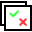
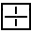
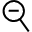
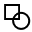

Console
=======

Overview
--------

The Console is the area of the application in which images can be viewed. Depending on the configuration and on the recipe you can see one or more images.

You can see the images both when the system is running and when it is stopped.

You can see images uploaded from files or acquired images.

Also, the images can be filtered by inspection results.

### Load images from files

You can load image files by command:

	Images > Images > Load…

An Open file window opens.

Select the image.

### Load images from acquisition system

If the Views of your system are configured with an image acquisition system, you can see the acquired images.

Live

The images are displayed in sequence as they are captured by the acquisition system. This display mode is accessed by menu:

	Images > Images > Live

Or by toolbar button:

	View > Toolbars > Commands

Commands toolbar will open. Press Live button.

Acquire

The image displayed in the Console is the one acquired when managing the Acquire command. This command can be sent from the menu:

	Images > Images > Acquire

Or by toolbar button:

	View > Toolbars > Commands

Commands toolbar will open. Press Acquire button.

### Save Images

Image displayed in Console can be saved as an image file by command:

	Images > Images > Save

A Save file window opens. Type the file name and press Save.

### Filtering images

While the system is running, images displayed in Console can be filtered by inspection result.

Filters can be selected by toolbar:

	View > Toolbars > Display mode

All

To see all acquired images press button All:

This button has a menu where you can select the images from the Views.

| | Description |
| - | - |
| All views | <ud> <li >Checked   You can alternately see images from all Views </li> <li> Not checked   You see images from selected View </li> </ud> |

Still

The flow of image display can be stopped by pressing the Still button.

Pass

Images can be filtered by displaying only those that have had a good result from the inspection by pressing button Pass.

This button has a menu where you can select the images from the Views.

| | Description |
| - | - |
| All views | <ud> <li > Checked   You can alternately see images from all Views </li> <li>Not checked  You see images from selected View </li> </ud> |
| First pass | <ud> <li > Checked   Images flow stops at first passed image </li> <li> Not checked   Images flow shows all passed images </li> </ud> |

Reject

If you only are interested in not passed images, you can filter inspected images by pressing button Reject.

This button has a menu where you can select the images from the Views.

| | Description |
| - | - |
| All views | <ud> <li > Checked   You can alternately see images from all Views </li> <li> Not checked   You see images from selected View</li> </ud> 
| First pass | <ud> <li > Checked   Images flow stops at first rejected image </li> <li> Not checked   Images flow shows all rejected images </li> </ud> 

Multiple Consoles
-----------------

Display mode toolbar will show two more buttons.

Multiview

This button allows you to switch from multiple view to single view and viceversa. Alternatively double click inside the Console window.

When in single view the current View is displayed. When in multiple view, the current view is identified by a frame around its pane.

Each pane can be sized dragging its border.

Default

You can use this button to resize the panes to default size

Zoom and Pan
------------

You can zoom and move the image inside the pane with Console commands. You can access them by menu:

	View > Console

Or by toolbar:

	View > Toolbars > Console

Zoom In

Use this command to enlarge the image.

### Zoom Out

Use this commando to make image smaller.

### Fit

Use this command to size the image to the pane.

### Normal

Use this command to size the image to its normal size.

Pan

Use this command to move the image inside the pan. The cursor changes to a hand-shaped pointer. To get back to normal pointer press Pointer button.

Show graphics

Draws the tools’ graphics on the image.

Clears graphics

Clears graphics from the image

View selection
--------------

When using multiple console, instead of using the selector, you can select the current image by clicking inside the corresponding pane. A frame around its pane appears.

If the registry variable StatusColorMode is set , the frame is colored as like as the result status of the inspected image:

| | Description |
| --- | --- |
| Red | Reject |
| Green | Pass |

Display settings
----------------

The tools in PROINSPECT can have a graphic interface that reports some result information and permits some diagnostic of results. Each tool has different graphic settings but all can be grouped in families. Select in the selector panel desired tool, then show the window:

	View > Display Settings

### Region draw settings section

Tools that implement an image processing.

| | Description |
| --- | --- |
| Current region | Selects the region of the tool you want set. This feature is available if the tool has more than one region to display. If case you have to select the region. |
| Region shape | Shows/Hides the graphics of the shape that describes the ROI of the selected tool. |
| Region center | Shows/Hides the center of the Region. |
| Region name | Shows/Hides the name of the region. By defaults is the name of the tool (followed by a \). |
| Region mask | Shows/Hides the shapes that mask the ROI of the selected tool. |
| Region if reject | Shows/Hides the graphics of the shape in case the selected tool has the reject result decision for current inspection even if the Region shape flag is set Hide. This is for showing the ROI where the tool failed. |

### Model draw setting section

Tools that have a model to look for.

| | Description |
| --- | --- |
| Model shape | Shows/Hides the graphics of the shape that describes the Model of the selected tool. |
| Model center | Shows/Hides the center (origin) of the Model of the tool. It may be different from the center of the model shape. |
| Model name | Shows/Hides the name of the region and its masks. By defaults is the name of the tool. (The masks’ name have the name of the tool followed by a #). |
| Model mask | Shows/Hides the shapes that mask the Model of the selected tool. |

### Tool draw setting section

 Tools that have some own features to display.

| | Description |
| --- | --- |
| <Own feature n\> | Shows/Hides the graphics of this custom feature of the selected tool. |
| <Own feature m\> | Shows/Hides the graphics of this custom feature of the selected tool. |

### Positions draw setting section

Tools that have one or more Position results.

| | Description |
| --- | --- |
| Position selection | Selects the position of the tool you want to set. This feature is available if the tool has more than one position result to display. |
| Target point | Shows/hides the graphics of the shape that displays the point returned as position. |
| Position name | Shows/hides the name of this position. |
| Text position | Select where to draw the info of this position:   | Relative | The Text is reported relative to the position of the target point. | | --- | --- | | Absolute | The Text is reported absolute to the origin of the image. |      | X | Relative/absolute X offset. | | --- | --- | | Y | Relative/absolute Y offset. | |
| Coordinates | Shows/hides coordinates (x, y, a) of the selected position. |

### Measurements draw setting section

Tools that have one or more Measurement results.

| | Description |
| --- | --- |
| Measurement selection | Selects the measurement of the tool you want to set. This feature is available if the tool has more than one measurement result to display. |
| Measurement value | Shows/hides the value of this measurement result. |
| Measurement name | Shows/hides the name of this measurement. |
| Precision | Sets how many decimal digits for this measurement. |
| Text position | Select where to draw the info of this measurement:   | Relative | The Text is reported relative to the position of the target point. | | --- | --- | | Absolute | The Text is reported absolute to the origin of the image. |      | X | Relative/absolute X offset. | | --- | --- | | Y | Relative/absolute Y offset. | |
| Quote | Shows/hides graphical position of this measurement.   | Location | Distance from the measurement of the graphical quote. | | --- | --- | |

### Value draw setting section

Tools that have one or more Value results.

| | Description |
| --- | --- |
| Value selection | Selects the value of the tool you want to set. This feature is available if the tool has more than one value result to display. |
| Value | Shows/hides the value result. |
| Value name | Shows/hides the name of this value. |
| Precision | Sets how many decimal digits for this value. |
| Text position | Select where to draw the info of this value.   | Relative | The Text is reported relative to the position of the target point. | | --- | --- | | Absolute | The Text is reported absolute to the origin of the image. |      | X | Relative/absolute X offset. | | --- | --- | | Y | Relative/absolute Y offset. | |

 

Configuration
-------------

Multi console is configured by registry. Registry variable EnableSplit must be set. 

Let’s call each split part as a pane. The division of the console window must be defined by registry variables Rows and Columns.

For each pane, a registry key is created. If for example you set Rows = 1 and Columns = 3, tree registry keys are created: Split00, Split01, Split02.

Each entry has the variables Rows and Columns, so you can recursively split each pane.

| Variable | Value | Description |
| --- | --- | --- |
| UserInterface\UI Frame\Split\EnableSplit | | 0 | Disabled | | --- | --- | | 1 | Enabled | | Enables multiple console |
| UserInterface\UI Frame\Split\Rows | Positive integer | Number of rows for splitted console |
| UserInterface\UI Frame\Split\Columns | Positive integer | Number of columns for splitted console |
| UserInterface\UI Frame\Split\Split<n> | Registry key | One key for each pane |
| UserInterface\UI Frame\Split \StatusColorMode | | 0 | No border | | --- | --- | | 1 | Colored border | | Enables console frame |

