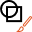

Display settings
================

Overview
--------

The tools in PROINSPECT can have a graphic interface that reports some result information and permits some diagnostic of results. Each tool has different graphic settings but all can be grouped in families. Select in the selector panel desired tool, then show the window:

	View > Display Settings

### Region draw settings section

Tools that implement an image processing.

| | Description |
| --- | --- |
| Current region | Selects the region of the tool you want set. This feature is available if the tool has more than one region to display. If case you have to select the region. |
| Region shape | Shows/Hides the graphics of the shape that describes the ROI of the selected tool. |
| Region center | Shows/Hides the center of the Region. |
| Region name | Shows/Hides the name of the region. By defaults is the name of the tool (followed by a \). |
| Region mask | Shows/Hides the shapes that mask the ROI of the selected tool. |
| Region if reject | Shows/Hides the graphics of the shape in case the selected tool has the reject result decision for current inspection even if the Region shape flag is set Hide. This is for showing the ROI where the tool failed. |

### Model draw setting section

Tools that have a model to look for.

| | Description |
| --- | --- |
| Model shape | Shows/Hides the graphics of the shape that describes the Model of the selected tool. |
| Model center | Shows/Hides the center (origin) of the Model of the tool. It may be different from the center of the model shape. |
| Model name | Shows/Hides the name of the region and its masks. By defaults is the name of the tool. (The masks’ name have the name of the tool followed by a #). |
| Model mask | Shows/Hides the shapes that mask the Model of the selected tool. |

### Tool draw setting section

 Tools that have some own features to display.

| | Description |
| --- | --- |
| <Own feature n\> | Shows/Hides the graphics of this custom feature of the selected tool. |
| <Own feature m\> | Shows/Hides the graphics of this custom feature of the selected tool. |

### Positions draw setting section

Tools that have one or more Position results.

| | Description |
| --- | --- |
| Position selection | Selects the position of the tool you want to set. This feature is available if the tool has more than one position result to display. |
| Target point | Shows/hides the graphics of the shape that displays the point returned as position. |
| Position name | Shows/hides the name of this position. |
| Text position | Select where to draw the info of this position:    <ud><li> Relative   The Text is reported relative to the position of the target point. </li> <li> Absolute   The Text is reported absolute to the origin of the image.  </li></ud>  <blockquote><ud><li>X   Relative/absolute X offset. </li><li> Y   Relative/absolute Y offset</li></ud> </blockquote> |
| Coordinates | Shows/hides coordinates (x, y, a) of the selected position. |

### Measurements draw setting section

Tools that have one or more Measurement results.

| | Description |
| --- | --- |
| Measurement selection | Selects the measurement of the tool you want to set. This feature is available if the tool has more than one measurement result to display. |
| Measurement value | Shows/hides the value of this measurement result. |
| Measurement name | Shows/hides the name of this measurement. |
| Precision | Sets how many decimal digits for this measurement. |
| Text position | Select where to draw the info of this measurement:    <ud><li>  Relative   The Text is reported relative to the position of the target point. </li> <li> Absolute   The Text is reported absolute to the origin of the image. </li></ud>   <blockquote><ud><li> X   Relative/absolute X offset. </li><li> Y   Relative/absolute Y offset. /li></ud> </blockquote> 
| Quote | Shows/hides graphical position of this measurement.   <blockquote><ud><li> Location   Distance from the measurement of the graphical quote. </li></ud> </blockquote> |

### Value draw setting section

Tools that have one or more Value results.

| | Description |
| --- | --- |
| Value selection | Selects the value of the tool you want to set. This feature is available if the tool has more than one value result to display. |
| Value | Shows/hides the value result. |
| Value name | Shows/hides the name of this value. |
| Precision | Sets how many decimal digits for this value. |
| Text position | Select where to draw the info of this value.    <ud><li> Relative   The Text is reported relative to the position of the target point. </li> <li> Absolute   The Text is reported absolute to the origin of the image. </li></ud>  <blockquote><ud><li> X   Relative/absolute X offset. </li> <li> Y   Relative/absolute Y offset. </li></ud> </blockquote> |

 

