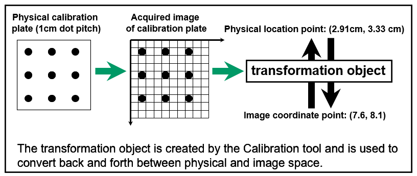

# Calibration

Calibration is the process with which the system establishes the
relationship between the camera space and a known space. Calibrating
involves using known data such as the coordinates of a set of points and
measuring them in the image space. Because PROINSPECT uses error
minimizing resolution techniques, the RMS error (root mean squared
error) is provided as estimate of the calibration quality.

In designing the calibration experiment, care should be taken to avoid
redundancy in the data that may lead to mathematical problems. A typical
situation of redundancy is when the calibration points are aligned.

