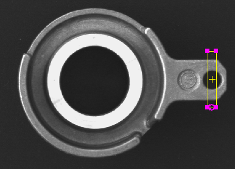
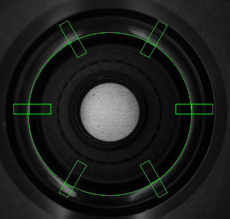
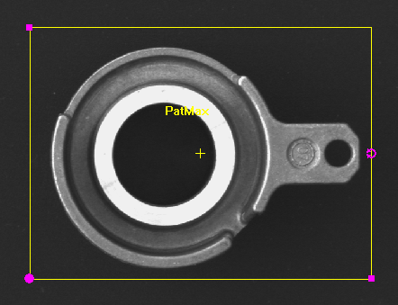

# Locate and Inspect

## Location Tools

The Location Tools are used to define a feature in the image that
provides positional data. The Location Tools create a Fixture, which is
used to locate a part in the image quickly and reliably, even if the
part being inspected rotates or appears in different locations in the
image.

Examine your part and determine which type of feature (or features)
meets your application's requirements.

## Inspect Tools

Examine your part or object to be inspected and determine which types of
features best lend themselves to your application's requirements, and
which Inspection Tools best suit themselves to solving your problem.

## Fixture

The Location Tools in the Locate Part step create an output known as a
Fixture, which acts as a reference point for other vision inspection
tools.

## Features

In machine vision, features are referred to as the objects of interest
in the image and vision inspections are designed around the types of
features found in the image.

Types of features in the Locate Part step include:

#### Edges

Linear areas of transition between light and dark pixels. Edges can be
things like the ends of parts, pins on a circuit board or threads on a
screw. Edges are one of the faster types of features to detect during an
inspection, but when used as a Fixture, they should only move in one
direction (horizontal or vertical) and be highly contrasted.

Locating an Edge

#### Circles

Circles are essentially edges, areas defined by a transition between
light and dark pixels that defines their geometric shape. Also one of
the faster types of features to recognize, as long as they are highly
contrasted, however circles do not provide any angular orientation data
when used as a Fixture.

Locating a circle

#### Patterns

A pattern can be anything from a simple group of repeating shapes to
complex configurations like logos or labels. The most reliable type of
feature to use as a Fixture, patterns allow for the greatest range of
positional rotation, movement and scale variations, but generally
require the most amount of time to inspect.

 

Locating a pattern

In this example a PatMax Patterns Location Tool is used to create a
Fixture. The PatMax Patterns Location Tool is used because it can locate
complicated patterns while accommodating a wide variety of locations,
orientations and scales.

#### Blobs

A group of dark or light-colored connected pixels, such as a splotch of
white paint on a black background or a black screw on a white conveyor
belt. Blobs fall between edges and patterns in terms of their detection
speed, and blobs allow for a wider variance of the blob feature's shape
and size compared to a pattern, but have limited angular orientation
value when used as a Fixture.

## Regions

Regions define the area of the image where the Location or Inspection
Tool will perform its operation, and are also referred to as the
\"Region of Interest.\"

There are several different types of regions used by the Location and
Inspection Tools in EasyBuilder, depending upon the type of tool being
used. The types of regions used by EasyBuilder are the following:

-   Rectangle
-   Circle
-   Annulus
-   Polygon
