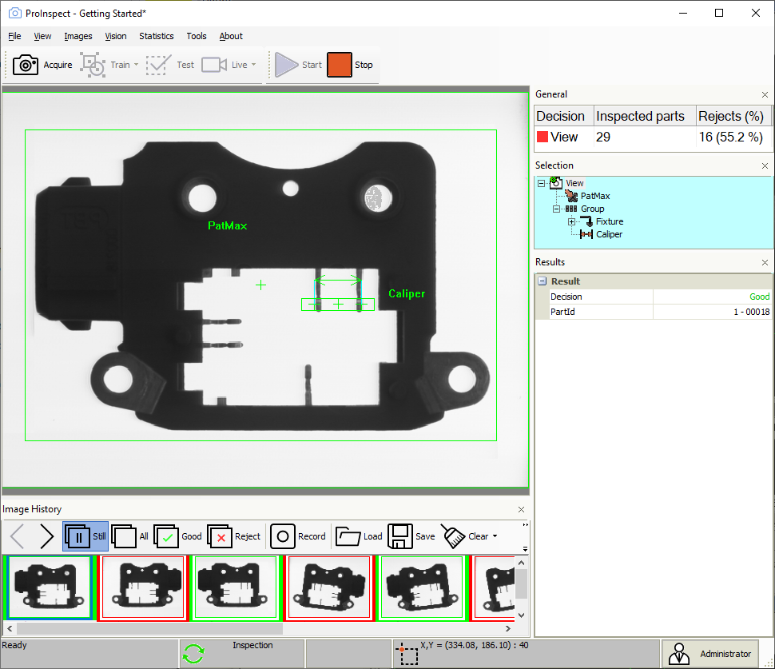
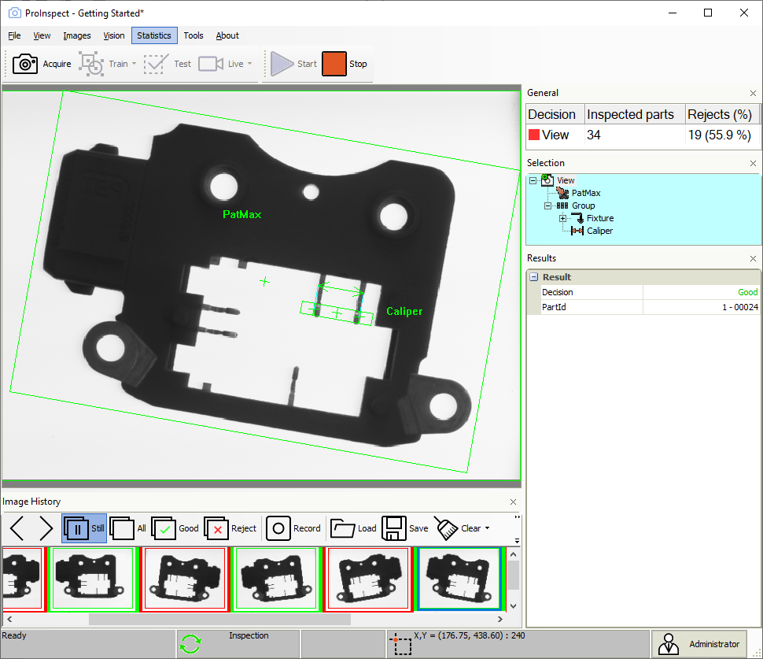
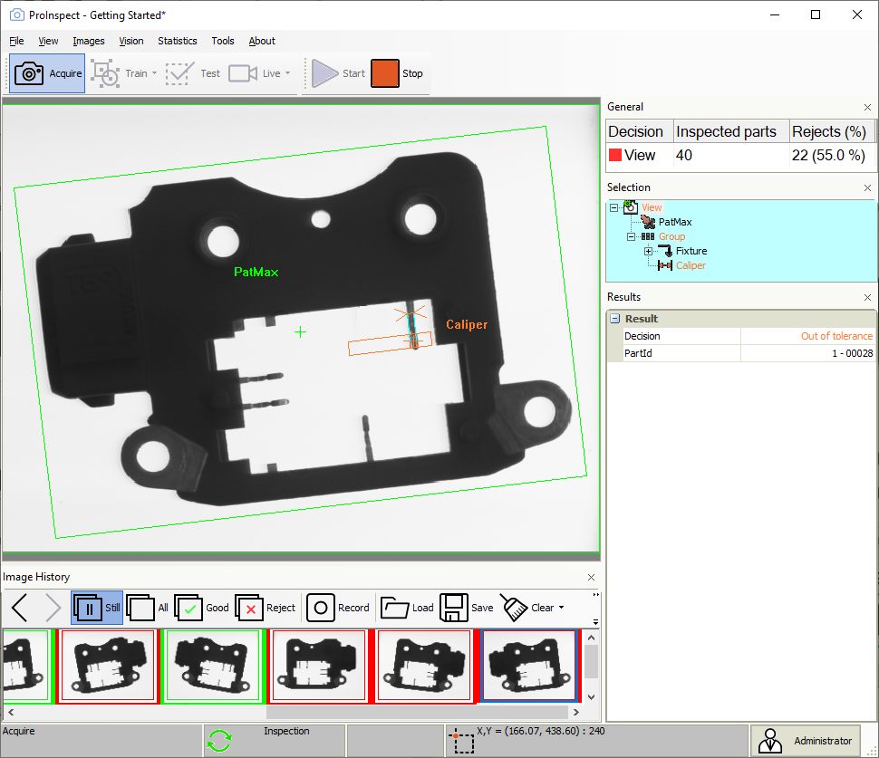

# Run recipe

## Testing the recipe

To test the recipe result you can acquire images from the camera or load
images from image files previously saved. After getting a new image
click the test button. You will see the graphical result of the
inspection and the numerical results of each tool in the Result window.

Example of good product 1

Example of good product 2

Example of bad product
