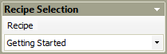

# Load and Save recipe

## Save a Recipe

A recipe can be saved through the menu

File \> Save

You can save the recipe while PROINSPECT is in inspection mode.

If you need to save the recipe under a different name

File \> Save As...

you must switch PROINSPECT into #SetupMode first.

## Load a Recipe

A recipe can be loaded via the menu

File \> Open

in this case PROINSPECT must be in #setupmode.

The second way to load a recipe is via the #RecipeSelection panel

Recipe toolbar

accessible from the toolbar. In this case, if PROINSPECT is in
inspection mode, the command will put PROINSPECT in configuration mode
before loading the recipe, then, once the recipe is loaded, it will put
PROINSPECT again in inspection mode.

 
