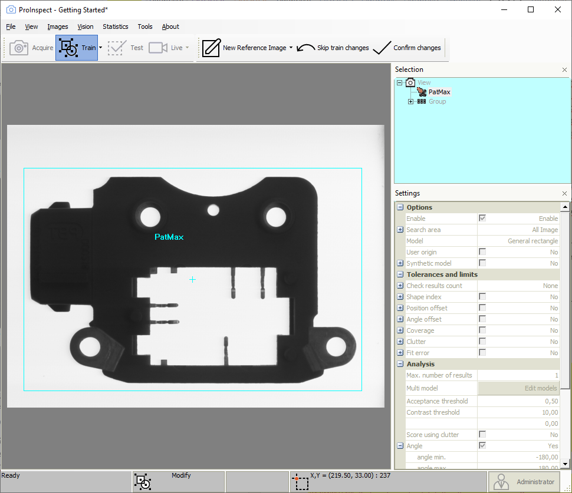

# Train

Training establishes the region of interest of inspection tools.
Furthermore it acquires image templates for tools that require that.
Training is needed after a tool has been inserted in the recipe.

Press the Train button. Each View has its own Reference image of the
scene that is stored with the recipe and that can be used any time a
re-train operation is required. A rectangular shape is shown in the
image area. Click near the edges of the rectangle and handles will
appear. Drag the corners or use rotational handles to resize the window
to enclose the object shape.

The small cross in the center of the rectangle is a special point called
origin, this point identifies the object position in the image
coordinate system. You can right click to zoom in/out while adjusting
regions. Press the Confirm Changes button again to confirm training.

Training is carried out for all the tools of the selected Object.

Train always recalls the "golden image" of the inspected part. The
golden image is stored the first time a recipe is trained. It can be
changed simply by acquiring or loading a disk image in a train session.

During training you will relocate and resize the windows that appear as
color overlay on the image with the mouse pointer. The active window is
shown in yellow with pink handles. In order to resize a window you
should drag an handle. Drag the yellow lines to relocate.

Once you are satisfied with the windows positions, press again the train
button to conclude training.

 
