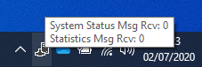

PROINSPECT OPC-UA Server
========================

Overview
--------

PROINSPECT OPC-UA Server is an application, apart from PROINSPECT, that allows to publish data via the OPC-UA standard.

The Server and PROINSPECT communicate with each other through a message queuing service based on Microsoft Queue (MSMQ).

The data that can be published includes:

- Status and diagnostic data related with PROINSPECT system.
- Statistical data related with the running inspection recipe.

Status and diagnostic data are not modifiable by the user and includes:

- Machine Name: unique identifier of the machine.
- Actual Recipe: current running recipe.
- Statistics Reset: an input variable used to reset statistical data stored in the Server.
- Watchdog: a value incremented for each message sent to indicate system activity.

Statistical data can be configured by mapping one or more Statistics, previously configured in PROINSPECT, to user-defined OPC-UA variables.

Each PROINSPECT statistic value is indeed converted into a set of OPC-UA variables related with the statistic itself:

- CP
- CPK
- Max
- Mean
- Min
- Nominal
- Standard Deviation
- Sum
- Sum Square
- Tolerance Min
- Tolerance Max
- Total Inspected
- Total Rejected

Usage
-----

PROINSPECT OPC-UA Server runs as a background application and its icon is visible in the Windows tray icon area.

OPC-UA Server icon

The data fetched from each queue can be disabled or enabled independently through the contextual menu of the application.

OPC-UA Server options

The number of messages fetched from each queue can be monitored by moving the mouse over the application icon.

OPC-UA Server queue status

The Server warns the user in case of particular events or anomalous conditions.

OPC-UA Server notifications

Configuration
-------------

There are three main components that must be installed and configured to run PROINSPECT OPC-UA Server:

- Microsoft Queue Service (MSMQ) Server
- PROINSPECT UvpQueueUIS plugin
- PROINSPECT OPC-UA Server application

### Microsoft Queue Service (MSMQ) Server

To install Microsoft Queue Service (MSMQ) Server open: 

	Control Panel > Programs and functionalities > Turn Windows features on or off > Microsoft Message Queue (MSMQ) Server > Microsoft Message Queue (MSMQ) Server Core

Microsoft Message Queue (MSMQ) Server installation

Microsoft Message Queue (MSMQ) Server has a default storage limit of 100 MB. Once the limit is reached new messages will be discarded. Note that this limit is global for all the queues present on the system. To change this limit open:

	Computer Management > Services and Applications > Message Queuing > Properties. 

Message Queuing Properties

Define the limit message storage (KB).

MSMQ Limit message storage configuration

### PROINSPECT UvpQueueUIS plugin

Add UvpQueueUIS plugin's configuration.

	UvpQueueUIS configuration is stored in Options > Queue. 

| Setting | Default value | Description |
| --- | --- | --- |
| StatsQueueEnable | 1 | Enable (1) or disable (0) Statistics queue |
| StatsQueueName | PROINSPECT Statistics Sessions | Statistics queue name |
| SystemStatusQueueEnable | 1 | Enable (1) or disable (0) System Status queue |
| SystemStatusQueueName | PROINSPECT System Status | System Status queue name |
| SystemStatusQueueUpdateTime | 1 | Interval (in seconds) to send each system status message |

Table 1. UvpQueueUIS configuration

### PROINSPECT OPC-UA Server application

Run OPCUAServer\_[version].exe to install the application.

PROINSPECT OPC-UA Server installer

Once the Server is installed there are two configuration files that must be edited:

- OPC-UA Server configuration file
- Statistics mapping file

Open with a text editor OPCUAServer.exe.config. The file is stored into the installation folder.

| Setting | Default value | Description |
| --- | --- | --- |
| SystemStatusQueueName | PROINSPECT System Status | System Status queue name. Must match UvpQueueUIS SystemStatusQueueName registry key |
| StatisticsQueueName | PROINSPECT Statistics Sessions | Statistics queue name. Must match UvpQueueUIS StatsQueueName registry key |
| OPCMappingFile | .\Data\mapping.ini | Variables mapping file |
| StatisticsQueueFetchTime | 5000 | Interval (in msec) to fetch data from the Statistics queue |
| SystemStatusQueueFetchTime | 5000 | Interval (in msec) to fetch data from the System Status queue |

Table 2 PROINSPECT OPC-UA Server configuration

Statistics mapping file contains the list of the published OPC-UA variables and the mapping with the statistic from the recipe. By default, the file is stored into Data sub-folder.

Each variable must be defined after section [Process] as follow:

OPC Variable = PROINSPECT Statistic Name

Example:

| [Process] | |
| --- | --- |
| LID.Position | Lid Position |
| LID.TE | Lid Te |
| LID.Short Shot | Lid Short Shot |
| LID.Flashes | Lid Flashes |
