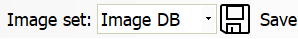
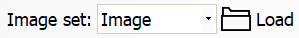

Image History
=============

Overview
--------

The ImageHistory is a ProInspect feature that permits to store, in run-time mode, the images used for View inspection. You can decide to store All images, or only the Reject or Good ones (images with an inspection result different from pass, or equal to pass). Selecting an image, ProInspect executes inspection of the current View on it and reports results.

The list (history) of images is a circular queue that you can resize: old images are overwritten by new ones. You can even decide to load archived image files from a storage device. The ImagHistory is useful also for the #Sampling and #Validation actions. ProInspect provides as many ImageHistory as Views of the recipe: selecting the View, automatically the proper History list is updated. Each image of history has a colored mark: color is associated to the #category decision.

The window is accessed via the menu item

	View > Image History

The visibility of the toolbar buttons is bound to:

 User access level
 Current functionality

Image display
-------------

The Image Display mode defines which history you want to collect. If you are in Run-mode and History Display mode is in a status different from #Still, you can see the inspected images scrolling in the panel: new ones are added on the right and fill the queue till they replace the oldest. IfWhen the History Display mode is #Still, you can access other operations, like loading new history, storing on disk, execute inspection, delete images, etc. When you select an image from the history image panel, automatically ProInspect switches the History display mode to #Still and executes all tools of the View on the selected image. The History Display status can be automatically updated by the #ForcedDisplayMode: after an interval time of user inactivity, ProInspect switches to this stauts.

### Display mode

Still

This status stops the image storing action. ProInspect stops adding run-time images to the history queue. In this display status you can:

 Select and run queue images
 Cancel from the list
 Save selected images
 Load a new list

If the system is in Stop and in the register the ForcedDisplayMode variable is set to a valid value, at the end of a time interval set also in the register, the system exits the Stop display mode and enters the mode set again from register. See Forced display.

All

In this status PROINSPECT stores all the run-time images into the queue and marks them with the category color.

Good

In this status PROINSPECT stores only the run-time images with a Pass decision result.

Reject

In this status PROINSPECT stores only the run-time images with a Reject decision result.

### Forced display

This feature automatically forces a history display mode after a time of user inactivity. It is a registry configuration.

Save
----

This command runs the saving action of selected images of the history list on a storage drive.

The path of the folders depends on the modality of the History: Image, Sampling, Validation.

The name of the files can be defined by the registry. TODO : Come?????? fare: #ImageNames

The Save button allows you to save the images displayed in the window.

### Saving in Image mode

By pressing Save button, all displayed images will be saved in Images folder.

Images path is:

 <Images folder\>\<Recipe name\>\<View name\>

### Saving in Sampling mode

To save the images that will be used in the Sampling process, select the Sample item in the Image set combobox.

By pressing Save button, all checked images will be saved in Samples folder.

Images path is:

 <Samples folder\>\<Recipe name\>\<View name\>

### Saving in Validation mode

To save the images that will be used in the Validation process, select the Validation item in the Image set combobox.

By pressing Save button, all checked images will be saved in Validation folder.

Images path is:

 <Validation folder\>\<Recipe name\>\<View name\>

In this modality you are required to select which images you want to save as Good expected and which ones as Reject expected. 

The Validation Save button has a sub menu you can use to select the proper option:

| | Description |
| --- | --- |
| As Good | Regardless the inspection result, the image is saved as a Good image |
| As Reject | Regardless the inspection result, the image is saved as a Reject image |
| As Is | The image is saved according to the inspection result |

Load
----

Pressing the button has a different effect depending on the Image set mode.

### Upload from Images folder

Pressing the button the file opening window opens showing the contents of the Images folder. You can select the images to be uploaded.

### Upload from Sampling folder

The Load button will load all the contents of the Sampling folder.

### Upload from Validation folder

The Load button will load all the contents of the Validation folder.

Clearing
--------

Cancel from the history list selected images.

The Clear button allows you to delete the images displayed in the window. The button is always enabled regardless of the display mode. The key has a menu in which you can choose the deletion options.

### Clearing selected image

Removes from the list the selected images. is the sub-menu All images option is checked all images will be removed.

### Clearing all images displayed for the current view

The Clear button will remove from the history list all images of the current View.

### Clearing images displayed for all views

The Clear button will remove from the history list all the images of all Views.

### Removing images on disk

The Clear button will remove from the history list and from the disk all the images of all the recipe Views.

Compute mode
------------

Usually Image History, when an image is selected in list, executes the tools of the view and shows results. There is a different mode of working for ImageHistory that doesn’t force execution: Compute History mode. This setting, visible by registry setting, enables ProInspect to store, run-time, not only the inspected image but also its results. With this variable enabled, you can decide by UI setting the desired behavior. The Selection of images in the ImageHistory in this case simply will show in console the image and the saved results and no execution of tools is performed. You can also decide to save reports and graphics on disk as well as images. In this case, when you load images from disk, automatically PROINSPECT loads also associated reports and graphics. To remind you this modality the ImageHistory panel becomes colored.

Settings
--------

The functions of the Image History window are regulated by parameters that can be set in the window:

	Tools > Recipe Options > Image History

The settings are unique for ach View.

### Parameters

| General | |
| --- | --- |
| Images folder | Destination folder for saved images. |
| Mode | Graphics and results shown when selecting an image.<ud> <li>Compute results Graphics and results of a new inspection. (Default)</li>  <li>Saved results Graphics and results saved.</li> </ud> |
| Save Graphics and Report to file | Create graphic and reports save files |

| I/O | |
| --- | --- |
| Device | Select the device that provides the input to reset the image counter.<ud> <li>None No device. (Default)</li>  <li><device name>  </li> </ud><blockquote> **Reset counter line** Device line to be used for reset. (Default = 1)   **Polarity** Line activation status            Active high      (Default)          Active low         </blockquote> |

| <selected view name\> | |
| --- | --- |
| Max. number of images to save | Maximum number of images to save for this View. (Default = 100) |
| Save frequency (“All mode”) | How often to save images. (default = 1) |
| Max. number of images to preview | Number of images shown in Image History. (Default = 10) |
| Circular counter | Circular counter activation.<ud> <li>No Not active. (Default)</li>  <li>Yes Active</li> </ud><blockquote> **Max. value** Length of the circular queue. (Default = 1000)   **View position offset** Starting number for this view. (Default = 0)  </blockquote> |
| Selective save | Saving subject to the outcome of the inspection.<ud> <li>No The image is saved when view is reject. (Default)</li>  <li>Yes The image is saved when one of the tools is reject.</li> </ud> |

| <selected tool name\> | |
| --- | --- |
| Take part to save image | This tool contributes to the storing of the image when its result decision is reject.<ud> <li>No Not active. (Default)</li>  <li>Yes Active</li> </ud> |

Configuration
-------------

The features introduced in this paragraph are offered by the plugin UvpMainUIS.

For instructions on how to load this plugin see the section Plugins.

| Variable | Value | Description |
| --- | --- | --- |
| UserInterface\UI History\ShowRecordButton | Permission Levels | Visibility of Record button |
| UserInterface\UI History\ShowTestButtons | Permission Levels | Visibility of buttons related to Advanced functionality |
| UserInterface\UI History\ForcedDisplayPolling | Positive integer | Time in seconds |
| UserInterface\UI History\ForcedDisplayTime | Positive integer | Elapsed time for user inactivity |
| UserInterface\UI History\ForcedDisplayMode | | -1 | Disabled | | --- | --- | | 0 | All | | 1 | Reject | | 2 | Pass | | Display mode status to force |
| Paths\Images | Full path | Images folder |
| Paths\Samples | Full path | Samples folder |
| Paths\Validation | Full path | Validation folder |
| Options\Process\ComputeHistory | Permission Levels | The choice of mode |

 

