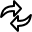

Process
=======

Overview
--------

PROINSPECT can run automatically thanks to a plugin that implements the core of automation: UvpProcessUIS. Here there is the code to drive acquisition, inspections, reports, statistics, output results: all the run-time actions excuted by PROINSPECT. In particular the Process is responsible to create run-time thread for acquisition and inspection, to manage I/O devices for output signals, to implement Sampling actions, to save/report inspection images, to handle run-time settings (Online Setup) etc.

Usage
-----

The main panel to configure PROINSPECT process is the window:

	Tools > Recipe Options… > Cycle 

The Cycle panel permits settings of selected View and recipe Object selected. View has different settings from other recipe Objects.

Settings for Views
------------------

| Cycle | |
| --- | --- |
| Mode | Defines what Process has to do with current View in run-time:<ud> <li>None The selected view will not have a runa thread</li>  <li>Queued cycle The selected view is queued in a thread with others view. Its trigger, for run inspection, will be fired after the inspection of another View. First View in a queued set must be triggered.</li>  <li>Stand alone cycle The selected View will run in a separated and owned thread.</li>  <li>Simultaneous queued cycle The selected will run in a single thread but all must be triggered.</li> </ud> |

| Output | |
| --- | --- |
| Device | Defines the device for the output result<ud> <li>None No output device</li>  <li>… List of device available.</li> </ud> |
| Mode | Defines how Process has to signal the results<ud> <li>Time delayed pulse Output will be a signal after a set delay. If result is not computed at set time, a reject will be forced.</li>  <li>Step delayed pulse Output will be a signaled on the trigger event of step delayed inspections later. Number of steps is > 1</li>  <li>No delay Output will be signaled as soon as possible when view inspection ends.</li> </ud><blockquote> **delay** Delay in ms in time delayed pulse   **Step delay** Steps in step delayed pulse.   **Pulse duration** Duration of output pulse  </blockquote> |
| Data ready | Enables/disables the data ready signal: it is a signal that enables the result signal. Result has a valid value when DataReay is ON.<blockquote> **Line** Line/bit on output device for DataReady   **Polarity** Polarity of Data ready status ON:             Active high      Status is ON when signal is High          Active low      Status is ON when signal is Low  </blockquote> |
| Result | Enables/disables the result signal.<blockquote> **line** Line/bit on output device for Result   **Polarity** Polarity of Result             Active high      Status is ON when signal is High          Active low      Status is ON when signal is Low   **Mode** Mode of result:            Pulse on reject      Pulse with the set polarity when the result decision is: reject.          Pulse on pass      Pulse with the set polarity when the result decision is: pass  </blockquote> |
| Reject code | Reject code is a number used to identify this view result. It is used with processImage result in custom implementations. |

| Data Device | |
| --- | --- |
| Device | Device name |

| Part Identifier Management | |
| --- | --- |
| Part Identifier Device | This section permits to identify selected View with a device that provides PartId tracking. If this kind of device is available you can associate this View to the PartId tracking mechanism setting the proper lines.  <blockquote> **Line** Line on partIdDevice where is connected the trigger of the acquisition Fifo of this View   **Source** It is the section of the partIdDevice (Input or Output) fo the Line   **Output Station** Enables the output station (the output reject line) associated to this View.   **Number** Number of the output station (1st , 2nd, … not the line!)  </blockquote> |

Settings for Objects
--------------------

| Output Object | |
| --- | --- |
| Result | Defines which line/bit to use for signaling selected tool<blockquote> **Disable** This item doesn’t produce a reject.   **View line** Use same line of the owner View.   **Separate line** This item will signal a pulse on a different line/bit from View’s one.            Line      Line/bit on output device for Result of this item  </blockquote> |
| Reject code | Reject code is a number used to identify this item result. It is used with ProcessImage result in custom implementations. |
| Part Identifier management |  |

| Part Identifier management | |
| --- | --- |
| Output Station | Enables the output station (the output reject line) associated to this Item.   <ud> <li> Disabled   Item doesn’t take care to the result output </li>  <li> View station   Use the same output station of owner View. </li>  <li> Different Station   Use a different output station for this Item. </li> </ud> |

Configuration
-------------

Process is provided by the UvpProcessUIS plugin.

