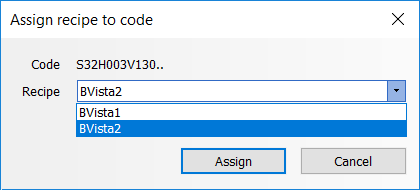
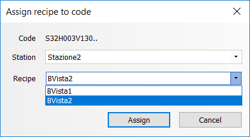
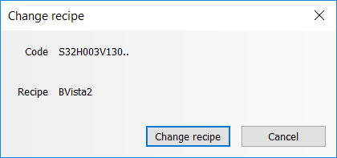
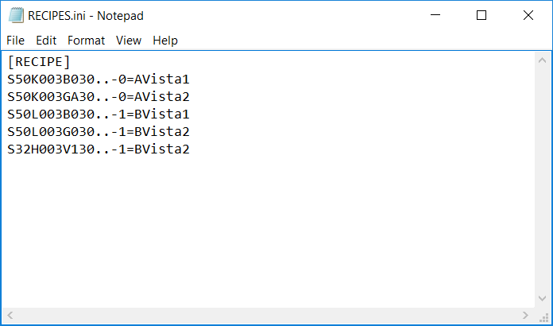

Bar code reader
===============

Overview
--------

PROINSPECT supports the use of barcode readers to perform the recipe change.

There are two modes of operation of PROINSPECT:

- Recipe
- Station

Depending on the mode, a recipe or station will be loaded when a barcode is selected.

For setting the mode see #ModalitàStazione.

Assign recipe to a code
-----------------------

Access the menu dialog

	Dataman > Assign…

### Recipe Mode

In recipe mode the window presents the list of available recipes. The recipes are those present in the configured Data folder.

If you want to change the recipe immediately, check the Change recipe on exit flag.

Press the Assign button to associate current read code to the selected recipe.

### Station mode

In station mode the window presents the list of available stations and for each station the list of available recipes.

The stations are the list of folders found in the configure Data folder.

In the Station selector you choose the station. In the Recipe selection you assign the recipe file to the selected station.

The recipe selection presents the list of recipes for the selected station.

Select the recipe.

If you want to change the recipe immediately, check the Change recipe on exit flag.

Change recipe
-------------

The dialog is accessed from the menu

	Dataman > Change

Press Change recipe button to load the assigned recipe.

Recipe List
-----------

This window shows the contents of the RECIPES.ini file which contains the association CODE/RECIPE or CODE-STATION / RECIPE. Path and name of this file is configured in the registry variable.

The file must exist.

### Recipe mode

Each line in the file corresponds to an association formatted in the following way:

	<code>=<recipe name>

### Station mode

Each line in the file corresponds to an association formatted in the following way:

	<code>-<station index>=<recipe name>

Configuration
-------------

The barcode reader functionality is contained in the PROINSPECT CPDatamanAdapterUIS plugin.

Load this plugin as usual. See CPDatamanAdapterUIS .

| Variable | Value | Description |
| --- | --- | --- |
| CustomPlugIns\CPDatamanAdapter\Adapter0\Parser\Terminator | | 0x0a (LF) | Cognex DataMan | | --- | --- | | 0x13 (CR) | DataLogic TD1 100 | | Parser terminator |
| UserInterface\UI CPDatamanAdapters\ShowRecipeAssign | Permission Levels | Visibility of Recipe Assign window |
| UserInterface\UI CPDatamanAdapters\ShowRecipeSelection | Permission Levels | The visibility of Change Recipe window |
| UserInterface\UI CPDatamanAdapters\ShowRecipeList |  | The visibility of Recipe List file button |
| CustomPlugins\CPDatamanAdapter\RecipeCodesFile |  | Path and name of RECIPES.ini file |
