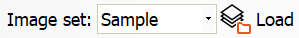

Sampling
========

Overview
--------

Sampling is a procedure to train some tools statistically. Instead of training models’ features from the single reference image, Sampling permits you to use a set of several images to extract information from. Statistical training produces an average image to use as the reference image and a variation image to understand how samples are different from each other. Not all the tools implement the sampling capability. Usually, the set of images is the same for all the tools contained in a View. All tools in a View share the same samples set. If necessary a single tool can have its own sample set. 

Usage
-----

There are different ways to run a sampling procedure. However, a condition is required: before starting a sampling, the tools involved must be trained. You can run sampling during normal work of PROINSPECT or in Online Setup mode, you can use current inspected images or use a prior saved set of images. You can add all samples in a single operation or decide which samples to use interactively. You can configure which modes are permitted and which PROINSPECT user can do what enabling by  Permission configuration. During the sampling operation, the status bar displays current status: 

|  | Description |
| --- | --- |
|  | Sampling <n\> / <tot\> |

Sampling has a few settings and these are unique for each View. You can set parameters by window:

	Tools > Recipe Options > Sample Images

Sample Images
-------------

| Options | |
| --- | --- |
| Samples folder | Base folder for saved samples images. To this folder you add the \<ViewName> and you have the complete specific folder for Current View. |

| View | |
| --- | --- |
| Sample only good parts | Tells the sampling operation to add the current sample only if it has a pass inspection result. |
| Samples number | Number of images to use for statistical training. When the number is reached the sampling operation ends and the resulting model is updated for all tools involved. |
| Save images | Tells the sampling operation to save the image of the current sample acquired by PROINSPECT. The image is saved in the View’s folder specified as a BMP file. |

### Sampling with run-time images

A way to run the sampling operation is to process images that PROINSPECT still is acquiring and inspecting, with run-time images. Pressing the Sample button PROINSPECT, after having inspected the last acquired image, pushes it in a pool of images used by the sampling process. The pool is then popped, by a low priority thread, and the sample image is added to the statistical training of the involved tools. Once reached the number of desired samples (samples number) the images are elaborated producing a new model for each enabled tool that will replace the current working one. 

### Sampling with images from disk

A second way to run the sampling operation is to process images present on the disk into the specified View’s folder. This action can be performed PROINSPECT is both in #Run mode and Online Setup mode. As in the sampling with run-time images, PROINSPECT processes all the sample images present in the folder (not only the desired samples number), by a low priority thread, and at the end produces a new model for each enabled tool that will replace the current working one. Sampling from disk permits another feature: the Interactive mode. In this mode images from the disk are loaded one by one and displayed in Console. You can decide what to do with this image:

|  |  Icon | Description |
| --- | --- | --- |
| process it |   | Add sample button |
| skip it |  | Skip sample button |
| end action |  | Stop Sample button |
| delete sample from disk |  | Delete sample button |

### Sampling with Image History

The sampling operation has a practical user interface integrated with the Image History window. Select the Sample option:

Now all the command buttons will work on images used for statistical training. 

|  |  Icon | Description |
| --- | --- | --- |
| Load |  | Loads and displays into Image History all the images of the Sampling folder. |
| Save |  | Saves the selected image in the Sapling folder. These images are added to current ones and will be used by Sampling from disk action. |
| Clear |  | Removes from the Image History list and/or from the disk (it depends on menu selection) the selected images. This command permits to choose which images to use for statistical training. |

Configuration
-------------

Sampling operation is available and visible only for enabled users. You can modify behavior by following registry values: 

|  |  | Description |
| --- | --- | --- |
| Options\Process\EnableSamplingInRun | Permission Levels | Enabling functionality |
| UserInterface\ShowSample | Permission Levels | GUI Visibility |

Sampling operation needs the UvpProcessUIS and UvpMainUIS plugIns.
