Sharing
=======

Overview
--------

Recipe portions can be shared with other recipes.

Suppose you have a proven recipe in which the parameters have been entered and modified many more to achieve the optimal inspection result. You have to make a new recipe and you realize that some tools should be identical or similar to those of the first recipe. In this case you can export the tools that interest you from the first recipe and import them into the second.

We call this procedure: Import-Export.

Sometimes instead we would like some tools to be shared among multiple recipes. This would allow you to make any changes to the tool in one recipe and automatically find them into all the recipes that share the tool. It is very convenient, for example, when using a calibration tool and wanting to use it for multiple recipes.

We call this process: Sharing.

You can Export-Import or Share entire object, means its training, parameters and model, or its settings parameters only.

Import-Export Objects
---------------------

Suppose you want to export the MyEdge tool of the MyRecipe\_1 recipe in the figure:

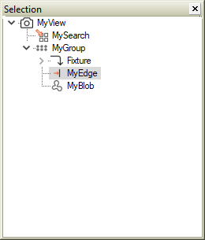

Figura 1

Select MyEdge in the selector window.

In the application menu select:

File>Export>Object…

The Save file window opens.

Select the destination folder and edit the file name.

By default, the name of the object being exported is presented as a file name. However, you can choose a name of your choice.

Save.

The exported object is saved in a file with a .pvx extension.

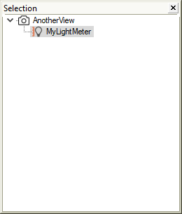

.MyRecipe\_2

You now want to import MyEdge object into the MyRecipe\_2 recipe

Open the recipe configuration window and create a new object of the same type as MyEdge. The tool that will import the shared file must be the same type, otherwise an exception will be thrown.

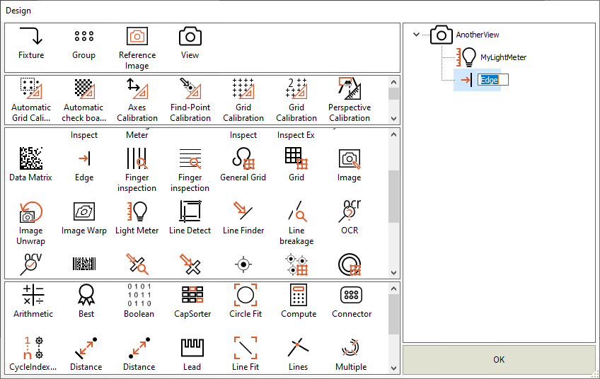

Adding a new Edge tool

It is not necessary to give a name to the created object because, after the import, the name will be changed to the name of the imported object.

Press OK.

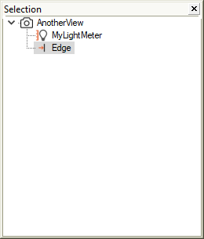

MyRecipe\_2 with new Edge

Select the new object and Import the pvx file:

File>Import>Object…

The File open window opens:

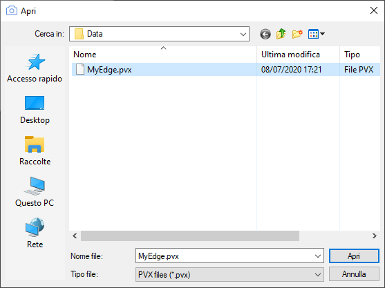

Import MyEdge

Select MyEdge.pvx file.

At this point the Edge object that we had created in MyRecipe\_2 has been replaced with an object identical to MyEdge from MyRecipe\_2 recipe. The values of the settings parameters of the two MyEdge objects in the two recipes are identical.

Sharing objects
---------------

Suppose you want to change a setting value of MyEdge tool of MyRecipe\_2 recipe and have the same change in the MyEdge tool of MyRecipe\_1 recipe.

The two tools can share the same pvx file.

Open MyRecipe\_2 recipe. Select MyEdge tool and open the Settings window.

Open the More... section

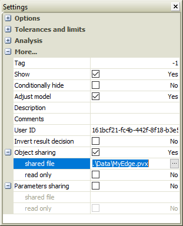

MyEdge settings. Object sharing

Check the Object sharing parameter. The shared file parameter is enabled.

In this field you set the file to be shared. You can proceed in two ways:

 Edit the path of the pvx file to be shared.
 Select the key. The file opening window opens. Select the MyEdge.pvx file.

Since you want to change a value of MyEdge tool and find the change in MyEdge tool of MyRecipe\_1 recipe, we do not check the read only parameter.

We proceed to modify the desired settings value. For example position X tolerance.

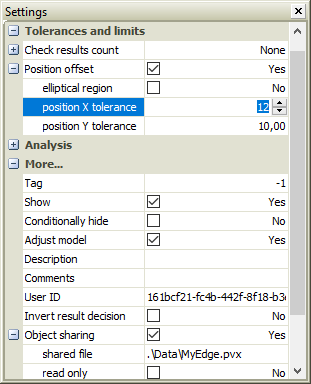

MyEdge settings. Change parameter.

Let's save the recipe.

You will notice that a padlock appears in the recipe selector near the MyEdge tool icon.

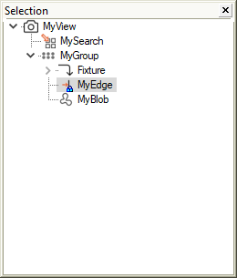

MyEdge with blue padlock

This indicates that that tool is shared on a pvx file.

Open the MyRecipe\_1 recipe. Select the MyEdge tool and open the Settings window.

Open the More... section

Check the Object sharing parameter.

Select the MyEdge.pvx file.

At this point the two recipes share the same MyEdge tool. If you change a tool value in one recipe, the change will also apply to the other.

If you want a single recipe to be able to change a shared tool, check the read only parameter into the other recipes.

If you make a change on a shared tool with the read only check, the change will not be saved in the shared file.

Read Only Mode
--------------

In this mode all shared recipe files will be read only. This mode is activated by registry variable SharedReadOnly.

In the Settings window the read only parameter will always be checked and disabled.

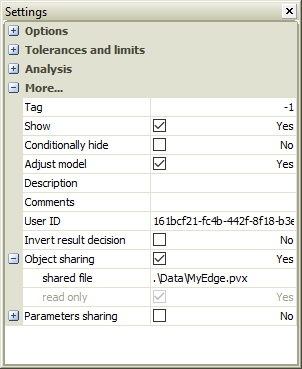

Read only shared file

When saving the recipe, the shared files will not be saved.

However, it may be necessary to edit the shared file. Set the registry parameter ShowSharedFileSave to display the menu item:

	File > Save Shared Files…

The Shared objects window appears:

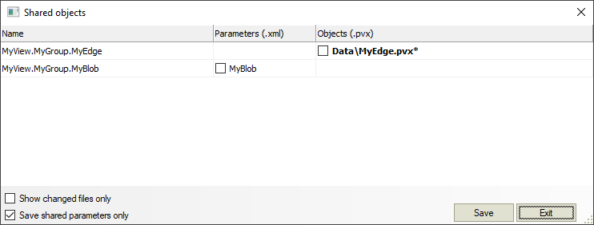

Shared objects window

The shared tools and the corresponding file are listed in this window.

In correspondence of each tool, in the Parameters column (.xml) there is the name of the parameter export file in XML. The name of the PVX object export file is listed in the Objects column (.pvx).

If a shared object has been modified, the corresponding file is shown in bold and marked with a \.

If the Show changed files only flag is checked, only the tools that have undergone a change will be listed.

Check the files you wish to save and press Save.

Import-Export Parameters
------------------------

Settings parameters can be exported and imported by saving them in an XML file

Use the following command:

	File > Export > Object settings…

The save file window opens.

Select the destination folder and edit the file name.

By default, the name of the object being exported is presented as a file name. However, you can choose a name of your choice.

Save.

The exported object is saved in an .xml file. This file can be modified by a common text editor.

To import an xml file use the following command:

	File > Import > Object settings…

In general, the Import-Export procedure on an XML file is the same described for import-export on PVX file.

Please refer to Import-Export Objects for details.

Sharing Parameters
------------------

Just like objects, settings parameters only can be shared too.

Please refer to Sharing objects for details.

Multiple tools parameters
-------------------------

Suppose you have an object than contains other tool and you want to export the settings parameters of that object and all the objects it contains.

Referring to the recipe in Figura 11, let’s export the MyGroup tool. 

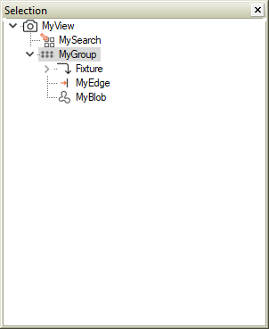

Exporting a Group

You select MyGroup and use the following command:

	File > Export > Objects settings…

An Open folder window will appear.

Select a folder.

If you open the selected folder you will see that four files are created:

 MyView.MyGroup.Fixture.xml
 MyView.MyGroup.MyBlob.xml
 MyView.MyGroup.MyEdge.xml
 MyView.MyGroup.xml

One file for the exported object, and one file for each contained tool.

Configuration
-------------

| Variable | Value | Description |
| --- | --- | --- |
| UserInterface\UI SharedItems\ShowSharedFileSave | Permission Levels | To visualize Shared objects window |
| Options\Settings\SharedReadOnly | | 0 | Disabled | | --- | --- | | 1 | Enabled | | Sets Read Only Mode |
| Paths\SharedData | String | Default path for shared files |

