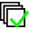
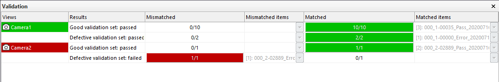
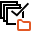
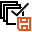
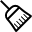

Validation
==========

Overview
--------

Validation is a procedure available in PROINSPECT that permits to verify a recipe on a known set of test images. It means that you have several images you have already chosen and marked as Good or Reject and your recipe must return the expected result decision. Once PROINSPECT has validated every test image with the expected result the recipe gets the validated status. This status is saved into the recipe. Every modification applied to the recipe gets the recipe to the invalidated status: this because every modified tolerance, every modified model etc. could change the response of the recipe to test samples and needs to be verified. Validation is an action available only in Online Setup mode.

Usage
-----

With PROINSPECT running, enter Online Setup.

Show the  Validation window by:

	View > Other Windows > Validation

Validation window

The Validation window reports the current validation status of selected View. The first column is green if the View is validated and the result as expected; it is red if View failed validation; it is white is the View is invalidated.

### Validate

 The command starts the validation process of selected view: PROINSPECT loads all test images, verifies each result decision testing current recipe and updates the proper cell in the Validation report dialog. Validation involves the Good validation set of images where the pass result decision is expected and the Defective validation set of images where the reject result decision is expected. The results if validation is updated in the proper cell and the name of images used to validation as well. Selecting images the inspection results and graphics is shown in Console.

Choosing test images from Image History
---------------------------------------

The most important and critical action before validating is the choosing of test images. This action can be done using the Image History window. Select the Validation Image set. Now all the command buttons will work on images used for validation. 

### Load

The command loads and displays into Image History all the images for validation of selected view.

### Save

The command saves the selected image in the Validation set folder. You can decide which result decision you expect for images you are saving: the save button has a sub-menu that permits to choose the desired decision:

| As Good | Selected images are being marked as Good. Validation will require a good result decision. |
| As Reject | Selected images are being marked as Reject. Validation will require a reject result decision. |
| As Is | Selected images are being marked as the current result decision. Validation will require the same result decision as the current images’ one. |

### Clear

The command removes from the Image History list and/or from the disk (it depends on menu selection) the selected images. This command permits to manage which images to use for validation. Please see Clearing in Image History documentation.

Configuration
-------------

Validation operation is available only for enabled users.

| Variable | Value | Description |
| --- | --- | --- |
| Options\Validation\ValidationEnabled | Permission Levels | Enables validation action |

Validation needs UvpValidationUIS plugIn. Please see Plugins.

