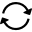

Run Statistics
==============

Overview
--------

You can see a selection of the measures or inspection results that are statistically monitored in the Run panel. You can open the Run panel from menu:

	View > Run

Settings
--------

To select the measures and inspection results you want to see in the Run panel, open Run panel:

	Tools > Recipe Options > Run

 In the Selection panel, select the tool that has the value you want to monitor. In a section with the view name, it will appear a list of items with a checkbox; select the value you want to add to the Run panel.

| <View name\> | |
| --- | --- |
| Statistic name | Show or hide the statistic in the Run panel. (default = No) |

Run Panel
---------

The Run panel can show the Start and Stop buttons.

Below the buttons, the Run panel shows the selected statistics data in a table.

The Run panel shows several values in the table rows according to the columns available. To select the available columns refer to the UserInterface-UI PartIdRun registry keys.

### Additional Operations

From the context menu available in the Run panel you can:

 select the sorting mode as the recipe order
 reset  the panel layout
 reset the statistics values

Configuration
-------------

The Run panel is available adding the UvpPartIdRunUIS plugin in the registry Plugins key.

Please refer to

	Options > PartId

and

	UserInterface > UI PartIdRun

registry keys for configuration options. See [Registry Keys](file:///F:/Univision/Dev/Applicazioni/Univision/ProVision/Docs/Registry keys.pdf) document.

