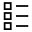
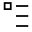

Statistics
==========

Overview
--------

Each measure or inspection result can be statistically monitored. In the Recipe Options window in the Process Statistic panel, you can select the measures and inspection results to be monitored. In the Statistics menu, you can select a set of panels that summarizes these values in tables. They provide a list of the counters of inspected parts, reject ratio, mean value, standard deviation, and value ranges of a given measure. All measurement values are in metrical units.

Usage
-----

To monitor a value, open the Recipe Options window and select the Process Statistic panel 

In the Selection panel, select the tool that has the value you want to monitor. Below the General section, it will appear a list of items with a checkbox; select the value you want to monitor. The selected values will appear in the statistic panels.

### Tool Name

| Statistic name | Enables or disables the statistic. (default = No) |

You can assign a cavity name to an inspected part checking the statistic of a tool that produces a string result, like Code for the OCR tool.

You can assign a defective class to each measure or inspection result that is statistically monitored.

To assign a defective class, open the Recipe Options window and select the Defective Class panel

You will find all the list of all the inspection results that are statistically monitored. You can assign that inspection result to a defective class, selecting one from the list on the left combo box list 

### View Name

| Statistic name | Category name selection (default = None) |

Statistics Panels
-----------------

Different panels show statistics data in a table for:

 Processes, views and tools values
 Cavity and tools values for each cavity
 Defective classes and tools values for each defective class

The statistics panels can show several values in the table rows according to the columns available. To select the available columns refer to the UserInterface-UI PartId registry keys.

### Processes, Views and Tools Values

From the Statistics menu you can open:

 the Process panel with the Process menu      that shows the statistics values of all the processes, as the total number of parts and rejects.
 the Process Statistics panel with the Process Statistics menu      that shows the statistics values of the views and the tools of the selected process in the Process panel, as the total number of parts, rejects, mean and standard deviation.
 the Statistics Report panel with the Statistics Report menu      that shows in a single panel the statistics values of the views when selected a process or the statistics values of the tools when selected a view in the Process panel, as the total number of parts, rejects, mean and standard deviation. This panel combines the two above panels in a single splitter view panel.

### Cavity and Tools Values for each Cavity

From the Statistics menu you can open:

 the Cavity panel with the Cavity menu     that shows the statistics values of all the cavities, as the total number of parts and rejects.
 the Cavity Statistics panel with the Cavity Statistics menu     that shows the statistics values of the views and the tools of the selected cavity in the Cavity panel, as the total number of parts, rejects, mean and standard deviation.

### Defective Classes and Tools Values for each Defective Class

From the Statistics menu you can open:

 the Defective Class panel with the Defective Class menu      that shows the statistics values of all the defective classes, as the total number of parts and rejects.
 the Cavity Statistics panel with the Defective Class Statistics menu     that shows the statistics values of the views and the tools of the selected defective class in the defective class panel, as the total number of parts, rejects, mean and standard deviation.

### Additional Operations

From the Statistics menu or the context menu available in the statistics panels can select:

 sorting mode
 visualization mode
 reset the statistics values
 export the visualized data in a CSV file

Configuration
-------------

The statistics are available adding the UvpPartIdUIS plugin in the registry Plugins key.

Refer to the OptionsPartId and UI PartId registry keys for configuration options.

