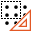

Automatic Grid Calibration
==========================

Overview
--------

Automatic Grid Calibration is a Grid-of-Dots Calibration tool that constructs a transformation object that relates locations in physical space, as defined by a grid-of-dots calibration plate, to locations in an image. You use the tool by acquiring an image in which the features are at known spacing. You supply the tool with the spacing of the features in physical coordinates and the tool constructs a transformation object that maps points between image coordinates and physical coordinates (also known as client coordinates).

Once you have created such a calibration, you can use it to transform information returned by vision tools into precise physical locations.

Settings
--------

| Options | |
| --- | --- |
| Enable | Enables or disables the tool. (default = Yes) |
| Save calibration image | Save image used for calibration. (default = Yes) |
| Line scan correction | Over different lines or the direction of travel (Y, line 1,2,3.. ) only a linear correction is calculated (default = No) Along the line, the selected calibration type is used (e.g. polynomial (3)) |
| Camera distance | Distance between image plane and outer lense plane or aperture of the camera. |
| Perspective correction | Scaling factor that translate points of the Calibration plane to points in the Inspection plane. See Z Calibration. (default = 1.0) |
| Calibration type | Select the calibration type. Polynomial calibrations are more accurate than linear one and compensate better lens distortion, but requires more points. Linear (default) needs at least a 3x3 grid points. Polynomial (3) needs at least a 6x6 grid points. Polynomial (5) needs at least a 8x8 grid points. |
| Pitch X | Pitch between the dots in the X axis. |
| Pitch Y | Pitch between the dots in the Y axis. |
| Origin X | The coordinate X of the origin bars in the grid, if present. |
| Origin Y | The coordinate Y of the origin bars in the grid, if present. |
| Use marker as origin | If the calibration image has origin markers they will be used to set the origin as the intersection of the lines passing from the markers. (default = Yes) |

### More

Click [here](../../Windows/dialog_settings.md) to access the More section description.

Results
-------

| Results | |
| --- | --- |
| Decision | Good/Bad decision of the calibration operation. |
| Scale X | Scaling value in the X axis. |
| Scale Y | Scaling value in the Y axis. |
| Axis X rotation | Rotation value in the X axes. |
| Axis Y rotation | Rotation value in the Y axes. |
| Mean residual | Mean difference between the theoretical point in the grid with the specified pitch and the calibrated point where the dot center is found. |
| Maximum residual | Maximum difference between the theoretical point in the grid with the specified pitch and the calibrated point where the dot center is found. |

