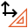

Axis Calibration
================

Overview
--------

This type of calibration allows to define position and orientation of the calibrated axes on the image. Scaling factor on X and Y can be defined also.

Settings
--------

| Options | |
| --- | --- |
| Enable | Enables or disables the tool. (default = Yes) |
| Save calibration image | Save image used for calibration. (default = Yes) |
| Camera distance | Used for Z-calibration: distance from the image plane to the outer lense plane or aperture of the camera (default = 0.0) |
| Line scan correction | Over different lines or the direction of travel (Y, line 1,2,3.. ) only a linear correction is calculated (default = No) Along the line, the selected calibration type is used (e.g. polynomial (3)) |
| Perspective correction | Deprecated, now use Z-calibration. Moves points relative to the origin according to this linear factor. (default = 1.0) |
| X units | Value corresponding to one unit in the X axis. (default = 10.0) |
| Y units | Value corresponding to one unit the Y axis. (default = 10.0 |
| Origin X | The coordinate X of the origin bars in the grid, if present. |
| Origin Y | The coordinate Y of the origin bars in the grid, if present. |

### More

Click [here](../../Windows/dialog_settings.md) to access the More section description.

Results
-------

| Results | |
| --- | --- |
| Decision | Good/Bad decision of the calibration operation. |
| Scale X | Scaling value in the X axis. |
| Scale Y | Scaling value in the Y axis. |
| Axis X rotation | Rotation value in the X axes. |
| Axis Y rotation | Rotation value in the Y axes. |
| Mean residual | Mean difference between the theoretical point in the grid with the specified pitch and the calibrated point where the dot center is found. |
| Maximum residual | Maximum difference between the theoretical point in the grid with the specified pitch and the calibrated point where the dot center is found. |

