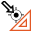

Find Point Calibration
======================

Overview
--------

Find-point calibration uses a small number of points whose coordinates are known in metrical external reference system. The actual number of points is defined in the tool settings. To find these points a search tool like PatMax or Search has to be added (Drag it on the Find-Point-Calibration in the design window). Select the search area for one point and train the search tool.

The World coordinates of each of the calibration point have to be entered in the tool settings. The images coordinates are measured by dragging a set of cursors over the calibration targets (zoom out, if not visible). Select menu Vision Calibration.., Calibration.

During calibration the system shows a set of cursors, one for each calibration point. The cursors can be dragged over the targets, as accurately as possible. The system shows the camera coordinates in the Geometry page.

Settings
--------

| Options | |
| --- | --- |
| Enable | Enables or disables the tool. (default = Yes) |
| Execute on run | Enables calibration, when the recipe is executed. Uses patterns, which are found by the connected search tool. Configuration like described in the introduction section above.(default = No) |
| Save calibration image | Save image used for calibration. (default = Yes) |
| Camera distance | Used for Z-calibration: distance from the image plane to the outer lense plane or aperture of the camera (defaul = 0.0) |
| Line scan correction | Over different lines or the direction of travel (Y, line 1,2,3.. ) only a linear correction is calculated (default = No) Along the line, the selected calibration type is used (e.g. polynomial (3)) |
| Perspective correction | Deprecated, now use Z-calibration. Moves points relative to the origin according to this linear factor. (default = 1.0) |
| Number of points | Number of point used to calibrate. The minimum number of point depends of the calibration type selected. |
| Calibration type | Select the calibration type. Polynomial calibrations are more accurate than linear one and compensate better lens distortion, but requires more points.    <ud><li> Linear   needs at least 3 points.(default) </li><li> Polynomial (2)   needs at least 6 points. </li><li> Polynomial (3)   needs at least 10 points. </li><li> Polynomial (4)   needs at least 15 points. </li><li> Polynomial (5)   needs at least 21 points. </li></ud>

| Points | |
| --- | --- |
| Point index | Select the point index to set Position X and Position Y coordinates. (default = 1; min = 1; max = Number of points) |
| Position X | World point coordinate X. (default = 0.00) |
| Position Y | World point coordinate Y. (default = 0.00) |

### More

Click [here](../../Windows/dialog_settings.md) to access the More section description.

Results
-------

| Results | |
| --- | --- |
| Decision | Good/Bad decision of the calibration operation. |
| Scale X | Scaling value in the X axis. |
| Scale Y | Scaling value in the Y axis. |
| Axis X rotation | Rotation value in the X axes. |
| Axis Y rotation | Rotation value in the Y axes. |
| Mean residual | Mean difference between the theoretical point in the grid with the specified pitch and the calibrated point where the dot center is found. |
| Maximum residual | Maximum difference between the theoretical point in the grid with the specified pitch and the calibrated point where the dot center is found. |

