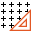
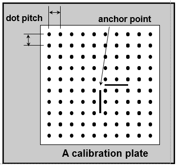

Grid Calibration
================

Overview
--------

Grid calibration tool (like the automatic grid calibration tool) creates the transformation which relates locations in image space to locations in physical space.

Grid calibration is done by showing a known grid of dots to the system. The system measures the position of each dot and computes the calibration map. A significant advantage of this type of calibration is that the large number of dots enables a better error correction function. With this solution it is possible to significantly reduce errors such as the geometrical optical distortion.

How it works
------------

Calibration requires an image of a calibration plate that provides known physical references:

 Must consist of a two-dimensional grid of dots
 Dost must be circular
 The dot diameter must be no greater than one-half of the smaller of the x-axis or y-axis dot pitch
 The diameter of a dot must be at least ten pixels
 The edge of the calibration plate should be outside the acquired image

 Calibration plate

Calibration tool creates a transformation in which points in the image coordinate system maps to points of the client coordinate system. You can optionally specify a fixed point as the origin point for the client coordinate system. 

Calibration determines the precise location of each dot on the calibration plate.  The tool then computes the transformation based on the specified x-axis and y-axis dot pitch.

Internal Calibration tool operations:

- Segments the input image of the calibration plate into foreground and background pixels. A soft threshold is used to avoid spatial quantization errors.See Soft threshold
- Determines the centers of mass of each dot.
- If the Calibration tool detects the presence of two rectangles, it computes and stores the location of the anchor point.
- Computes the linear or non-linear transformation — your choice — that best translates physical space into image space.
- Computes the residual error for each point on the grid.  Residual error is caused by nonlinear distortion present in the optical system.

After constructing the transformation object, a Calibration tool measures the distance between pixel locations in the image and corresponding locations predicted by the transformation object. If the tool constructed a linear mapping between image and client coordinates, the residual error measures the uncorrected error remaining in your application, both linear and nonlinear. If the tool maps image and client coordinates by using a nonlinear polynomial transformation, the residual error measures how much of the nonlinear distortion is not corrected. If you need higher levels of mapping accuracy you may need to increase the order of the polynomial mapping.

Settings
--------

| Options | |
| --- | --- |
| Enable | Enables or disables the tool. (default = Yes) |
| Save calibration image | Save image used for calibration. (default = Yes) |
| Line scan correction | Over different lines or the direction of travel (Y, line 1,2,3.. ) only a linear correction is calculated (default = No) Along the line, the selected calibration type is used (e.g. polynomial (3)) |
| Camera distance | Distance between image plane and outer lense plane or aperture of the camera. |
| Perspective correction | Scaling factor that translate points of the Calibration plane to points in the Inspection plane. See Z Calibration. (default = 1.0) |
| Calibration type | Select the calibration type. Polynomial calibrations are more accurate than linear one and compensate better lens distortion, but requires more points. Linear (default) needs at least a 3x3 grid points. Polynomial (3) needs at least a 6x6 grid points. Polynomial (5) needs at least a 8x8 grid points. |
| Pitch X | Pitch between the dots in the X axis. |
| Pitch Y | Pitch between the dots in the Y axis. |
| Origin X | The coordinate X of the origin bars in the grid, if present. |
| Origin Y | The coordinate Y of the origin bars in the grid, if present. |
| Rows | Grid rows. |
| Columns | Grid columns. |

### More

Click [here](../../Windows/dialog_settings.md) to access the More section description.

Results
-------

| Results | |
| --- | --- |
| Decision | Good/Bad decision of the calibration operation. |
| Scale X | Scaling value in the X axis. |
| Scale Y | Scaling value in the Y axis. |
| Axis X rotation | Rotation value in the X axes. |
| Axis Y rotation | Rotation value in the Y axes. |
| Mean residual | Mean difference between the theoretical point in the grid with the specified pitch and the calibrated point where the dot center is found. |
| Maximum residual | Maximum difference between the theoretical point in the grid with the specified pitch and the calibrated point where the dot center is found. |

