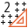
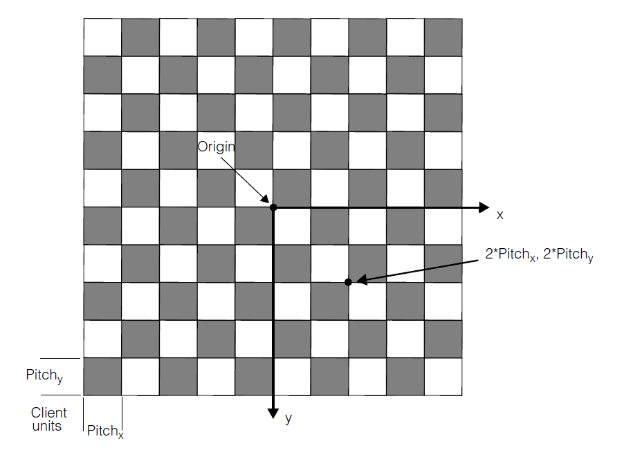

Grid Calibration 2
==================

Overview
--------

Grid calibration 2 tool creates the transformation which relates locations in image space to locations in physical space.

The tool creates a nonlinear transform that models radial optical distortion and perspective distortion.The

tool has two components: feature extraction and calibration. The feature extractor is specifically designed to extract features in an image of a checkerboard calibration plate. The calibration component can create a calibration transform using the output of the feature extractor.

How it works
------------

Using images of a calibration plate taken from your application is the most common way to create a feature correspondence transform. It is empirical in that it measures the actual environment where your application runs.

The Tools locates vertices in the image, points where the corners of four checkerboard squares meet. The points found are called vertex features and produces a vector of point pairs where each point pair specifies the location of the source image vertex feature in client coordinates, and the feature location in physical units relative to the checkerboard origin.

Calibration Plate Specifications
--------------------------------

1. The calibration plate tiles should be perfectly square. However, the feature extractor that works on the calibration plate image will tolerate tile aspect ratios of from 0.8 to 1.2.

2. The dimensions of the black tiles and the white tiles must be equal.

3. Choose the calibration plate surface material to minimize reflections and non-uniformities. The surface material choice will depend on the camera optics and the surface illumination.

4. Including a registration fiducial in your calibration plate is optional. If you include a fiducial, only use one that conforms to the pattern and dimensions.

5. Calibration plate dimension tolerances must be carefully controlled during the manufacturing process. This is usually more difficult when you make smaller calibration plates. Measure your completed calibration plate carefully to ensure the accuracy of the vertices.

Settings
--------

| Options | |
| --- | --- |
| Enable | Enables or disables the tool. (default = Yes) |
| Save calibration image | Save image used for calibration. (default = Yes) |
| Camera distance | distance from the image plane to the outer lense plane or aperture of the camera |
| Distortion model | Identifies the lens distortion models used in calibration<ud> <li>Modified SineLaw Projection (default)  </li>  <li>SineTanLaw Projection  </li>  <li>3Rad2Tang PolyDistortion  </li>  <li>1Param Radial  </li>  <li>No Distortion  </li>  <li>3Param Radial  </li>  <li>Line scan  </li> </ud> |
| Pitch X | Pitch between the dots in the X axis. |
| Pitch Y | Pitch between the dots in the Y axis. |
| Origin X | The coordinate X of the origin bars in the grid, if present. |
| Origin Y | The coordinate Y of the origin bars in the grid, if present. |
| Rows | Grid rows. |
| Columns | Grid columns. |
| Origin id | The index of vertex used as origin |
| Corrections | Enables an external corrections to vertices . |

### More

Click [here](../../Windows/dialog_settings.md) to access the More section description.

Results
-------

| Results | |
| --- | --- |
| Decision | Good/Bad decision of the calibration operation |
| Scale X | Scaling value in the X axis. |
| Scale Y | Scaling value in the Y axis. |
| Axis X rotation | Rotation value in the X axes. |
| Axis Y rotation | Rotation value in the Y axes. |
| Mean residual | Mean difference between the theoretical point in the grid with the specified pitch and the calibrated point where the dot center is found. |
| Maximum residual | Maximum difference between the theoretical point in the grid with the specified pitch and the calibrated point where the dot center is found. |

