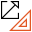

Raw Calibration
===============

Overview
--------

Raw Calibration allows to directly insert roto-translation transform parameters to be applied to the reference coordinate system.

Settings
--------

| Options | |
| --- | --- |
| Enable | Enables or disables the tool. (default = Yes) |
| Save calibration image | Save image used for calibration. (default = Yes) |
| Camera distance | Used for Z-calibration: distance from the image plane to the outer lense plane or aperture of the camera (defaul = 0.0) |
| E11 | Upper left value of the transform matrix. (default = 1.0) |
| E12 | Upper right value of the transform matrix. (default = 0.0) |
| E21 | Lower left value of the transform matrix. (default = 0.0) |
| E22 | Lower right value of the transform matrix. (default = 1.0) |
| Tx | X translation value. (default = 0.0) |
| Ty | Y translation value. (default = 0.0) |

### More

Click [here](../../Windows/dialog_settings.md) to access the More section description.

Results
-------

| Results | |
| --- | --- |
| Decision | Good/Bad decision of the calibration operation. |
| Scale X | Scaling value in the X axis. |
| Scale Y | Scaling value in the Y axis. |
| Axis X rotation | Rotation value in the X axes. |
| Axis Y rotation | Rotation value in the Y axes. |
| Mean residual | Mean difference between the theoretical point in the grid with the specified pitch and the calibrated point where the dot center is found. |
| Maximum residual | Maximum difference between the theoretical point in the grid with the specified pitch and the calibrated point where the dot center is found. |

