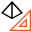
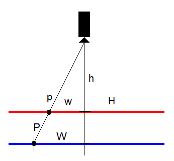

Z Calibration
=============

Overview
--------

It may happen that the calibration is carried out on a different plane from that actually used for the inspection. In this case, the transformation of calibration must be corrected in order to compensate for the offset of the inspection plane from the calibration plane.

Assuming that the two planes are coplanar, the measures on the inspection plane are proportional to the measures in calibration plane. The scale factor of this transformation must be supplied by the user or calculated providing the distance of the center of the two planes from the camera.

Z Calibration

Assume the situation represented in the figure. The red plane is the Calibration plane and the blue plane is the Inspection plane. Measure W in the Inspection plane is related to measure w in the Calibration plane by the following transform:

~~~
W = w \ H /h

where

H distance of the Inspection plane from camera
h distance of the Calibration plane from the camera
w distance of a point p in the Calibration plane from the axis passing through the center of the camera
W distance of point P, projection of point p on the inspection plane, from the axis through the center of the camera
~~~

Z Calibration tool is not a standalone tool but it must be used in pair with another calibration tool. To use Z Calibration tool, at design time, drag it onto the other calibration tool.

Settings
--------

| Options | |
| --- | --- |
| Enable | Enables or disables the tool. (default = Yes) |
| Save calibration image | Save image used for calibration. (default = Yes) |
| Line scan correction | Over different lines or the direction of travel (Y, line 1,2,3.. ) only a linear correction is calculated. (default = No) Along the line, the selected calibration type is used (e.g. polynomial (3)). |
| Calibration plane Z offset | Distance between Calibration plane and Inspection plane. (default = 0.0) |

### More

Click [here](../../Windows/dialog_settings.md) to access the More section description.

Results
-------

| Results | |
| --- | --- |
| Decision | Good/Bad decision of the calibration operation. |
| Scale X | Scaling value in the X axis. |
| Scale Y | Scaling value in the Y axis. |
| Axis X rotation | Rotation value in the X axes. |
| Axis Y rotation | Rotation value in the Y axes. |
| Mean residual | Mean difference between the theoretical point in the grid with the specified pitch and the calibrated point where the dot center is found. |
| Maximum residual | Maximum difference between the theoretical point in the grid with the specified pitch and the calibrated point where the dot center is found. |

