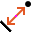

Distance Point to Line
======================

Overview
--------

The Distance Point to Line tool computes the orthogonal distance between an input line tool and an input point tool.

Settings
--------

| Options | |
| --- | --- |
| Enable | Enables or disables the tool. (default = Yes) |

| Tolerances and limits | |
| --- | --- |
| Position offset | Enables or disables position tolerance limits. Specification position is the trained one and it is defined as the middle point between point and its projection on the line.<blockquote> **Elliptical region** Use an elliptical region area instead of a rectangular one. Position XY tolerances are the semi-axes the ellipse or the semi-size of rectangle.   **Position X tolerance** Position tolerance in the X axes. (default = 10)   **Position Y tolerance** Position tolerance in the Y axes. (default = 10)  </blockquote> |
| Angle offset | Enables or disables orientation tolerance limits. Specification orientation is the trained one and it is defined as the orientation of segment between the point and its projection on the line.<blockquote> **Angle+** Tolerance for positive angles. (default = 360; min = 0; max = 360)   **Angle-** Tolerance for negative angles. (default = 360; min = 0; max = 360)  </blockquote> |
| Signed distance | Enables or disables sign on distance result. A signed value tells about the point's position relative to the line (above-under). |
| Distance | Enables or disables the distance tolerance limits.<blockquote> **Specification** Expected distance value. (default = 100)   **Tolerance+** Positive tolerance of the measured distance. (default = 10)   **Tolerance-** Negative tolerance of the measured distance. (default = 10)  </blockquote> |
| Distance (md) | Enables or disables the minor defect classification of the distance. Minor defect is a classification of results that are outside of a smaller range of the active tolerance limits.<blockquote> **Tolerance+ (%)** Percentage of positive tolerance of the measured distance. (default = 0)   **Tolerance- (%)** Percentage of negative tolerance of the measured distance. (default = 0)  </blockquote> |

### More

Click More... to access the More section description.

Results
-------

| Results | |
| --- | --- |
| Decision | Pass/Fail decision of a tool, including multiple results if any. |
| Processing time | Tool processing time in msec. |
| Position X | X position coordinates. The position is referred to the origin point of the tool.<blockquote> **Offset X** Offset between the tool's specification X position and tool's result X position (specification reference system).  </blockquote> |
| Position Y | Y position coordinates. The position is referred to the origin point of the tool.<blockquote> **Offset Y** Offset between the tool's specification Y position and tool's result Y position (specification reference system).  </blockquote> |
| Offset length | Distance between specification and result points. |
| Angle | Angle of the tool.<blockquote> **Angle offset** Offset between the tool's specification orientation angle and tool's result orientation angle.  </blockquote> |
| Distance | Measured distance.<blockquote> **Difference with specification** Difference between the specification and result distance.  </blockquote> |

