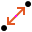

Distance Point to Point
=======================

Overview
--------

The Distance Point to Point tool computes the distance between two input tools.

Settings
--------

| Options | |
| --- | --- |
| Enable | Enables or disables the tool. (default = Yes) |

| Tolerances and limits | |
| --- | --- |
| Position offset | Enables or disables position tolerance limits. Specification position is the trained one and it is defined as middle point between the two tool points.<blockquote> **Elliptical Region** Use an elliptical region area instead of a rectangular one. Position XY tolerances are the semi-axes the ellipse or the semi-size of rectangle.   **Position X tolerance** Position tolerance in the X axes. (default = 10)   **Position Y tolerance** Position tolerance in the Y axes. (default = 10)  </blockquote> |
| Angle offset | Enables or disables orientation tolerance limits. Specification orientation is the trained one and it is defined as the orientation of the segment between the two points. <blockquote> **Angle+** Tolerance for positive angles. (default = 360; min = 0; max = 360)   **Angle-** Tolerance for negative angles. (default = 360; min = 0; max = 360)  </blockquote> |
| Use first tool angle | Distance between the two points is projected on the first tool's direction (angle). (default = No) |
| Distance | Enables or disables the distance tolerance limits. SpecificationExpected distance value. (default = 100)  Tolerance+Positive tolerance of the measured distance. (default = 10)  Tolerance-Negative tolerance of the measured distance. (default = 10) |
| Delta X | X component of measured distance (calibrated reference system). (default = No)<blockquote> **Specification** Expected value. (default = 10)   **Tolerance+** Positive tolerance of the measured delta X. (default = 10)   **Tolerance-** Negative tolerance of the measured delta X. (default = 10)  </blockquote> |
| Delta Y | Y component of measured distance (calibrated reference system). (default = No)<blockquote> **Specification** Expected value. (default = 10)   **Tolerance+** Positive tolerance of the measured delta Y. (default = 10)   **Tolerance-** Negative tolerance of the measured delta Y. (default = 10)  </blockquote> |
| Distance (md) | Enables or disables the minor defect classification of the distance. Minor defect is a classification of results that are outside of a smaller range of the active tolerance limits. <blockquote> **Tolerance+ (%)** Percentage of positive tolerance of the measured distance. (default = 0)   **Tolerance- (%)** Percentage of negative tolerance of the measured distance. (default = 0)  </blockquote> |
| Difference of angles | Angle distance: difference (<180°) between the input tools' angles. (default = No)<blockquote> **Specification** Expected difference value. (default = 0)   **Tolerance+** Positive tolerance of the measured difference. (default = 0)   **Tolerance-** Negative tolerance of the measured difference. (default = 0)  </blockquote> |

### More

Click More... to access the More section description.

Results
-------

| Results | |
| --- | --- |
| Decision | Pass/Fail decision of a tool, including multiple results if any. |
| Processing time | Tool processing time in msec. |
| Position X | X position coordinates. The position is referred to the origin point of the tool.<blockquote> **Offset X** Offset between the tool's specification X position and tool's result X position (specification reference system).  </blockquote> |
| Position Y | Y position coordinates. The position is referred to the origin point of the tool.<blockquote> **Offset Y** Offset between the tool's specification Y position and tool's result Y position (specification reference system).  </blockquote> |
| Offset length | Distance between specification and result points. |
| Angle | Angle of the tool.<blockquote> **Angle offset** Offset between the tool's specification orientation angle and tool's result orientation angle.  </blockquote> |
| Distance | Measured distance.<blockquote> **Difference with specification** Difference between the specification and result distance.  </blockquote> |
| Delta X | Measured delta X.<blockquote> **Difference with specification** Difference between the specification and result X component.  </blockquote> |
| Delta Y | Measured delta Y.<blockquote> **Difference with specification** Difference between the specification and result Y component.  </blockquote> |
| Difference of angles | Difference between the specification and result orientations. |

