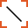

Line Fit
========

Overview
--------

The Line Fit tool is a Geometric tool. It lets you fit a line to a set of points by minimizing the sum of the squares of the distances between all the points and the fit line. The Line Fit tool generates as a result a segment line over the fit line. Extremes of this segment are the closest points on the fit line of the first and last points of the point set provided.

The result of the Line Fit tool is the centre position and the orientation of the segment that limits the line. 

Settings
--------

| Options | |
| --- | --- |
| Enable | Enables or disables the tool. (default = Yes) |

| Tolerances and limits | |
| --- | --- |
| Position offset | Enables or disables position tolerance. Specification position is the middle point between the two extremes of the segment on the fit line.<blockquote> **Elliptical region** Use an elliptical region area instead of a rectangular one. Position XY tolerances are the semi-axes the ellipse or the semi-size of rectangle   **Position X tolerance** Position tolerance in the X axes. (default = 10)   **Position Y tolerance** Position tolerance in the Y axes. (default = 10)  </blockquote> |
| Angle offset | Enables or disables orientation tolerance limits. Specification orientation is the angle computed starting from the specification contained tools' points.<blockquote> **Angle+** Tolerance for positive angles. (default = 360; min = 0; max = 360)   **Angle-** Tolerance for negative angles. (default = 360; min = 0; max = 360)  </blockquote> |
| Number of missing points | Enables or disables missing point condition.<blockquote> **Max. number of missing points** How many point can be missing without set fail condition. (default = 0)  </blockquote> |
| Ignore points | The number of points to discard to have the best fit. The fitting algorithm ignores the points with the worst distance between the tool result point and the fit line.Then it recalculates the fit line.<blockquote> **Residual limit for ignoring** Residual limit for ignoring The minimum value to consider a point as a candidate for decimation. (default = 0).  </blockquote> |
| Best points | The number of points, with the best score, to use for fitting. |
| Positive worst error | Enables positive worst point error condition. If the point with the worst error has a residual bigger than the worst point error limit, the condition fails. Positive sign when the normal to the line passing from this point generates with the oriented line an angle of +90°. Worst point error limitMax accepted distance between any edge and the fitted line. (default = 0) |
| Negative worst error | Enables negative worst point error condition. If the point with the worst error has a residual bigger than the worst point error limit, the condition fails. Negative sign when the normal to the line passing from this point generates the oriented line an angle of -90°.<blockquote> **Worst point error limit** Max accepted distance between any edge and the fitted line. (default = 0)  </blockquote> |
| Mean error | Enables or disables mean error condition.<blockquote> **Error limit** Max accepted mean error distance. (default = 0)  </blockquote> |
| Local errors | Enable or disable the local error condition. Local errors are the errors of points relative to the errors of closest points. The residual error of each point is compared with neighbors (local) to evaluate if they are real defects. If this comparison is bigger than a threshold, the condition fails.<blockquote> **Positive local error** Maximum accepted positive local error . (default = 0)   **Negative local error** Maximum accepted negative local error. (default = 0)   **Filter for local errors** Number of neighbors points used for comparison. (default = 2)   **Filter latency** Parameter that identifies neighbors: distance in pixels from current point to define neighbors for comparison. (default = 0)  </blockquote> |

### More

Click More... to access the More section description.

Results
-------

| Results | |
| --- | --- |
| Decision | Pass/Fail decision of the tool. |
| Processing time | Tool processing time in msec. |
| Position X | X position coordinates. The position is referred to the origin point of the tool.<blockquote> **Offset X** Offset between the tool's specification X position and tool's result X position (specification reference system).  </blockquote> |
| Position Y | Y position coordinates. The position is referred to the origin point of the tool.<blockquote> **Offset Y** Offset between the tool's specification Y position and tool's result Y position (specification reference system).  </blockquote> |
| Offset length | Distance between specification and result points. |
| Angle | Angle of the tool.<blockquote> **Angle offset** Offset between the tool's specification orientation angle and tool's result orientation angle.  </blockquote> |
| Mean error | Mean distance between the result points and the fitted line. |
| Worst error+ (point) | Worst positive distance between the result points and the fitted line. The number between () indicates the point index the value refers to |
| Worst error- (point) | Worst negative distance between the result points and the fitted line. The number between () indicates the point index the value refers to |
| Max local error+ (point) | Maximum positive local error. The number between () indicates the point index the value refers to. |
| Max local error- (point) | Maximum negative local error. The number between () indicates the point index the value refers to. |
| Number of missing points | Number of result points not found |

