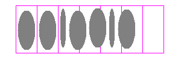
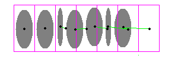

Grids
=====

Overview
--------

Grid tools are a container of tools: at runtime, every contained tool is positioned at a specified position and run it with all the same settings.

How it works
------------

Drag desired tools into the Grid tool. Define how many ROIs you want your tools need to be run. Train each master tool.

This chapter discusses the following

Grid Local Tuning
-----------------

Local tuning is an operation of adjustment of the expected position of a tool of one cell with respect of the position result of the preceding one.

Figure shows a situation in which some piled pieces are wanted to be inspected. Because they are expected to be of a given size an that they are disposed approached one another, a grid is used.

In the example happens that there are some defective pieces that shift the following pieces from their expected position. It end out that the pieces are searched in a position they are not anymore and the tool would result in a fault, even if the corresponding piece is good.

By checking local tuning, each cell tool position is pre-aligned with the offset resulting from the run of the tool in the preceding position. This way, bad pieces are detected, but their presence does not affect the inspection of succeeding pieces.

Figure above shows that last piece, without local tuning, would be searched in an area that actually is empty.

Figure above shows offset that are applied to cell tool position before inspecting them.

 

