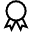

Best
====

Overview
--------

Best tool evaluates the best result between the results of the defined tools. The best means according to the selected criterion. For tools that provide more than one result, only the first one is used for criterion decision

Settings
--------

| Options | |
| --- | --- |
| Enable | Enables or disables the tool. (default = Yes) |

| Tolerances and limits | |
| --- | --- |
| Position offset | Enables or disables position tolerance limits. Specification position is the trained one and it is defined as middle point between the two tool points.<blockquote> **Elliptical Region** Use an elliptical region area instead of a rectangular one. Position XY tolerances are the semi-axes the ellipse or the semi-size of rectangle.   **Position X tolerance** Position tolerance in the X axes. (default = 10)   **Position Y tolerance** Position tolerance in the Y axes. (default = 10)  </blockquote> |
| Angle offset | Enables or disables orientation tolerance limits. Specification orientation is the trained one and it is defined as the orientation of the segment between the two points. <blockquote> **Angle+** Tolerance for positive angles. (default = 360; min = 0; max = 360)   **Angle-** Tolerance for negative angles. (default = 360; min = 0; max = 360)  </blockquote> |
| Size | Enables or disables the distance tolerance limits.<blockquote> **Specification** Expected size value. (default = 100)   **Tolerance+** Positive tolerance of the measured size. (default = 10)   **Tolerance-** Negative tolerance of the measured size. (default = 10)  </blockquote> |
| Value | Enables or disables the value tolerance limit.<blockquote> **Specification** Expected value. (default = 100)   **Tolerance+** Positive tolerance of the measured value. (default = 10)   **Tolerance-** Negative tolerance of the measured value. (default = 10)  </blockquote> |

| Analysis | |
| --- | --- |
| Criteria | Criterion of evaluation.<ud> <li>Major (default) Major is the best.</li>  <li>Minor Minor is the best.</li> </ud> |
| Criteria value | Tools results used to select the best value.<ud> <li>X (default) X position coordinates.</li>  <li>Y Y position coordinates.</li>  <li>Angle Orientation.</li>  <li>Measurement Measure.</li>  <li>Value Value.</li> </ud> |
| Run mode | Criterion of evaluation.<ud> <li>Normal (default) Calculates the best result between all the defined tools.</li>  <li>Stop at 1st pass Best result is the one related to the first tool with pass decision. Other tools are not run and evaluated.</li> </ud> |

### More

Click [here](../../Windows/dialog_settings.md) to access the More section description.

Results
-------

| Results | |
| --- | --- |
| Decision | Pass/Fail decision of the tool. |
| Processing time | Tool processing time in msec. |
| Position X | X position coordinates. The position is referred to the origin point of the tool.<blockquote> **Offset X** Offset between the specification X position and result X position (specification reference system).  </blockquote> |
| Position Y | Y position coordinates. The position is referred to the origin point of the tool.<blockquote> **Offset Y** Offset between the specification Y position and result Y position (specification reference system).  </blockquote> |
| Offset length | Distance between specification and result points. |
| Angle | Angle of the tool.<blockquote> **Angle offset** Angle offset from the trained tool angle position.  </blockquote> |
| Size | Best's Size.<blockquote> **Difference with specification** Difference between result and specification size.  </blockquote> |
| Value | Best's Value.<blockquote> **Difference with specification** Difference between result and specification value.  </blockquote> |

Configuration

This tool is included into the library UvfStdTools.

