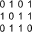

Boolean
=======

Overview
--------

Boolean tool is a tool that can either own other tools or performs operations on linked tools. This tool performs logical Boolean operations on the results of the contained tools. A Pass result is associated with 1 (or TRUE); a Fail result is associated with 0 (or FALSE).

Settings
--------

| Options | |
| --- | --- |
| Enable | Enables or disables the tool. (default = Yes) |

| Analysis | |
| --- | --- |
| Boolean operation | Boolean operations selection.<ud> <li>AND Logical AND. (Default)</li>  <li>OR Logical OR.</li>  <li>NAND Logical NAND.</li>  <li>NOR Logical NOR.</li>  <li>XOR Logical XOR.</li>  <li>NXOR Logical NXOR.</li>  <li>NOT Logical NOT.</li> </ud> |

### More

Click [here](../../Windows/dialog_settings.md) to access the More section description.

Results
-------

| Results | |
| --- | --- |
| Decision | Pass/Fail decision of the tool. |
| Processing time | Tool processing time in msec. |

Configuration
-------------

This tool is included into the library UvfStdTools.

