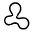

Blob Inspection
===============

Overview
--------

Blob inspection is a tool that checks brightness uniformity in a region of interest: it detects and measures the areas of any shape (blobs) corresponding to non uniformities. A point is considered to belong to a blob according to conditions such as its brightness or its contrast with respect to its neighborhood. Blob Inspection can detect bright regions, dark regions or grey regions (regions that are brighter than a threshold thr1 and darker than thr2.

Settings
--------

| Options | |
| --- | --- |
| Enable | Enable or disable the tool. (default = Yes) |
| Geometry | Defines tool's region shape.<ud> <li>Circle Circular shape.</li>  <li>General rectangle (default) Rectangular shape.</li>  <li>Annulus Annulus shape.</li>  <li>General polygon General polygon shape.</li>  <li>CAD (Closed ROI) Closed shape imported from a CAD file.</li> </ud> |
| CAD file [1](#uno) | CAD file name. |
| Layer nameDisplayed only when CAD (Closed ROI) geometry is selected. | Lists the layer names defined in the selected CAD file.<blockquote> **Connection tolerance** Distance between close segment points to be considered as connected. (default = 0)  </blockquote> |
| User calibrationDisplayed only when CAD (Closed ROI) geometry is selected. | If checked user defines parameters for CAD shapes calibration. Otherwise tool calibration is used.<blockquote> **axes X rotation** Rotation in the X axes to be applied to the CAD shape. (default = 0; min = -360; max = 360)   **axes Y rotation** Rotation in the Y axes to be applied to the CAD shape. (default = 0; min = -360; max = 360)   **scale X** Scale variation in the X axes to be applied to the CAD shape. You express scale value as a multiplier value. (default = 1)   **scale Y** Scale variation in the Y axes to be applied to the CAD shape. You express scale value as a multiplier value. (default = 1)  </blockquote> |

| Tolerances and limits | |
| --- | --- |
| Min. Area | Blobs smaller than value are ignored for the result evaluation. |
| Blobs number | Enables or disables Blob number limit. <blockquote> **max. Blob number** Maximum number of blobs that can be found. (default = 0)   **minor defects** Enable this condition for minor defects evaluation. (default = No)  </blockquote> |
| Single Blob area | Enables or disables Single Blob area limit.<blockquote> **single Blob area limit** Maximum area for a single blob. (default = 100)   **minor defects** Enable this condition for minor defects evaluation. (default = No)  </blockquote> |
| Sum of all Blobs area | Enables or disables Sum of all Blobs area.<blockquote> **sum of all Blobs area limit** Maximum value for the sum of the blobs' areas. (default = 500)   **minor defects** Enable this condition for minor defects evaluation.(default = No)  </blockquote> |
| Sum of all Blobs area (%) | Enables or disables Sum of all Blobs area as percentage of ROI.<blockquote> **sum of all Blobs area limit (%)** Maximum value (%) for the sum of the blobs' areas. (default = 0)   **minor defects** Enable this condition for minor defects evaluation. (default = No)  </blockquote> |

[1](#references)

And you can link to it like this:

[Go to important point](#another-unique-anchor)

| Analysis | |
| --- | --- |
| Threshold mode | Sets threshold’s way of working<ud> <li>Standard Threshold is the gray level value. (default = 128 min = 0 max = 255) </li>  <li>Percentage of full range Threshold is the value calculated as percentage of the full histogram of the tool's ROI image.</li>  <li>Percentage of range [min - 255] Threshold is calculated as percentage of the part [min - 255] of the histogram .</li>  <li>Percentage of range [0 - max] Threshold is calculated as percentage of the part [0 - max] of the histogram.</li>  <li>Percentage of range [min - max] Threshold is calculated as percentage of the part [min - max] of the histogram .</li> </ud> |
| Adaptive sensitivity | Threshold is a value that follows the variation of histogram mean between training and inspected ROI image. Threshold is shifted according. (default = no) |
| Automatic | Threshold is automatically calculated as the optimum value that divides the histogram in two groups such that each group has the minimum with-in group variance. For any given threshold, the within-group variance is defined by the weighted sum of the variances of the two groups.(default = no) |
| First threshold | Mode standard   If polarity is Dark objects, pixels with grey-scale value below the threshold are considered as foreground, while all pixels with value above the threshold are assigned as background pixels. The opposite for White objects. (default = 0 | min = 0 | max = 255)    Mode percentage   Same, but with values are expressed as percentage. (default = 50 | min = 0 | max = 100) |
| Second threshold [^1] | Mode standard   If polarity is Dark objects, pixels with grey-scale value below the threshold are considered as foreground, while all pixels with value above the threshold are assigned as background pixels. The opposite for White objects. (default = 0 | min = 0 | max = 255) |
| SoftnessDisplayed only when threshold mode "Standard" is selected. | In case of large transitions with low slope between the levels of background and blobs the measured area becomes inaccurate. Therefore the width of the transition can be entered. Value are internally weighted and a linear slope is calculated for the transition. |
| Polarity | Polarity of the object to consider as blob (defects).   | White objects (default) | Finds objects that are brighter than the background. | | --- | --- | | Dark objects | Finds dark objects on a light background. | | Dark and White objectsDisplayed only when threshold mode "Standard" is selected. | Uses the parameters First threshold and Second threshold. Finds objects that are darker than the First threshold or brighter than the Second threshold. | | Grey objectsDisplayed only when threshold mode "Standard" is selected. | Uses the parameters First threshold and Second threshold Finds objects that are brighter than the First threshold and darker than the Second threshold. | |
| Min. area (pixel) | Area must be greater than this limit to be labeled as blob. |
| Calibrated results | Show results in calibrated units, e.g. mm. (default = no) |
| Preprocessing | If necessary a # Pre-processing filter can be applied before blob analysis.   | None (default) | No preprocessing. | | --- | --- | | Median difference | Median difference filter. | | XY median difference | Median difference filter only in X and Y direction. | | Sobel | Sobel filter. | | Average difference | Average difference filter. |  <blockquote> **X (pixel)** Filter width.   **Y (pixel)** Filter height.   **Magnitude scaling factor** Sobel filter parameter.   **Magnitude threshold** Sobel filter parameter.  </blockquote> |

### More

Click [here](../../../Windows/dialog_settings.md) to access the More section description.

Results
-------

| Results | |
| --- | --- |
| Decision | Pass/Fail decision of a tool, including multiple results if any. |
| Processing time | Tool processing time in msec. |
| Max. blobs number | Number of blobs found. |
| Total area (pixel) | Sum of the areas of all found blobs, in pixel. |
| All Blobs area (%) | Sum of the areas of all found blobs, percentage of ROI area. |
| Max. area (pixel) | Greatest blob area, in pixel. |
| Min. area (pixel) | Smallest blob area, in pixel. |
| Result | Selection of i-th found blob.<blockquote> **Area** Area, in pixel.   **Center X** Center of mass X position.   **Center Y** Center of mass X position.  </blockquote> |

Images
------

| Images | |
| --- | --- |
| Mask | Mask image to apply. White pixels are care pixels. Black pixels are don't care. |
| Preprocessing | Image processed through filter (if any) before blob analysis. |

Configuration
-------------

This tool is included into the library UvfCvl.

### References
[1](#uno): Displayed only when CAD (Closed ROI) geometry is selected.
[5]: Displayed only when threshold mode "Standard" and polarity "Dark and white objects" are selected. 

This is another important point.

