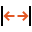

Caliper
=======

Overview
--------

Caliper tool uses the same techniques described for the Edge tool applied to edge pairs. It locates pair of edges instead of a single edge and reports as additional result the distance between them.

Settings
--------

| Options | |
| --- | --- |
| Enable | Enables or disables the tool. (default = Yes) |

| Tolerances and limits | |
| --- | --- |
| Check results count | The expected number of results<ud> <li>None No check.</li>  <li>Expected number Number of results must be equal to Num. of results to find.</li>  <li>Less than Number of results must be less then Num. of results to find.</li>  <li>Greater than Number of results must be greater then Num. of results to find.</li> </ud>    | Num. of results to find | Number of expected edge pair results. | | --- | --- | |
| Position offset | Enables or disables position tolerance limits. Specification position is the center of the Projection region in the reference image .<blockquote> **Elliptical Region** Use an elliptical region area instead of a rectangular one. Position XY tolerances are the semi-axes the ellipse or the semi-size of rectangle.   **Position X tolerance** Position tolerance in the X axes. (default = 10)   **Position Y tolerance** Position tolerance in the Y axes. (default = 10)  </blockquote> |
| Size | Enables or disables the size tolerance limit. Sizeis the distance between edge pair.<blockquote> **Specification** Expected size value. (default = 100)   **Tolerance+** Positive tolerance. (default = 10)   **Tolerance-** Negative tolerance. (default = 10)  </blockquote> |
| Size (md) | Enable this condition for minor defects evaluation.(default = No)<blockquote> **Tolerance+ (%)** Positive tolerance. (default = 10)   **Tolerance- (%)** Negative tolerance. (default = 10)  </blockquote> |

| Analysis | |
| --- | --- |
| Max number of results | Number of result to find. |
| Contrast threshold | The contrast above which a transition is considered an edge. (default = 20) |
| First edge polarity | The expected polarity of the first edge. <ud> <li>Dark to light Transition from darker region to lighter one.</li>  <li>Light to dark Transition from lighter region to darker one.</li>  <li>Don't care (default) Any polarity.</li> </ud> |
| Second edge polarity | The expected polarity of the second edge. <ud> <li>Dark to light Transition from darker region to lighter one.</li>  <li>Light to dark Transition from lighter region to darker one.</li>  <li>Don't care (default) Any polarity.</li> </ud> |
| Filter size | The filter width for edge extraction. (default = 2) |
| Contrast mode | Contrast is used to score edges.<ud> <li>Disabled No contrast criteria is used.</li>  <li>Stronger contrast (default) Stronger couple of edges get higher scores.</li>  <li>Weaker contrast Weaker couple of edges get higher scores.</li> </ud>  <blockquote> **Expected contrast** Expected value of contrast: edges with contrast close to this value will get the highest score. (default = 255.00)  </blockquote> |
| Position mode | Position is used to score edges.<ud> <li>Disabled (default) No position criteria is used.</li>  <li>Centered position The center of edge pairs closer to the center of the projection region gets higher scores.</li>  <li>Closer position The center of edge pairs closer to the starting side of the projection region gets higher scores.</li>  <li>Farther position The center of edge pairs further form the starting side of the projection region gets higher scores.</li> </ud> |
| Size mode | Size (distance between the edge pair) is used to score edges.<ud> <li>Disabled (default) No size mode criteria is used.</li>  <li>Expected size Edge pair size closer to expected gets higher scores.</li>  <li>Smaller Edge pair size smaller than expected one gets higher scores.</li>  <li>Larger Edge pair size larger than expected one gets higher scores.</li> </ud>  <blockquote> **Expected size** Expected edge pair size, in pixel. This value is used for scoring only. (default = 0.00)  </blockquote> |

### More

Click [here](../../../Windows/dialog_settings.md) to access the More section description.

Results
-------

| Results | |
| --- | --- |
| Decision | Pass/Fail decision of a tool, including multiple results if any. |
| Processing time | Tool processing time in msec. |
| First edge contrast | Contrast of the found first edge. |
| Second edge contrast | Contrast of the found second edge. |
| Position X | X position coordinates. The position is referred to the origin point of the tool.<blockquote> **Offset X** Offset between the tool's specification X position and tool's result X position (specification reference system).  </blockquote> |
| Position Y | Y position coordinates. The position is referred to the origin point of the tool.<blockquote> **Offset Y** Offset between the tool's specification Y position and tool's result Y position (specification reference system).  </blockquote> |
| Offset length | Distance between specification and result points. |
| Size | Distance between the edge pairs.<blockquote> **Difference with specification** Difference between the size specified in the Tolerances and limits settings and this measured size.  </blockquote> |
| Score | Score of edge result. |

Configuration
-------------

This tool is included into the library UvfCvl.

