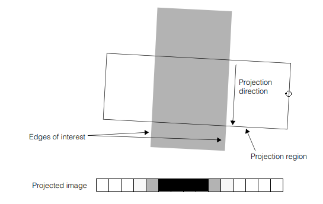

Edges
=====

Overview
--------

The Edge tool is the basic method to find image brightness transitions along a given direction. Brightness transitions correspond to physical boundaries of objects in the scene so the Edge is commonly used to locate and measure position of such borders. Brightness transitions have the property of being independent from the actual brightness level of the image so the transition position remains stable even if the global brightness of the scene undergoes significant variations.

Edge tool runs through the tool region in a specific direction to produce a one-dimensional representation of the brightness along it. The position of edges corresponds to the points where brightness changes more quickly. Change can occur as bright to dark or dark to light transition. The Edge tool computes a score for each edge based on the scoring method supplied. It finally selects the edges with the highest score.

Edge in image

The figure shows how an edge tool works: the Projection region where to look for edges; the Projection operation that sums all the information in the projection region accentuating the strength of edges that lie parallel to the projection rays and reducing the effects of noise; the Projected 1D image that shows the strength of edges; the scan direction for polarity of transitions to the shape handle.

How it works
------------

The edge magnitude and edge angle images are constructed by applying the Sobel edge detection operator to an input image.

