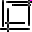

Line Detect
===========

Overview
--------

Line Detect lets you find linear scratches in the selected search area. It uses basically the Hough algorithm to extract desired linear features.

Settings
--------

| Options | |
| --- | --- |
| Enable | Enable or disable the tool. (default = Yes) |
| Geometry | Defines tool's region shape.<ud> <li>Circle Circular shape.</li>  <li>General rectangle (default) Rectangular shape.</li>  <li>Annulus Annulus shape.</li>  <li>General polygon General polygon shape.</li>  <li>CAD (Closed ROI) Closed shape imported from a CAD file.</li> </ud> |
| CAD file | CAD file name. |
| Layer name | Lists the layer names defined in the selected CAD file.<blockquote> **Connection tolerance** Distance between close segment points to be considered as connected.. (default = 0)   **Normalize XY weight** If checked weight is distributed for 50% to X features and for 50% to Y features. If unchecked all features have the same weight. (default = No)  </blockquote> |
| User calibration | If checked user defines parameters for CAD shapes calibration. Otherwise tool calibration is used.<blockquote> **Axes X rotation** Rotation in the X axes to be applied to the CAD shape. (default = 0; min = -360; max = 360)   **Axes Y rotation** Rotation in the Y axes to be applied to the CAD shape. (default = 0; min = -360; max = 360)   **Scale X** Scale variation in the X axes to be applied to the CAD shape. You express scale value as a multiplier value. (default = 1)   **Scale Y** Scale variation in the Y axes to be applied to the CAD shape. You express scale value as a multiplier value. (default = 1)  </blockquote> |

| Tolerances and limits | |
| --- | --- |
| Number of shapes not matched | Enables or disables check on the number of linear scratches found. (default = Yes)<blockquote> **Max number of shapes** Maximum allowed number.  (default = 0)  </blockquote> |
| Length of each shape | Enables or disables check on scratch's length limit. (default = No)<blockquote> **Single shape length limit** Maximum value of shapes' length. (default = 10.00)  </blockquote> |
| Sum of all shapes length | Enables or disables check on the sum of all scratches' length limit. (default = No)<blockquote> **Sum of all shapes length limit** Maximum value of shapes' length sum. (default = 50.00)  </blockquote> |

| Analysis | |
| --- | --- |
| Magnitude threshold | Magnitude threshold above which a feature is considered in the Hough space. (default = 20) |
| Max. num. of lines | Maximum number of scratches to find. (default = 10000) |
| Minimum length (pixel) | Minimum length (pixels) of valid scratches. (default = 10) |
| Minimum density | The density is computed as the ratio of the number of contributing featurelets divided by the length. A low density threshold may cause colinear line segments to merge into one longer segment. A high density threshold may break up an otherwise longer line segment into multiple shorter colinear pieces. Very high density threshold may exceed the density of all line segments in the image data, and cause the tool to report no line segment. (default = 0.8) |
| Diagnostic | Enable extended diagnostic. (default = No) |

### More

Click [here](../../../Windows/dialog_settings.md) to access the More section description.

Results
-------

| Results | |
| --- | --- |
| Decision | Pass/Fail decision of a tool. |
| Processing time | Tool processing time in msec. |
| Num of shapes not matched | Found shapes count. |
| Sum of shapes length | Sum of shapes length. |
| Max length | Maximum length of all founded shapes. |
| Min length | Minimum length of all founded shapes. |
| Result | Select the index of the line to show information about.<blockquote> **Length** Measured length of the selected shape.   **Start point X** X coordinate of the starting point.   **Start point Y** Y coordinate of the starting point.  </blockquote> |

Configuration
-------------

This tool is included into the library UvfCvl.

