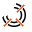

Multiple Polar Caliper
======================

Overview
--------

The tool applies several Caliper tools along a circular shape tangentially and returns min , max, average and standard deviation of their sizes. User defines the polar region and the first caliper region.

Settings
--------

| Options | |
| --- | --- |
| Enable | Enables or disables the tool. (default = Yes) |
| Geometry | Defines tool's region shape.<ud> <li>Polar grid Circular shape.</li> </ud> |

| Tolerances and limits | |
| --- | --- |
| Num of sectors | Number of sectors: defines the number of caliper tools to use(default = 1) |
| Size | Enables or disables check on size of each caliper size. <blockquote> **Specification** Nominal value. (default = 10)   **Tolerance+** Positive tolerance value. (default = 10)   **Tolerance-** Negative tolerance value. (default = 10)  </blockquote> |

| Analysis | |
| --- | --- |
| Contrast threshold | The contrast above which a transition is considered an edge. (default = 20) |
| First edge polarity | The expected polarity of the first edge. <ud> <li>Dark to light Transition from darker region to lighter one.</li>  <li>Light to dark Transition from lighter region to darker one.</li>  <li>Don't care (default) Any polarity.</li> </ud> |
| Second edge polarity | The expected polarity of the second edge. <ud> <li>Dark to light Transition from darker region to lighter one.</li>  <li>Light to dark Transition from lighter region to darker one.</li>  <li>Don't care (default) Any polarity.</li> </ud> |
| Filter size | The filter width for edge extraction. (default = 2) |
| Contrast mode | Contrast is used to score edges.<ud> <li>Disabled No contrast criteria is used.</li>  <li>Stronger contrast (default) Stronger couple of edges get higher scores.</li>  <li>Weaker contrast Weaker couple of edges get higher scores.</li> </ud><blockquote> **Expected contrast** Expected value of contrast: edges with contrast close to this value will get the highest score. (default = 255.00)  </blockquote> |
| Position mode | Position is used to score edges.<ud> <li>Disabled (default) No position criteria is used.</li>  <li>Centered position The center of edge pairs closer to the center of the projection region gets higher scores.</li>  <li>Closer position The center of edge pairs closer to the starting side of the projection region gets higher scores.</li>  <li>Farther position The center of edge pairs further form the starting side of the projection region gets higher scores.</li> </ud> |
| Size mode | Size (distance between the edge pair) is used to score edges.<ud> <li>Disabled (default) No size mode criteria is used.</li>  <li>Expected size Edge pair size closer to expected gets higher scores.</li>  <li>Smaller Edge pair size smaller than expected one gets higher scores.</li>  <li>Larger Edge pair size larger than expected one gets higher scores.</li> </ud><blockquote> **Expected size** Expected edge pair size, in pixel. This value is used for scoring only. (default = 0.00)  </blockquote> |

### More

Click [here](../../../Windows/dialog_settings.md) to access the More section description.

Results
-------

| Results | |
| --- | --- |
| Decision | Pass/Fail decision of a tool. |
| Processing time | Tool processing time in msec. |
| Num of passed | Number of calipers with good result. |
| Min E1 contrast (point) | Minimum contrast of the first edge found transitions. |
| Mean E1 contrast | Average contrast of the first edge found transitions. |
| Max E1 contrast (point) | Maximum contrast of the first edge found transitions. |
| Min E2 contrast (point) | Minimum contrast of the second edge found transitions |
| Mean E2 contrast | Average contrast of the second edge found transitions. |
| Max E2 contrast (point) | Maximum contrast of the second edge found transitions. |
| Min size (point) | Minimum measured size. |
| Mean size | Average measured size. |
| Max size (point) | Minimum measured size. |
| Std. Dev. size | Standard deviation of all measured sizes. |

Configuration
-------------

This tool is included into the library UvfCTStd and UvfCTCvl.
