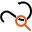

Boundary Inspect
================

Overview
--------

Boundary Inspect is a tool that uses a geometric model to inspect the quality of a model in the run-time image.  
The geometric boundary inspection proceeds with matching the model boundary with the remaining image contours to produce matched and unmatched model boundary and image contours.

An image contour (partial or whole) is considered to match a model boundary (partial or whole), if the distance between the contour elements (featurelets) and the model boundary is within a distance tolerance range (Min/Max  distances and angle tolerances). Unmatched contour are filtered with size criteria (minimum and maximum length).

Boundary tolerances based on boundary distance and orientation may not be sufficient to discover some types of defects on the boundaries such as small protrusions and intrusions (mouse bites and boundary chips). The boundary inspection tool provides a way of detecting these types of anomalies through boundary anomaly analysis (local contour comparison mode), which is performed by comparing the matched model boundaries with the corresponding image contours to detect any local differences in terms of local contour geometry. Any image contour sections that show these differences will be marked as anomalous sections.  

Settings
--------

| Options | |
| --- | --- |
| Enable | Enables or disables the tool. (default = Yes) |
| Geometry | Defines tool's model shape.<ud> <li>Circle Circular shape.</li>  <li>General rectangle (default) Rectangular shape.</li>  <li>Annulus Annulus shape.</li>  <li>General polygon General polygon shape.</li>  <li>Line seg Line segment.</li>  <li>CAD (Closed ROI) Closed shape imported from a CAD file.</li>  <li>Ellipse arc Ellipses arc.</li> </ud> |
| CAD file | CAD file name. |
| Layer name | Lists the layer names defined in the selected CAD file.<blockquote> **Connection tolerance** Distance between close segment points to be considered as connected.. (default = 0)  </blockquote> |
| User calibration | If checked user defines parameters for CAD shapes calibration. Otherwise tool calibration is used.<blockquote> **Axes X rotation** Rotation in the X axes to be applied to the CAD shape. (default = 0; min = -360; max = 360)   **Axes Y rotation** Rotation in the Y axes to be applied to the CAD shape. (default = 0; min = -360; max = 360)   **Scale X** Scale variation in the X axes to be applied to the CAD shape. You express scale value as a multiplier value. (default = 1)   **Scale Y** Scale variation in the Y axes to be applied to the CAD shape. You express scale value as a multiplier value. (default = 1)  </blockquote> |
| Search area tol. X left | Search area is the bounding box of the shape. Search area Tols enlarge size of bounding box moving sides respectively. Move left side. (default = 5) |
| Search area tol. Y up | Move upper side. (default = 5) |
| Search area tol. X right | Move right side. (default = 5) |
| Search area tol. Y down | move bottom side. (default = 5) |

| Tolerances and limits | |
| --- | --- |
| Num of shapes not matched | Enables or disables check on the number of features that doesn't match with model's ones. These features are filtered by Boundary's settings and than checked.(default = Yes)<blockquote> **Max number of shapes** Max number of shapes. (default = 0)  </blockquote> |
| Length of each shape | Enables or disables shapes' length check. (default = No)<blockquote> **Single shape length limit** Max length. (default = 10.00)  </blockquote> |
| Sum of all shapes length | Enables or disables sum of shapes' length check. (default = No)<blockquote> **Sum of all shapes length limit** Max length. (default = 50.00)  </blockquote> |

| Analysis | |
| --- | --- |
| Min distance tolerance (pixels) | Negative distance tolerance of a feature from the fitted shape. (default = -10.00) |
| Max distance tolerance (pixels) | Positive distance tolerance of a feature from the fitted shape. (default = 10.00) |
| Angle tolerance +/- | Angle tolerance. (default = 20.00) |
| Unmatched feature min. length (pixels) | Minimum length of a feature (shape). (default = 3.00) |
| Unmatched feature max. length (pixels) | Maximum length of a feature (shape). (default = 0.00) |
| Anomaly score | Minimum anomaly score. (default = 0.50) |
| Anomaly min. area | Minimum area of an anomaly. (default = 0.00) |
| Anomaly max. length | Consider as anomaly the ones that have size less than this limit. (default = 10.00) |
| Contrast threshold | Grey Level for features detection. (default = 20.00) |
| Reverse polarity | Find boundaries with inverse polarity compared to the model polarity. (default = No) |
| Ignore polarity | Find boundaries of any polarity. (default = No) |
| Granularity | Granularity is expressed as the radius of interest, in pixels, within which features are detected. (default = 1.00) |

### More

Click More... to access the More section description.

Results
-------

| Results | |
| --- | --- |
| Decision | Pass/Fail decision of a tool. |
| Processing time | Tool processing time in msec. |
| Num of shapes not matched | Number of pieces of shapes not matched. |
| Sum of shapes lenght | Sum of not matched shapes' length. |
| Max length | Maximum length of matched shapes. |
| Min length | Minimum length of matched shapes. |
| Result | Not matched shapes selection.<blockquote> **Length** Length of selected shape.   **Start point X** X coordinate of starting point of the selected shape.   **Start point Y** Y coordinate of starting point of the selected shape.  </blockquote> |
| Num of anomalies | Number of detected anomalies. |
| Max score for anomalies | Maximum anomalies' detected score. |

Configuration
-------------

This tool is included into the library UvfCvl.
