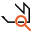

Contour Inspect
===============

Overview
--------

The shape of the tool defines a contour where Contour Inspect extracts a set of boundary points and computes the distance between each point and the and the expected shape. Boundary points are extracted by several Edge tools laid orthogonally to the contour.

Settings
--------

| Options | |
| --- | --- |
| Enable | Enables or disables the tool. (default = Yes) |
| Geometry | Defines tool's model shape.<ud> <li>Circle Circular shape.</li>  <li>General rectangle (default) Rectangular shape.</li>  <li>Annulus Annulus shape.</li>  <li>General polygon General polygon shape.</li>  <li>Line seg Line segment.</li>  <li>CAD (Closed ROI) Closed shape imported from a CAD file.</li>  <li>Ellipse arc Ellipses arc.</li> </ud> |
| CAD file | CAD file name. |
| Layer name | Lists the layer names defined in the selected CAD file.<blockquote> **Connection tolerance** Distance between close segment points to be considered as connected.. (default = 0)  </blockquote> |
| User calibration | If checked user defines parameters for CAD shapes calibration. Otherwise tool calibration is used.<blockquote> **Axes X rotation** Rotation in the X axes to be applied to the CAD shape. (default = 0; min = -360; max = 360)   **Axes Y rotation** Rotation in the Y axes to be applied to the CAD shape. (default = 0; min = -360; max = 360)   **Scale X** Scale variation in the X axes to be applied to the CAD shape. You express scale value as a multiplier value. (default = 1)   **Scale Y** Scale variation in the Y axes to be applied to the CAD shape. You express scale value as a multiplier value. (default = 1)  </blockquote> |

| Tolerances and limits | |
| --- | --- |
| Position offset | Enables or disables position tolerance limits. Specification position is the center of the reference shape in the reference image. Reference shape is the shape originated by nominal shape and the laid on reference points.<blockquote> **Elliptical Region** Use an elliptical region area instead of a rectangular one. Position XY tolerances are the semi-axes the ellipse or the semi-size of rectangle.   **Position X tolerance** Position tolerance in the X axes. (default = 10)   **Position Y tolerance** Position tolerance in the Y axes. (default = 10)  </blockquote> |
| Angle offset | Enables or disables orientation offset check. (default = No)<blockquote> **Angle+** Tolerance for positive angles. (default = 360.00)   **Angle-** Tolerance for negative angles. (default = 360.00)  </blockquote> |
| Minor defect length | Enables or disables minor defect length check. It is the length of the shape contour that is distant to the reference shape more than minor defect depth  (default = Yes)<blockquote> **minor defect depth** Maximum accepted distance between contour and reference shape. (default = 0.00)   **Limit** Maximum error accepted. (default = 0.00)  </blockquote> |
| Sum of length of minor defects | Enables or disables sum of length of detected minor defect lengths check. (default = No) LimitMaximum length. (default = 0.00) |
| Major defect length | Enables or disables major defect length check. It is the length of the shape contour that is distant to the reference shape more than major defect depth  (default = Yes)<blockquote> **major defect depth** Maximum accepted distance between contour and reference shape. (default = 0.00)   **Limit** Maximum error accepted. (default = 0.00)  </blockquote> |
| Sum of length of major defects | Enables or disables sum of length of detected major defects check. (default = No)<blockquote> **Limit** Maximum length. (default = 0.00)  </blockquote> |
| Worst point error | Enables or disables maximum error between detected points and reference shape. (default = Yes)<blockquote> **Limit** Maximum error. (default = 0.00)  </blockquote> |
| Number of missing points | Enables or disables maximum number of not matched points. (default = Yes)<blockquote> **Max number of missing points** Maximum number. (default = 0)  </blockquote> |

| Analysis | |
| --- | --- |
| Error polarity | Select polarity of error respect to the reference shape of the inspected object.<ud> <li>Only positive Outside.</li>  <li>Only negative Inside.</li>  <li>Don't care (default) Inside or outside.</li> </ud> |
| Inspection mode | Select how the reference shape is calculated. It is the contour algorithm refers to decide if a border point accepted or is a defect. <ud> <li>Ideal shape Geometric shape. It is the specification shape mapped by alignment transformation.</li>  <li>LS fitted shape Fitting shape. It is the result of fitting operation of reference points versus specification shape model.</li>  <li>Spline fitted shape (default) A spline. It is the result of the interpolation of reference points on the best spline.</li> </ud> |
| Num. reference points | Number of points used to calculate the reference shape. (default = 15.00) |
| Num. of points to get average | Number of points to be used in average calculation. (default = 10.00) |
| Ignore points | The number of points to discard to have the best fit. The fitting algorithm ignores the points with the worst distance to the fitted contour. (default = 0)<blockquote> **Residual limit for ignoring** Ignore points for fitting whose residual goes beyond this value. (default = 0)  </blockquote> |
| Best points | The number of points, with the best score, to use for fitting. (default = 0.0) |
| Pitch | Distance between Edge tools. (default = 10.00) |
| Edge search width (pixel) | Edge tools width. (default = 20.00) |
| Edge search height (pixel) | Edge tools height. (default = 5.00) |
| Contrast threshold | The contrast, in gray levels, above which a transition is considered an edge. (default = 5.00) |
| First edge polarity | The expected polarity of the edge. Only edges with the specified polarity are considered. <ud> <li>Dark to light Transition from darker region to lighter one.</li>  <li>Light to dark Transition from lighter region to darker one.</li>  <li>Don't care (default) Any polarity.</li> </ud> |
| Filter size | The filter width for edge extraction. (default = 2) |
| Contrast mode | The edge contrast is used to score single edges.<ud> <li>Disabled No contrast criterion is used.</li>  <li>Stronger contrast (default) Stronger edge pairs get higher scores.</li>  <li>Weaker contrast Weaker edge pairs get higher scores.</li> </ud><blockquote> **Expected contrast** Expected transition grey value that get higher score. (default = 255.00)  </blockquote> |
| Position mode | The edge position is used to score single edges.<ud> <li>Disabled (default) No position criteria is used.</li>  <li>Centered position The edge position closer to the center of the projection region gets higher scores.</li>  <li>Closer position The edge position closer to the starting side of the projection region gets higher scores.</li>  <li>Farther position The edge position further form the starting side of the projection region gets higher scores.</li> </ud> |
| Check background | This value checks if a not found edge tool result is due to an obstruction of the border (eg. transfer belts). If the point is not found and the ROI of this edge tool is the expected background, then this point is missing and valuated, otherwise algorithm assumes this region is obstructed and ignore the result.(default = Yes)<blockquote> **Dark background** Background is dark on foreground is brighter or conversely. (default = No)   **Background color limit** Gray value that defines background limit. (default = 128)  </blockquote> |

### More

Click More... to access the More section description.

Results
-------

| Results | |
| --- | --- |
| Decision | Pass/Fail decision of a tool. |
| Processing time | Tool processing time in msec. |
| Position X | X position coordinates. The position is referred to the origin point of the tool.<blockquote> **Offset X** Offset between the tool's specification X position and tool's result X position (specification reference system).  </blockquote> |
| Position Y | Y position coordinates. The position is referred to the origin point of the tool.<blockquote> **Offset Y** Offset between the tool's specification Y position and tool's result Y position (specification reference system). .  </blockquote> |
| Offset length | Distance from the trained tool position. |
| Angle | Angle of the tool.<blockquote> **Angle offset** Angle offset from the trained tool angle position.  </blockquote> |
| Min contrast | Minimum founded contrast level. |
| Worst error | Worst error between the contour point and the result reference shape. |
| Num. of minor defects | Number of minor defects. |
| Min length of minor defects | Minimum length of minor defects. |
| Max length of minor defects | Maximum length of minor defects. |
| Sum of length of minor defects | Sum of lengths of all found minor defects. |
| Num of major defects | Number of major defects. |
| Min length of major defects | Minimum length of major defects. |
| Max length of major defects | Maximum length of major defects. |
| Sum of length of major defects | Sum of lengths of major defects. |
| Number of missing points | Number of points not found. |
| Number of points | Number of used Edge tools. |

Configuration
-------------

This tool is included into the library UvfCTStd and UvfCTCvl.
