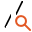

Line Breakage
=============

Overview
--------

Tool can classify found interruptions into three groups: short, medium and long. User insert values for classification ranges.

Settings
--------

| Options | |
| --- | --- |
| Enable | Enable or disable the tool. (default = Yes) |
| Geometry | Defines tool's region shape.<ud> <li>LineSeg Line segment.</li>  <li>CAD Closed shape imported from a CAD file.</li> </ud> |
| CAD file | CAD file name. |
| Layer name | Lists the layer names defined in the selected CAD file.<blockquote> **Connection tolerance** Distance between close segment points to be considered as connected.. (default = 0)  </blockquote> |
| User calibration | If checked user defines parameters for CAD shapes calibration. Otherwise tool calibration is used.<blockquote> **Axes X rotation** Rotation in the X axes to be applied to the CAD shape. (default = 0; min = -360; max = 360)   **Axes Y rotation** Rotation in the Y axes to be applied to the CAD shape. (default = 0; min = -360; max = 360)   **Scale X** Scale variation in the X axes to be applied to the CAD shape. You express scale value as a multiplier value. (default = 1)   **Scale Y** Scale variation in the Y axes to be applied to the CAD shape. You express scale value as a multiplier value. (default = 1)  </blockquote> |

| Tolerances and limits | |
| --- | --- |
| Short interruptions | Enables or disables short interruptions tolerance check.<blockquote> **Max number** Maximum number of allowed short interruptions. (default = 0)  </blockquote> |
| Medium interruptions | Enables or disables medium interruptions tolerance check.<blockquote> **Max number** Maximum number of allowed medium interruptions. (default = 0)  </blockquote> |
| Long interruptions | Enables or disables long interruptions tolerance check.<blockquote> **Max number** Maximum number of allowed long interruptions. (default = 0)  </blockquote> |
| Sum of length of interruptions | Enables or disables tolerance check on the sum of length of all detected interruptions.<blockquote> **Single finger limit** Maximum value for the sum of the blobs' areas. (default = 500)   **Global limit** Includes minor defects to evaluation and therefore result.(default = No)  </blockquote> |
| All Blobs area (%) | Enables or disables Sum of all Blobs area as percentage of ROI.<blockquote> **All Blobs area limit** Maximum value for the sum of the blobs' areas. (default = 0)   **minor defects** Includes minor defects to evaluation and therefore result.(default = No)  </blockquote> |

| Analysis | |
| --- | --- |
| Threshold mode | Sets how the threshold parameters are filled in.<ud> <li>Standard Threshold is represented as grey level value.(default = 128 | min = 0 | max = 255)</li>  <li>Percentage of full range Threshold is calculated as percentage of the full histogram (ROI)</li>  <li>Percentage of range [min - 255] Threshold is calculated as percentage of the part [min - 255] of the histogram</li>  <li>Percentage of range [0 - max] Threshold is calculated as percentage of the part [0 - max] of the histogram</li>  <li>Percentage of range [min - max] Threshold is calculated as percentage of the part [min - max] of the histogram</li> </ud> |
| Adaptive sensitivity | Mean values are calculated for the histograms of the ROI of the training and inspected image. Threshold is shifted according to changes of these values. (default = no) |
| Automatic | Threshold is automatically calculated by the first derivative of the histogram (ROI) (default = no) |
| First threshold (mode standard) | Mode standard: If polarity is Dark objects, pixels with grey-scale value below the threshold are considered as defect, while all pixels with value above the threshold are assigned as background pixels. The opposite for White objects (default = 0 | min = 0 | max = 255)   Mode percentage: Like described above, but with values expressed as percentage.(default = 50 | min = 0 | max = 100) |
| Second threshold | Displayed only if threshold mode "Standard" and polarity "dark and white objects" is selected: If polarity is Dark objects, pixels with grey-scale value below the threshold are considered as defect, while all pixels with value above the threshold are assigned as background pixels. The opposite for White objects (default = 0 | min = 0 | max = 255)   Mode percentage: The above description fits but with values expressed in percentage.(default = 50 | min = 0 | max = 100) |
| Softness | In case of large transitions with low slope between the levels of background and blobs the measured area becomes inaccurate. Therefore the width of the transition can be entered. Value are internally weighted and a linear slope is calculated for the transition |
| Polarity | Polarity of the object to consider as blob (defects).   | White objects (default) | Finds objects that are brighter than the background. | | --- | --- | | Dark objects | Finds dark objects on a light background. | | Dark and White objects (default) | Uses the parameters "First threshold" and "Second threshold" Finds objects that are darker than the "First threshold" or brighter than the "Second threshold". | | Grey objects | Uses the parameters "First threshold" and "Second threshold" Finds objects that are brighter than the "First threshold" and darker than the "Second threshold". | |
| Min. Area (pixel) | Area must be greater than this limit to be recognized as blob. |
| Calibrated results | show results in calibrated value, e.g. mm (default = no) |
| Preprocessing | If necessary a preprocessing filter can be selected, operation or not, as default no filtering is done   | None (default) | No preprocessing needed. | | --- | --- | | Median Difference | Median difference filtering preprocess. | | XY Median Difference | Median difference filtering mainly in X and Y direction. | | Sobel | Used to improve contrast changes | | Average Difference | Average difference filtering preprocess. |  <blockquote> **X (pixel)** Filter width.   **Y (pixel)** Filter height.   **Magnitude scaling factor** Sobel filter parameter.   **Magnitude threshold** Sobel filter parameter.  </blockquote> |

### More

Click More... to access the More section description.

Results
-------

| Results | |
| --- | --- |
| Decision | Pass/Fail decision of a tool, including multiple results if any. |
| Processing time | Tool processing time in msec. |
| Max. blobs number | Number of blobs found. |
| Total area (pixel) | Sum of the areas of all found blobs, in pixel. |
| All Blobs area (%) | Sum of the areas of all found blobs, in %. |
| Max. area (pixel) | Greatest area of all found blobs, in pixel. |
| Min. area (pixel) | Smallest area of all found blobs, in pixel. |
| Result | Select the index of the blob to show information about.<blockquote> **Area** Area of the selected blob, in pixel.   **Center X** Position X of the center of mass of the selected blob.   **Center Y** Position Y of the center of mass of the selected blob.  </blockquote> |
