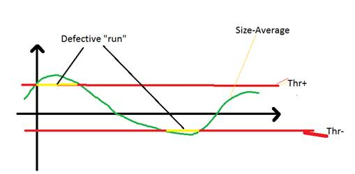

Thickness Inspect
=================

Overview
--------

The tool checks the width of a threaded shaped feature on the image. Typical use is the inspection of a glue thread deposed on a surface to verify its minimum or maximum thickness. Internally many Edge tools (calipers) are used, each representing a measurement point with a result. Parameter slice width in the analysis section defines the distance between these points or measurements (in pixel).

How it works
------------

Several calipers are positioned along the selected shape at a defined distance. At run time, the region of the shape is unwrapped and the Caliper tools work all aligned vertically. Edge points detected and sizes evaluated. For each point the local averaged size is then calculated. Local errors are evaluated as the signed distance of a point from its local average.

A point is critical if its local errors are higher than the defined limits:

- if local error is negative and higher than Limit for smaller size value, it is marked as belonging to a smaller defect
- if local error is positive and higher than Limit for larger size value, it is marked as belonging to a larger defect

Defect length is evaluated as the distance between the first and the last of a group of consecutive critical points.

Settings
--------

| Options | |
| --- | --- |
| Enable | Enables or disables the tool. (default = Yes) |
| Geometry | Defines tool's region shape.<ud> <li>Annulus Annulus shape.</li>  <li>Annulus section Annulus section shape.</li>  <li>General thick polygon General polygon shape with a thickness.</li> </ud> |

| Tolerances and limits | |
| --- | --- |
| Check size | Select which values are used to check size constraints.<ud> <li>Absolute Size value of each measurement point is used.</li>  <li>Average Local average value of each measurement point is used.</li> </ud> |
| Size | Enables or disables the size tolerance limits.<blockquote> **Specification** Expected size value. (default = 100)   **Tolerance+** Positive tolerance. (default = 10)   **Tolerance-** Negative tolerance. (default = 10)  </blockquote> |
| Defect length | Enables or disables tolerance limit for defect length. Defect length is the length of sections out of size tolerance. ((default = No)<blockquote> **limit** Minimum defect length. (default = 0.0)  </blockquote> |
| Local errors | Enable or disable local error constraints. (default = No) Local errors are the errors of points relative to the errors of closest points. The size of each point is compared with neighbors (local) to evaluate if they are real defects. If this comparison is bigger than a threshold, the condition fails.<blockquote> **Positive local error** Error over the local mean. (default = 0)   **Negative local error** Error under the local mean. (default = 0)  </blockquote> |

| Analysis | |
| --- | --- |
| Slice width (pixel) | Sets the distance between the measurement points (calipers) in pixel. (default = 10.0) |
| Error direction | The contrast, in grey levels, above which a transition is considered an edge.<ud> <li>Don't care Any transition.</li>  <li>Only positive Transition from dark pixels to lighter ones.</li>  <li>Only negative Transition from light pixels to darker ones.</li> </ud> |
| Limit for smaller size | Limit for negative local error for smaller defects classification. (default = 1.0) |
| Limit for larger size | Limit for positive local error for larger defects classification. (default = 1.0) |
| Number of points to get average (1/2) | Number of points used to evaluate local average. (default = 0.0) |
| Contrast threshold | The contrast, in grey levels, above which a transition is considered an edge. |
| First edge polarity | The expected polarity of the edge. Only edges with the specified polarity are considered. <ud> <li>Dark to light Transition from darker region to lighter one.</li>  <li>Light to dark Transition from lighter region to darker one.</li>  <li>Don't care (default) Any polarity.</li> </ud> |
| Second edge polarity | The expected polarity of the second edge. <ud> <li>Dark to light Transition from darker region to lighter one.</li>  <li>Light to dark Transition from lighter region to darker one.</li>  <li>Don't care (default) Any polarity.</li> </ud> |
| Filter size | The filter width for edge extraction. (default = 2) |
| Contrast mode | Contrast is used to score edges.<ud> <li>Disabled No contrast criteria is used.</li>  <li>Stronger contrast (default) Stronger couple of edges get higher scores.</li>  <li>Weaker contrast Weaker couple of edges get higher scores.</li> </ud><blockquote> **Expected contrast** Expected value of contrast: edges with contrast close to this value will get the highest score. (default = 255.00)  </blockquote> |
| Position mode | Position is used to score edges.<ud> <li>Disabled (default) No position criteria is used.</li>  <li>Centered position The center of edge pairs closer to the center of the projection region gets higher scores.</li>  <li>Closer position The center of edge pairs closer to the starting side of the projection region gets higher scores.</li>  <li>Farther position The center of edge pairs further form the starting side of the projection region gets higher scores.</li> </ud> |
| Size mode | Size (distance between the edge pair) is used to score edges.<ud> <li>Disabled (default) No size mode criteria is used.</li>  <li>Expected size Edge pair size closer to expected gets higher scores.</li>  <li>Smaller Edge pair size smaller than expected one gets higher scores.</li>  <li>Larger Edge pair size larger than expected one gets higher scores.</li> </ud><blockquote> **Expected size** Expected edge pair size, in pixel. This value is used for scoring only. (default = 0.00)  </blockquote> |

### More

Click More... to access the More section description.

Results
-------

| Results | |
| --- | --- |
| Decision | Pass/Fail decision of a tool, including multiple results if any. |
| Processing time | Tool processing time in msec. |
| Points not found | Number of sampling points where the thickness could not be measured. |
| Min E1 contrast (point) | Minimum contrast value measured for the first edge found transition. |
| Mean E1 contrast | Average value contrast measured for the first edge found transition. |
| Max E1 contrast (point) | Maximum value contrast measured for the first edge found transition. |
| Min E2 contrast (point) | Minimum contrast value measured for the second edge found transition. |
| Mean E2 contrast | Average value contrast measured for the second edge found transition. |
| Max E2 contrast (point) | Maximum value contrast measured for the second edge found transition. |
| Min size (point) | Minimum measured size. |
| Mean size | Average measured size. |
| Max size (point) | Minimum measured size. |
| Std. Dev. size | Standard deviation of all measured size. |
| Min. length of defect seg. | Minimal length of all defect segments |
| Max. length of defect seg. | Maximal length of all defect segments |
| Sum of length of defect seg. | Sum of length of defect segments |
| Max local error +(point) (le+) | Returns the maximum positive local error and the location point. |
| Max local error -(point) (le-) | Returns the maximum negative local error and the location point . |

Images
------

| Images | |
| --- | --- |
| Model | Unwrapped image of reference image used to train the tool. |
| Last | Run time unwrapped image. |

Configuration
-------------

This tool is included into the library UvfCTStd and UvfCTCvl.

