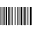

Bar Code
========

Overview
--------

The Barcode tool decodes 1D symbol codes: Code 39, Code 128, UPC/EAN, Code 93, Codabar, Interleaved 2 of 5, PharmaCode, Postal, RSS, PDF417. In addition to decoding symbols, the ID tool can also compute and report standard measures of symbol quality.

Images that you supply to the ID tool must meet the following requirements to qualify for the easy-to-read category:

• All symbols must be greater than 50 pixels in length, while the maximum width of any module, where a module is the narrowest element of the symbol (either a spaceor a bar), cannot exceed 10 pixels.

• For linear symbologies (where modules have different widths but uniform heights), a module must be at least 1.6 pixels wide and 50 pixels high. For postal codes (where the modules are of uniform width but varying height), a module must be at least 2.5 pixels in width.

• A quiet zone (an area on either end of a symbol with no marks) of at least the minimum size specified in the print specification for the barcode must be present.

• The contrast between modules and background must be at least 32 grey levels.

• The pixel aspect ratio can be no greater than 1.35 to 1.

Settings
--------

| Options | |
| --- | --- |
| Enable | Enables or disables the tool. (default = Yes) |

| Tolerances and limits | |
| --- | --- |
| Position offset | Enables or disables position tolerance limits. Specification point is the center of the rectangular region where to look for code.<blockquote> **Elliptical Region** Use an elliptical region area instead of a rectangular one. Position XY tolerances are the semi-axes the ellipse or the semi-size of rectangle.   **Position X tolerance** Position tolerance in the X axes. (default = 10)   **Position Y tolerance** Position tolerance in the Y axes. (default = 10)  </blockquote> |
| Angle offset | Enables or disables orientation tolerance limits. Specification orientation is the orientation of the rectangular region where to look for code. <blockquote> **Angle+** Tolerance for positive angles. (default = 360; min = 0; max = 360)   **Angle-** Tolerance for negative angles. (default = 360; min = 0; max = 360)  </blockquote> |
| Value | Enables or disables checking of read code.<blockquote> **read code** desired code to match.  </blockquote> |
| Word errors | Enables or disables tolerance limit on decoding. Word errors are the number of erroneous data words encountered while decoding the symbol. (default = No)<blockquote> **number** limit.  </blockquote> |
| Bit errors | Enables or disables tolerance limit on decoding. Bit errors are the number of erroneous bits encountered  while decoding the symbol. (default = No)<blockquote> **number** limit.  </blockquote> |

| Analysis | |
| --- | --- |
| Symbology | Code format to use in decoding process.<ud> <li>Code39 Code 39 (also called USS Code 39 or Code three of nine) is a widely-used symbology developed for use in non-retail environments, and can encode both letters,digits, and special characters such as " % " and " / ". Asymbol using Code 39 symbology encodes each character using 5 bars and 4 spaces for a total of 9 elements, and 3 out of the 9 elements are always wide. The symbol can include a checksum character for error detection.</li>  <li>UPC/EAN UPC is a fixed-length, numeric-only symbology which can be scanned bidirectionally. The size for a UPC symbol can vary to accommodate various printing processes, but the code works best when the height of  the symbol exceeds its width. European companies use the generally equivalent European Article Numbering (EAN) system.</li>  <li>Code 128 Code 128 is a very high-density alphanumeric symbology which can be scanned bidirectionally. The symbology can encode the entire 128 ASCII character set plus four non-data characters. A symbol using Code 128 symbology encodes each character using 11 black or white modules, and each symbol includes a checksum character</li>  <li>Interleaved 2 of 5 Popular in warehouse applications, Interleaved 2 of 5 (also called I-2/5 or ITF) is a variable-length, numeric-only code. A symbol using Interleaved 2 of 5 symbology encodes 2 characters in a unit of 5 bars and spaces, where the even position character is encoded into bars while the odd position character is encoded into spaces. The Interleaved 2 of 5 symbology can only encode data with an even number length. The symbol can include a checksum character for error detection.</li>  <li>4 State 4-State is an alphanumeric symbology adopted by the Australian Post. A barcode using the 4-State symbology encodes each character using 4 different types of bars, each of which has a distinct name and value. A 4-State barcode can be generated in one of three different structures of 37 bars (standard), 52 bars, or 67 bars. The ID tool supports the Australian,  UPU, Japan Post and USPS versions of the 4-state symbology.</li>  <li>POSTNET The Postal Numeric Encoding Technique (POSTNET) barcode was nvented by the US Postal Office to encode ZIP Code information. A barcode using the POSTNET symbology encodes each numeric character using a combination of 5 bars, either short or long. A POSTNET barcode can contain a 5-digit ZIP Code, a 5-digit ZIP + 4 Code, or an 11-digit delivery point code. The symbol always includes a checksum character.</li>  <li>RSS Reduced Space Symbology (RSS) was developed as a family of seven linear symbologies to provide users with features that address specific space limitation and application needs. RSS is designed to allow encoding of up to 74 characters of data. RSS allows greater capacity for encoding and capturing data such as product supplier, expanded product identification, price per pound, extended price, product weight, and so on. The ID tool supports a variety of RSS types.</li>  <li>Code 93 Code 93 is an alphanumeric code similar to Code 39 and can encode 48 different characters. Code 93 is more compact than Code 39, but is not as widely used.</li>  <li>Codabar Developed in the early 1970s, Codabar is designed to be accurately read even when printed on dot-matrix printers for multi-part forms such as FedEx Airbills and blood bank forms. Although newer symbologies hold more information in a smaller space, Codabar has a large installed base in libraries.</li>  <li>PharmaCode Also known as Pharmaceutical Binary Code, Pharmacode is used in the pharmaceutical industry as a packing control system. It is designed to be readable despite printing errors.</li>  <li>PDF417 PDF417 is a stacked linear bar code symbol used in a variety of applications, including transport, identification cards, and inventory management.</li> </ud> |
| Mirrored | Flag indicates whether the image is mirrored.. |

### More

Click [here](../../../Windows/dialog_settings.md) to access the More section description.

Results
-------

| Decision | Pass/Fail decision of a tool. |
| --- | --- |
| Processing time | Tool processing time in msec. |
| Symbology | Symbology decoded |
| Read code | Decoded string code. |
| Position X | X position coordinates. The position is referred to the origin point of the tool.<blockquote> **Offset X** Offset between the tool's specification X position and tool's result X position (specification reference system).  </blockquote> |
| Position Y | Y position coordinates. The position is referred to the origin point of the tool.<blockquote> **Offset Y** Offset between the tool's specification Y position and tool's result Y position (specification reference system).  </blockquote> |
| Offset length | Distance between specification and result points. |
| Angle | Angle of the tool.<blockquote> **Angle offset** Offset between the tool's specification orientation angle and tool's result orientation angle.  </blockquote> |
| Word errors | Number of word errors |
| Bit errors | Number of bit errors |

Configuration
-------------

This tool is included into the library UvfIdToolsStd and UvfIdToolsCvl

