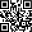

QRCode
======

Overview
--------

The QRCode locates 2D Quick Response Code in an image and returns the string encoded by the symbol. QRCode is a two-dimensional matrix symbology having finder patterns on three of its corners. There are three versions of QR Code symbols:

- Model 1: original version
- Model 2: enhanced version
- Micro QR

It first builds a model of a typical symbol. Then, using the model and several values that control how to apply it.

Settings
--------

| Options | |
| --- | --- |
| Enable | Enable or disable the tool. (default = Yes) |
| Search area | Select the area where search for a model.<ud> <li>All Image (default) Search area agrees with overall image area.</li>  <li>Centered Search area is the model area enlarged by a symmetric frame.</li>  <li>Free Search area is defined by the user.</li> </ud><blockquote> **Frame X** Frame width. (default = 20)   **Frame Y** Frame height. (default = 20)  </blockquote> |
| User origin | Allows to set the model origin in an arbitrary position, instead of the center of the model area. It is the point returned by the tool. |
| Runtime learning | Sets autolearning. Run-time tools try to learn feature of the code to read: learning a 2D symbol means set parameters of QRCode format to create a model to use for decoding. |

| Tolerances and limits | |
| --- | --- |
| Shape index | Conformity limit for acceptable result.<blockquote> **Shape index limit** Minimum acceptable shape index. (default = 1.0)  </blockquote> |
| Position offset | Enables or disables position tolerance. (default = No)<blockquote> **Elliptical region** Position tolerance positive angles. (default = 360)   **Position X tolerance** Position tolerance in the X axes. (default = 10)   **Position Y tolerance** Position tolerance in the Y axes. (default = 10)  </blockquote> |
| Angle offset | Enables or disables angle tolerance. (default = No)<blockquote> **Angle+** Position tolerance positive angles. (default = 360)   **Angle-** Position tolerance negative. (default = 360)  </blockquote> |
| Value | Enables or disables checking of read code. (default = No)<blockquote> **Code** desired code to match.  </blockquote> |
| Word errors | Enables or disables tolerance limit on decoding. Word errors are the number of erroneous data words encountered while decoding the symbol. (default = No)<blockquote> **Number** limit. (default = 0)  </blockquote> |
| Bit errors | Enables or disables tolerance limit on decoding. Bit errors are the number of erroneous bits . (default = No)<blockquote> **Number** Bit errors limit. (default = 0)  </blockquote> |

| Analysis | |
| --- | --- |
| Auto learn | Enables or disables automatic set of QRCode model settings. (default = Yes)<blockquote> **Size** QR Code model type and grid size.   [21, 49] for QRModel1.  [21, 49] for QRModel2.  [11, 17] for MicroQR.   **Columns** Columns of the grid Data Matrix symbols.   **Polarity** Polarity of the symbol.            Dark to light (default)      Transition from dark pixels to lighter ones.          Light to dark      Transition from light pixels to darker ones.          Don't care      Any transition.   **QRModel** QR Model format to use             Unknown      Model not recognized.          Model1      QRCode Model1.          Model2      QRCode Model2.          MicroQR    QRCode micro format.  </blockquote> |
| Mirror image | Mirror flag, which indicates whether the image of the symbol is mirrored or not. (default = No) |
| Score | A score used by the DataMatrix tool to determine symbol quality. (default = 0.50) |
| Confusion | A score that defines success when using the model to search for the finder pattern. A match scoring above this threshold automatically succeeds. (default = 0.70) |
| Contrast | The contrast threshold is the minimum contrast that a run-time image may have and still be considered a symbol. This threshold is a fraction of the contrast of the symbol model. (default = 0.50) |
| Aspect | The aspect ratio is the expected ratio of pixel width to pixel height. You should use the default value except with unusual cameras or single-field acquires. (default = 1.00) |
| Scale range | To compensate for differences in size between the model and the image, the DataMatrix tool can apply a scaling factor to the model before comparing it to the image. (default = 0.00) |

### More

Click [here](../../../Windows/dialog_settings.md) to access the More section description.

Results
-------

| Results | |
| --- | --- |
| Decision | Pass/Fail decision of a tool. |
| Processing time | Tool processing time in msec. |
| Code | Decoded string. |
| Position X | X position coordinates. The position is referred to the origin point of the tool.<blockquote> **Offset X** Offset from the trained tool position in the X axes.  </blockquote> |
| Position Y | Y position coordinates. The position is referred to the origin point of the tool.<blockquote> **Offset Y** Offset from the trained tool position in the Y axes.  </blockquote> |
| Offset length | Distance from the trained tool position. |
| Angle | Angle of the tool.<blockquote> **Angle offset** Angle offset from the trained tool angle position.  </blockquote> |
| Scale X | Detected X scale value. |
| Score | The result score, a number between 0.0 and 1.0, where 1.0 indicates a perfect correlation between the symbol and the model. If the score is 0.0 during the search phase, the tool does not perform the decoding step and sets angle, scale and aspect to their nominal values. |
| Aspect | The aspect ratio of the symbol that was found with respect to the client coordinate space. |
| Word errors | The number of erroneous data words encountered while decoding the symbol. |
| Bit errors | The number of erroneous bits encountered while decoding the symbol. |

Configuration
-------------

This tool is included into the library UvfIdToolsStd and UvfIdToolsCvl.

