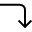

Fixture
=======

Overview
--------

The Fixture object is a tool that creates a positional relationship between some independent tools (fixturing tools) and other dependent tools (fixtured tools). In training you can set position of selected tools. At Run-time the Fixture tool computes the rigid transformation that maps all fixturing tools' specification position to the their result position. This transformation is than applied to all fixtured tools that are re-positioned to the new expected position. The operation is name Pre-Alignment.

If the Fixture is applied to the Group, all contained tools inherit the same pre-alignment. If the fixture is applied to a single tool, only the tool gets the pre-alignment.

### Components

The Fixture tool computes the rigid transformation depending on number of fixturing tools and components selection. If there is only one tool the transformation will use specification and results position and orientation . If there are more tools the transformation will be the best fitting (Least Mean Square) mapping between all specification and results points. You can even select which component to use for transfomation

### Reference system

Fixture components result can be used to define the origin of a Cartesian reference system.

All the tools fixtured by that Fixture tool will have their coordinates result expressed in the Fixture reference system.

### Presence

If a fixture tool fails, i.e. the fixturing tools have the fail result, the fixtured group or tool will not be executed and its result will be set to not Run: you can say that a failure of a fixture is a presence condition for a group or a tool.

### Multiple results

If a fixture has a single fixturing tool with multiple results, and this fixture is applied to a Group, then at run-time the Group and all its owned tools will be cloned and pre-aligned to fixturing tool results.

Settings
--------

| Options | |
| --- | --- |
| Enable | Enables or disables the fixture. (default = Yes) |
| Use as client reference system | Fixtured tools will have their results expressed in the Cartesian reference system defined by this fixture. (default = No) |
| Mode | How the fixture uses its fixturing tools' results. <ud> <li>Normal (default) Rigid transformation computed as best fitting.</li>  <li>Selective Rigid transformation using selected components.</li> </ud><blockquote> **X** Select the tool for the X component.            Fixed (default)      Gets X component from the parent's fixture.          (Fixturing tools #n)      Use the selected tool's X component.   **Y** Select the tool to be used as component.            Fixed (default)      Gets X component from the parent's fixture.          (Fixturing tools #n)      Use the selected tool's Y component.   **Angle** Select tool to be used as component.            Fixed (default)      Gets X component from the parent's fixture.          (Fixturing tools #n)      Use the selected tool's angle component.  </blockquote> |

### More

Click [here](../../../Windows/dialog_settings.md) to access the More section description.

Results
-------

| Results | If the fixture is assigned to a tool with multiple results, select the desired result. |
| --- | --- |
| Translation X | Component X of the translation vector of the resulting roto-translation used to fixture. |
| Translation Y | Component Y of the translation vector of the resulting roto-translation used to fixture. |
| Axis X rotation | Component X of the rotation vector of the resulting roto-translation used to fixture. |
| Axis Y rotation | Component Y of the rotation vector of the resulting roto-translation used to fixture. |
| Scale X | Scaling value on the X axes of the resulting roto-translation used to fixture. |
| Scale Y | Scaling value on the Y axes of the resulting roto-translation used to fixture. |

