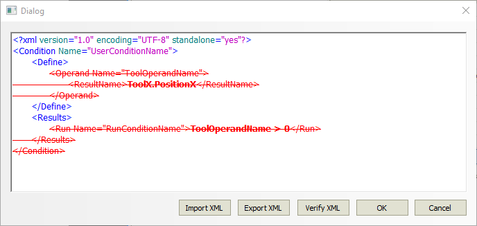

Group
=====

Overview
--------

A Group is a container of tools. Group shares with contained tools the image to inspect, the calibration to transform results with, the fixture object to pre-align tools with.

### Constraints

Group can define some constraints that force the specification position of contained tools. Constraint can be:

#### Concentric

All the group contained tools are forced to have own center to the center of the tool of the fixture (if there are more tools into the fixture the median point is used). To get all contained tools centered you need to train the group.

#### Pre-aligned

All the group contained tools are forced to have a fixed position relative to the tool of the fixture (if there are more tools into the fixture the median point is used). When the fixturing tool moves (in training mode) all group tools follow the same motion.

#### None

No constraints.

Settings
--------

| Options | |
| --- | --- |
| Enable | Enables or disables the group. (default = Yes) |
| Position constraint | Constraints to be applied to the contained tools.<ud> <li>None (default) No constraint is applied.</li>  <li>Concentric All contained tools are concentric with the center of the fixturing tool.</li>  <li>Pre-aligned All contained tools follow movements of the fixturing tool.</li> </ud> |
| Angle constraint | Only in concentric mode.<ud> <li>None (default) No constraint is applied.</li>  <li>Concentric All contained tools orient according to the fixturing tool orientation.</li> </ud> |

| More | |
| --- | --- |
| Tag | Generic label for object custom identification. |
| Show | Enables or disables visibility of the Group object into the Selection for users not administrator. |
| Hide object | Enables or disables visibility of the Group object into the Selection for users not administrator conditioned to View Selectively hide objects status. |
| Description | Text field to give a brief group description. |
| Comments | Text field to give a brief comments. |
| User Id | Unique GUID of this item. You can either edit it by clicking on the button. |
| Enable Conditioned-Run | Enables or disables execution of this Group on View's conditioned run input code. |
| Conditioned-Run codes | The code of this Group to match for enabling execution. |
| Invert result decision | Invert inspection result: Group result return fails it all owned items are pass and vice-versa. |
| Object sharing | Enable or disable saving of the configuration of the Group in a separate binary files that can be shared over several recipes.<blockquote> **Shared file** Path of the file (pvx extension)   **Read only** Enables or disables overwriting of the shared file during recipe saving.  </blockquote> |
| Parameters sharing | Enable or disable saving of the settings of the Group in a separate files that can be shared over several recipes.<blockquote> **Shared file** Path of the file (xml extension)   **Read only** Enables or disables overwriting of the shared file during recipe saving.  </blockquote> |
| Enable condition XML | Enables or disables a condition defined by a script that permits execution of this Group. The script return true = Group can be executed, or false = Group cannot be run. When the script gives a fail condition Group result is not Run and doesn't contribute to the result of its owner.<blockquote> **condition XML** editor to the Script configuration  </blockquote> |

Script configuration
--------------------

This window is accessed by pressing Condition XML button in Group settings window.

### Keywords

Script keywords are described in the following table.

|  | User can describe the conditioning features of group through an XML language. |
| --- | --- |
| Computation Name | Define the user friendly name of this configuration. |
| Define | Starts the section for operands definitions. |
| Operand Name | Name of the Operand (position, measure, value, status) used in the computational script. This name is the operand symbol that Group uses in the script formula. |
| Results | Starts the section for Group computational result definition. The result is a Boolean that enables or disables the execution of the Group. The Script may accept Operands (as described), values, mathematical functions. |

### Import XML

Import an XML definition for this Group conditional script from a stored file.

### Export XML

Export the current XML definition of this Group conditional script to a file.

### Verify XML

Verify the correctness of Operands and Results. This action is necessary to accept new Group conditional definition.

### Example
~~~
<\?xml version="1.0" encoding="UTF-8" standalone="yes"?> 
<\Condition Name="UserConditionName"> 
<\Define> 
<\Operand Name="L1"> 
<\ResultName>L1.General<\/ResultName> 
<\/Operand> 
<\Operand Name="L2"> 
<\ResultName>L2.General<\/ResultName> 
<\/Operand> 
<\/Define> 
<\Results> 
<\Run Name="RunConditionName">NOT(L2 OR L1)<\/Run> 
<\/Results> 
<\/Condition> 
~~~

 where:

L1 and L2 are the symbol name of tools in the recipe. The Group condition uses their result (good or fail) to condition its execution. The condition, in this case, is a Boolean expression.

Results
-------

| Decision | Pass/Fail decision of the Group. A Group result is pass if all contained items results are passed; it is reject if at least one result is reject. |
| - | - |
| Processing time | Estimate of processing time |

