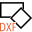

CAD
===

Overview
--------

CAD tool is a container of tools that can be initialized by a DXF file. Cad file will be constructed so to contain information on which tool to create, and their associated shapes. Cad file will have several layer whose name will be a formatted string that follows the mentioned below rules.

Layers names
------------

| Name | Value | Purpose |
| --- | --- | --- |
| TOOL<n> | Valid tool name (\) | Create the tool |
| NAME | Any | Name of the tool |
| LINK | Any NAME previously assigned to other tools; use ‘+’ if more | Linked tools |
| TAG | Number | Tag id |
| FIX | Any NAME previously assigned to other tools; use ‘+’ if more | Fixture tools |
| SID | Number | Search Id |
| PID | Number | Point Id |
| XML | File name | XML with parameters |
| Name | Value | Purpose |
| ORIGIN | Any NAME previously assigned to other tools (only PatMax) | Assign this origin to the tool NAME |

Names are separated with ‘&’  
A value is separated from its name with ‘#’  
Additional values are separated with ‘+’  
Examples:  
TOOL1#PatMax&NAME#MyPatMax&LINK#TAG#0  
TOOL2#LineFinder&NAME#MyLine1&LINK#TAG#0&FIX#MyPatMax

TOOL3#LineFinder&NAME#MyLine1&LINK#TAG#0&FIX#MyPatMax  
TOOL4#LineIntersection&NAME#MyLineIntersection&LINK#MyLine1+MyLine2#TAG#0&FIX#&SID#1&PID#1

\Valid tool names

Search, BlobInspect, BlobMeasure, PatMax, PatInspect, Edge, Caliper, CircleFinder, LineFinder, TInspect, RectFinder, Sharpness, DistancePointToPoint, DistancePointToLine, LightMeterStd, LineIntersection, LineFit, PointFit, RectFit, Boolean operator, Arithmetic, Point, Best, Grid, GridPolar, GridPoints, SyntheticXML, SyntheticDXF, LineInspect, LineBreakage

PatMax
------

When drawing a line in Y direction only (as the dotted line), from the bottom to the top, the white (+) is on the right of the line and the black (-) is on the left of the line

Edge
----

Use a Polyline. Vertex 1 is the starting point: place as in the picture to find a light to dark transition in X direction

LineFinder
----------

When drawing a line in Y direction only, from the bottom to the top, the white (+) is on the right of the line and the black (-) is on the left of the line

When there are tools with a valid SearchId , the tool searches for the tools positions. Then compares the found positions to the expected positions, as defined in the dxf drawing, and calculates the mean and worst errors.

The tool position is defined as the origin (0, 0) mapped with the transformation that best fits the found to the expected positions.

Settings
--------

| Options | |
| --- | --- |
| Enable | Enables or disables the tool. (default = Yes) |
| CAD file | Insert file name to initialize the tool with a CAD file. |

| Tolerances and limits | |
| --- | --- |
| Mean error | Enables or disables tolerance check on mean error for tool fixture.<blockquote> **Error limit** Max accepted mean error distance. (default = 0)  </blockquote> |
| Worst error | Enables or disables tolerance check on worst error for fixture tool. Worst point is the one with the largest distance from the fitted point. <blockquote> **Worst point error limit** Max accepted distance between any point and the fitted point. (default = 0)  </blockquote> |

### More

Click [here](../../../Windows/dialog_settings.md) to access the More section description.

Results
-------

| Results | |
| --- | --- |
| Decision | Pass/Fail decision of a tool. |
| Processing time | Tool processing time in msec. |
| Position X | X position coordinates. The position is referred to the origin point of the tool. |
| Position Y | Y position coordinates. The position is referred to the origin point of the tool. |
| Offset length | Distance from the trained tool position. |
| Angle | Angle of the tool. |

