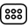

Connector
=========

Overview
--------

Connector is a tool for inspection of pins of connectors. A connector is seen as a set of several rows of pins. Every row has a unique pin model, and each pin has a defined position inside the row and relative to all other pins of other rows. The Connector tool is designed to have a data-driven description and configuration. Connector result is an evaluation of pins positions' and pins' model quality.

Settings
--------

| Options | |
| --- | --- |
| Enable | Enables or disables the tool. (default = Yes) |
| Reference point X | X position of the whole connector (calibrated unites). (default = 0.00) |
| Reference point y | Y position of the whole connector (calibrated unites). (default = 0.00) |
| Rows angle | Angle/direction of all member rows (calbrated degrees). (default = 0.00) |
| Rows number | Number of rows that compose the connector. (default = 1) |
| True position | If "true" each pin offset is computed from nominal expected position. Otherwise nominal position is corrected (mapped) by fitting current transformation result. (default = Yes) |
| User row reference origin | Enable user to graphically set the position of first pin of each row. Otherwise position is driven by row data. (default = No) |
| Global Position tols | Enable or disable same tolerances for each pin result position. (default = Yes) |
| Position offset | Enables or disables pin position tolerance (if Global Position tols is enabled).<blockquote> **Elliptical region** Instead of rectangular offset area a elliptical is used.   **Position X tolerance** Position tolerance in the X axes. (default = 10)   **Position Y tolerance** Position tolerance in the Y axes. (default = 10)  </blockquote> |

| Row Section | |
| --- | --- |
 Row | Selection of connector rows || Reference point X | X position of the first pin of this row, relative to connector reference point (calibrated unites). (default = 0.00) |
| Reference point y | Y position of the first pin of this row, relative to connector reference point (calibrated unites). (default = 0.00) |
| Pitch | Distance between two pins (calibrated unites). (default = 100) |
| Number of Pins | Number of pins in this row. (default = 2) |
| First pin id | Identifier of row first pin. (default = 1) |
| Default pin name | Enable or disable default naming of pins. By default pin name originates from its identifier (id). (default = Yes) |
| Pin selection | Selector of i-th pin.   | Enable | Enable or disable correction of pin nominal position | | --- | --- | | Pin offset X | Correction of nominal X coordinate (orientation is as calibration X-axes) | | Pin offset Y | Correction of nominal Y coordinate (orientation is as calibration Y-axes) | | Custom Pin name | User defined Pin name (available only if Default Pin name is false) | |
| Frame X (pixel) | Search area frame in horizontal direction around the pin model area. (default = 20) |
| Frame Y (pixel) | Search area frame in vertical direction around the pin model area. (default = 20) |
| Position offset | Enables or disables position tolerances to be used as pass/fail condition. These settings are available only if Connector Global position tols is false<blockquote> **Elliptical region** Instead of rectangular offset area a elliptical is used.   **Position X tolerance** Position tolerance in the calibrated X axes. (default = 10)   **Position Y tolerance** Position tolerance in the calibrated Y axes. (default = 10)  </blockquote> |
| Line scan correction | Enables calibration correction for images acquired with line scan cameras. (default = No) |
| Calibration plane Z offset | Offset of calibration plane of this pins row. It is the z-calibration offset setting specific for this row. (default = 0,00) |
| Model | Model used to look for pins into this row<ud> <li>Search Use Search algorithm.</li>  <li>PatMax Use PatMax algorithm.</li>  <li>RSI Search Use RSI Search algorithm.</li> </ud> |
| Multimodel | Enables and trains different pin models for row. This button shows [multimodel](../Pattern_Match/Multimodel.md) parameters settings. |
| Geometry | Defines shape of the pin model.<ud> <li>Circle Circular shape.</li>  <li>General rectangle (default) Rectangular shape.</li>  <li>Annulus Annulus shape.</li>  <li>General polygon General polygon shape.</li> </ud> |
| Score | The acceptance level for the global searching score. Results with scores below this limit are not accepted. (default = 0.30) |
| Contrast ratio | Enables or disables contrast ratio condition. Available only if Model is of type Search or RSI Search<blockquote> **Tolerance -** Negative tolerance.   **Tolerance +** Positive tolerance.  </blockquote> |
| Contrast threshold | Minimum contrast of boundaries used to locate the pattern. Available only if Model is of type PatMax(default = 10) |
| Elasticity | It specifies the degree to which you will allow PatMax to tolerate deformations of the object boundaries. You specify the elasticity value in pixels. (default = 0.00) |
| Angle | Enables or disables angle search range. (default = No)<blockquote> **Angle min** Lower limit. (default = -180)   **Angle max** Upper limit. (default = 180)  </blockquote> |
| Pattern granularity | PatMax uses large features first to do a pre-localization of the object and then refines the search using fine features. Granularity is expressed as the radius of interest, in pixels, within which features are detected.<ud> <li>Automatic (default) The system perform, at train time, an estimate of the optimal settings for Fine and Coarse granularity.</li>  <li>Manual Fine and coarse granularity are used to train the pattern.</li> </ud>  <blockquote> **Fine** The smallest granularity used to detect features in the training image or shape description. (default = 1)   **Coarse** The largest granularity used to detect features. (default = 4)  </blockquote> |

| Tolerances and limits | |
| --- | --- |
| Position offset | Enables or disables position tolerance of the complete connector. Position is computed as best fit of all pins position result<blockquote> **Elliptical region** Instead of rectangular offset area a elliptical is used.   **Position X tolerance** Position tolerance in the X direction. (default = 10)   **Position Y tolerance** Position tolerance in the Y direction. (default = 10)  </blockquote> |
| Angle offset | Enables or disables orientation tolerance.<blockquote> **Angle+** Tolerance for positive angles. (default = 360; min = 0; max = 360)   **Angle-** Tolerance for negative angles. (default = 360; min = 0; max = 360)  </blockquote> |
| Ignore points | Number of pins to ignore in computing connector position. (default = No)<blockquote> **Residual limit for ignoring** The minimum value to consider a point as a candidate for decimation. (default = 0.00     </blockquote> |
| Positive worst error | Enables positive worst point error condition; worst point is the one with the largest distance from the expected pin position. Expected pin position is the nominal pin position moved by the fitting transformation result.<blockquote> **Worst point error limit** Max accepted distance between any point and the expected fitted one. (default = 0)  </blockquote> |
| Mean error | Average of distances between result pins positions and expected fitted ones<blockquote> **Error limit** Max accepted mean distance. (default = 0)  </blockquote> |
|
|

### More

Click [here](../../../Windows/dialog_settings.md) to access the More section description.

Results
-------

| Results | |
| --- | --- |
| Decision | Pass/Fail decision of a tool, including multiple results if any. |
| Processing time | Tool processing time in msec. |
| Position X | X position coordinates. The position is referred to the origin point of the tool.<blockquote> **Offset X** Offset between the tool's specification X position and tool's result X position (specification reference system).  </blockquote> |
| Position Y | Y position coordinates. The position is referred to the origin point of the tool.<blockquote> **Offset Y** Offset between the tool's specification Y position and tool's result Y position (specification reference system).  </blockquote> |
| Offset length | Distance between specification and result points. |
| Angle | Angle of the tool.<blockquote> **Angle offset** Angle offset from the trained tool angle position.  </blockquote> |
| Mean error | Average of distances between result pins positions and expected fitted ones. |
| Worst error+ (point) (we +) | Worst pin distance and the index of the pin that produced it. |
| Number of missing points | Number of pins not found. |
| Worst score (pin) | Worst result score ant the index of the pin that produced it. |
| Max X pin offset (pin) | Maximum distance from result and expected one, in X direction. |
| Max Y pin offset (pin) | Maximum distance from result and expected one, in Y direction. |
| Max length pin offset (pin) | Maximum distance from result and expected one. |
| Pin ID | Pin selection.<blockquote> **Row** Row owner.   **Scale X** Calibration X scale used.   **Scale Y** Calibration Y scale used.   **Fitting result** Fitting result decision for this pin.   **Residual** Residual of fitting computation: distance from result position and expected one.   **Offset X** Offset from the expected pin position in the X direction.   **Offset Y** Offset from the expected pin position in the Y direction.   **Offset length** Offset from the expected pin position.   **Score** Result score of pattern matching.   **Contrast ratio** Result contrast ratio od search. Available ony if model is of type Search   **Angle** Result angle of pattern matching. Available ony if model is of type PatMax.  </blockquote> |

Configuration
-------------

This tool is included into the library UvfCTStd and UvfCTCvl.

