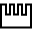

Lead Inspection
===============

Overview
--------

Lead inspection is a tool that automatically creates N instances of the owned tool (selected by the user), and positions them on a user defined line at regular steps. Usually this tool is used to inspect the position of leads of basic electronic components. Lead Inspection arrange expected position

Settings
--------

| Options | |
| --- | --- |
| Enable | Enables or disables the tool. (default = Yes) |

| Tolerances and limits | |
| --- | --- |
| Position offset | Enables or disables position tolerance.<blockquote> **Elliptical region** Instead of rectangular offset area a elliptical is used.   **Position X tolerance** Position tolerance in the X axes. (default = 10)   **Position Y tolerance** Position tolerance in the Y axes. (default = 10)  </blockquote> |
| Angle offset | Enables or disables orientation tolerance.<blockquote> **Angle+** Tolerance for positive angles. (default = 360; min = 0; max = 360)   **Angle-** Tolerance for negative angles. (default = 360; min = 0; max = 360)  </blockquote> |
| Pitch | Enables or disables pitch evaluation. (default = No)<blockquote> **Specification** Pitch nominal value. (default = 100)   **Tolerance+** Positive tolerance on Pitch value. (default = 100)   **Tolerance-** Negative tolerance on Pitch value. (default = 100)  </blockquote> |
| Pitch mean | Enables or disables pitch mean evaluation. (default = No)<blockquote> **Tolerance+** Positive tolerance on Pitch mean value. (default = 0)   **Tolerance-** Negative tolerance on Pitch mean value. (default = 0)  </blockquote> |
| Standard deviation | Enables or disables standard deviation evaluation. (default = No)<blockquote> **Specification** Standard deviation nominal value. (default = 0)   **Tolerance+** Positive tolerance on standard deviation value. (default = 0)   **Tolerance-** Negative tolerance on standard deviation value. (default = 0)  </blockquote> |
| Ignore points | Enables or disables missing point condition. Points with a larger distance than the limit below are ignored.<blockquote> **Residual limit for ignoring** How many point can be missing without set fail condition. (default = 0)  </blockquote> |
| Best points | The fitting algorithm use only the points with best score. |
| Positive worst error | Enables positive worst point error condition; worst point is the one with the largest distance from the interpolated line. After the line has been fitted it is shifted in to the positive worst point<blockquote> **Worst point error limit** Max accepted distance between any edge and the fitted line. (default = 0)  </blockquote> |
| Negative worst error | Enables worst point error condition; worst point is the one with the largest distance from the interpolated line. After the line has been fitted it is shifted in to the negative worst point<blockquote> **Worst point error limit** Max accepted distance between any edge and the fitted line. (default = 0)  </blockquote> |
| Mean error | Enables or disables mean error condition.<blockquote> **Error limit** Max accepted mean error distance. (default = 0)  </blockquote> |

| Analysis | |
| --- | --- |
| Number of points | Number of tools to use. (default = 4) |
| Oriented pitch | If checked pitch is calculated as the distance between two consecutive tools. If not checked pitch is the distance between the projected position of two consecutive tools on the fitting line. (default = Yes) |

### More

Click [here](../../../Windows/dialog_settings.md) to access the More section description.

Results
-------

| Results | |
| --- | --- |
| Decision | Pass/Fail decision of the tool. |
| Processing time | Tool processing time in msec. |
| Position X | X position coordinates. The position is referred to the origin point of the tool.<blockquote> **Offset X** Offset from the trained tool position in the X axes.  </blockquote> |
| Position Y | Y position coordinates. The position is referred to the origin point of the tool.<blockquote> **Offset Y** Offset from the trained tool position in the Y axes.  </blockquote> |
| Offset length | Distance from the trained tool position. |
| Angle | Angle of the tool.<blockquote> **Angle offset** Angle offset from the trained tool angle position.  </blockquote> |
| Pitch mean | Average of all detected pitch values. |
| Standard deviation | Standard deviation of all detected pitch values. |
| Pitch min | Minimum detected pitch value. |
| Pitch max | Maximum detected pitch value. |
| Max pin offset X | Maximum measured X tool offset (Pin ID). |
| Max pin offset Y | Maximum measured Y tool offset (Pin ID). |
| Max pin offset A | Maximum measured angle tool offset (Pin ID). |
| Min pin score | Minimum measured  score. |
| Mean error | Mean error of each tool position. |
| Worst error+ (point) | Worst positive error of each tool position. The number between () indicates the point index the value refers to. |
| Worst error- (point) | Worst negative error of each tool position. The number between () indicates the point index the value refers to. |
| Number of missing points | Number of not found tools results. |

Configuration
-------------

This tool is included into the library UvfCTStd.

