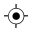

Point
=====

Overview
--------

Point tool defines a point on the image. The point will be fixed with respect to it's group fixture. Angle is the same as owner group.

Settings
--------

| Options | |
| --- | --- |
| Enable | Enables or disables the tool. (default = Yes) |
| Geometry | Defines tool's region shape.<ud> <li>Circle Circular shape.</li>  <li>General rectangle (default) Rectangular shape.</li>  <li>Annulus Annulus shape.</li>  <li>General polygon General polygon shape.</li>  <li>CAD (Closed ROI) Closed shape imported from a CAD file.</li> </ud> |
| CAD file [1](#uno) | CAD file name. |
| Layer nameDisplayed only when CAD (Closed ROI) geometry is selected. | Lists the layer names defined in the selected CAD file.<blockquote> **Connection tolerance** Distance between close segment points to be considered as connected. (default = 0)  </blockquote> |
| User calibrationDisplayed only when CAD (Closed ROI) geometry is selected. | If checked user defines parameters for CAD shapes calibration. Otherwise tool calibration is used.<blockquote> **axes X rotation** Rotation in the X axes to be applied to the CAD shape. (default = 0; min = -360; max = 360)   **axes Y rotation** Rotation in the Y axes to be applied to the CAD shape. (default = 0; min = -360; max = 360)   **scale X** Scale variation in the X axes to be applied to the CAD shape. You express scale value as a multiplier value. (default = 1)   **scale Y** Scale variation in the Y axes to be applied to the CAD shape. You express scale value as a multiplier value. (default = 1)  </blockquote> |

| Tolerances and limits | |
| --- | --- |
| Position offset | Enables or disables position tolerance.<blockquote> **Elliptical region** Instead of rectangular offset area a elliptical is used.   **Position X tolerance** Position tolerance in the X axes. (default = 10)   **Position Y tolerance** Position tolerance in the Y axes. (default = 10)  </blockquote> |
| Angle offset | Enables or disables orientation tolerance.<blockquote> **Angle+** Tolerance for positive angles. (default = 360; min = 0; max = 360)   **Angle-** Tolerance for negative angles. (default = 360; min = 0; max = 360)  </blockquote> |

### More

Click [here](../../../Windows/dialog_settings.md) to access the More section description.

Results
-------

| Results | |
| --- | --- |
| Decision | Pass/Fail decision of a tool, including multiple results if any. |
| Processing time | Tool processing time in msec. |
| Position X | X position coordinates. The position is referred to the origin point of the tool.<blockquote> **Offset X** Offset between the tool's specification X position and tool's result X position (specification reference system).  </blockquote> |
| Position Y | Y position coordinates. The position is referred to the origin point of the tool.<blockquote> **Offset Y** Offset between the tool's specification Y position and tool's result Y position (specification reference system).  </blockquote> |
| Offset length | Distance between specification and result points. |
| Angle | Angle of the tool.<blockquote> **Angle offset** Angle offset from the trained tool angle position.  </blockquote> |

Configuration
-------------

This tool is included into the library UvfStdTools.

### References
[1](#uno): Displayed only when CAD (Closed ROI) geometry is selected.