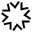

Sharpness
=========

Overview
--------

The Image Sharpness tool computes a measure of the relative sharpness of an input image. The primary purpose of this tool is to automate focusing a camera lens on a scene. You acquire an image and run the tool to obtain a sharpness score. By iteratively refocusing, scoring, and comparing the sharpness scores you can maximize the score which is the best camera focus condition.

Settings
--------

| Options | |
| --- | --- |
| Enable | Enables or disables the tool. (default = Yes) |

| Tolerances and limits | |
| --- | --- |
| Shape index | Enables or disables RMS error condition. (default = No)<blockquote> **Shape index limit** Fitting error threshold. (default = 1000)  </blockquote> |

### More

Click [here](../../../Windows/dialog_settings.md) to access the More section description.

Results
-------

| Results | |
| --- | --- |
| Decision | Pass/Fail decision of a tool. |
| Processing time | Tool processing time in msec. |
| Score | A value ranging from 0 to 1000 indicating the global value of sharpness. The highest the score, the better is the sharpness.<blockquote> **Difference with specification** Difference between the actual value and the specified value for Shape index.  </blockquote> |

Configuration
-------------

This tool is included into the library UvfStd.
