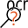

OCR
===

Overview
--------

The OCR tool performs optical character recognition (OCR), a process for recognizing characters. In order to accommodate the wide variation in the appearances of characters in different applications, the OCR API is split into three separate vision tools:

- Character segmentation takes an image as input and produces a set of segmented character images.
- Classification takes the segmented character images and determines what character each corresponds to.
- Fielding takes the entire result string from the classifier and checks to see whether the string matches what the user expected as a good result.

The OCR Tool tries to read a paragraph: a string or a set of strings containing characters using the same font. For each line the ROI (region of interest) has to be set. Increase parameter number of regions for several lines. The ROI is specified as an affine rectangle that specifies the approximate location, angle, and skew of the line of text. The ROI must be entirely contained within the input image. The x axis of the affine rectangle should be parallel to the baseline of the text, and the y axis should be parallel to the vertical strokes of the characters. The ROI is expected to contain only the one line of text to be read and some surrounding background and should be larger than the line of text by at least half a character width on all sides if possible.

The OCR Classifier takes a rectified image of a character and returns the best matching character, the score of that best matching character, and the confidence of that best matching character. The OCR Classifier can be incrementally trained with additional training images at any time. The OCR Classifier determines not only the classification (character code/instance) of the run-time rectified image, but it also reports the score of that classification and the confidence of that classification. The score is an indication of the closeness of the match to the training instances. The confidence is computed as the difference between the score of the classification and the score of the next-highest classification.

The OCR Dictionary Fielding tool provides functionality to verify and correct strings read by the OCR Classifier. There are two secondary usages:

- OCR result verification: in this usage, you try to determine whether the OCR result is correct or not by comparing it against acceptable results specified via fielding.
- OCR result correction: in this usage, the raw OCR result string is not among the acceptable results. The user tries to find an acceptable string allowed by the field that is closest to raw OCR result string. 

The OCR Dictionary Fielding tool also allows for the possibility of multiple candidates for each character in the input string.

Settings
--------

| Options | |
| --- | --- |
| Enable | Enables or disables the tool. (default = Yes) |

| Tolerances and limits | |
| --- | --- |
| Validate paragraph | Enables or disables paragraphs validation. (default = No)<blockquote> **Accept null paragraphs** Accept empty paragraphs. (default = No)   **Wildcard** Enter wildcard characters. These are used as wildcards or "don't care" characters, when the paragraph is validated.   **Valid codes** Enter valid codes for validation, separated by "," (comma).  </blockquote> |
| Shape index | Enables shape index limit. (default = No)<blockquote> **shape index limit** Classification score. (default = 1.0)  </blockquote> |

| Analysis | |
| --- | --- |
| Number of regions | Paragraph to be searched can be distributed into different image regions. (default = 1) |
| Font | Select font. It is the font used by the OCR Tool to look for matching (classification) of characters. These fonts are available and exportable into external files. Fonts are shared into PROINSPECT and each time they are modified (a new character model is added) all OCR Tools into the recipe gets updated. |
| Learn Font | This button opens Learn font dialog. |

| Segmentation | |
| --- | --- |
| Text colour | Set the polarity of the characters. <ud> <li>Automatic (default) Polarity is automatically determined. Automatic polarity detection might fail for very noisy backgrounds.</li>  <li>Dark on light background Dark characters on light background. Polarity specification decreases execution time.</li>  <li>Light on dark background Light characters on dark background. Polarity specification decreases execution time.</li> </ud> |
| Angular range | half of the angle search range. The line angle search range is centered on the xRotation of the affine rectangle used as the ROI for the segmenter. In other words, the full search range is [xRotation - angleHalfRange, xRotation + angleHalfRange]. Increasing angleHalfRange increases the segmenter's run time. Setting angleHalfRange to 0 effectively disables angle search. (default = 0.00) |
| Skew range | half of the skew search range. The line skew search range is centered on the skew of the affine rectangle used as the ROI for the segmenter. In other words, the full search range is [skew - skewHalfRange, skew + skewHalfRange]. Increasing skewHalfRange increases the segmenter's run time. skewHalfRange to 0 effectively disables skew search. (default = 0.00) |
| Filter strokes | whether to remove from the normalized image everything that does not appear to have the same stroke width as the rest of the image. This can be useful if, for example, characters appear to be connected to each other by thin noise streaks. However, using the stroke width filter might incorrectly remove real characters if the widths are inconsistent. (default = Yes) |
| Grey level foreground modifier | a modifier in the range [0, 1] that is used to compute the binarization threshold, in the normalized image, that binarizes between foreground and background. (default = 0.5) |
| Ignore border fragments | whether to completely ignore any fragments that touch any border of the ROI. Ignoring such fragments can be useful for excluding non-text features such as the edges of labels that might be included within the ROI. (default = Yes) |
| Contrast threshold | he minimum amount of contrast (in normalized image greylevels) that a fragment must have, relative to the binarization threshold, in order to be considered for possible inclusion in a character. Any character fragment with a contrast lower than this value is completely ignored for all further processing, as though that fragment had never been detected. (default = 30.0) |
| Fragment max distance to main line | maximum distance a fragment can have outside the main line of characters as percentage of estimated line height. Fragments that overlap the mainline by at least 50% get included regardless of the value of this parameter. (default = 0.0) |
| Min. fragment (pixel) | the minimum number of foreground (i.e. text) pixels that a character fragment must have in order to be considered for possible inclusion in a character. A character fragment is a blob in the binarized image. Character fragments that contain fewer foreground pixels than this value are completely ignored for all further processing, as though that fragment had never been detected. (default = 15) |
| Fragments merge mode | Smode used to determine whether to merge two fragments into one character during the Group stage.<ud> <li>Horizontal overlap (default) Character fragments must overlap horizontally by at least one pixel to be merged. The amount of overlap required is specified by Min. overlap</li>  <li>Min space between characters Character fragments with a horizontal gap between them may be merged to form characters, where any two fragments with a gap less than Min space between characters (pixel) will be merged.</li>  <li>Min and max space between characters Character fragments with a horizontal gap between them may be merged to form characters, with the decision to merge two fragments based on both Min. space between characters (pixel) and Max. space between characters (pixel).</li> </ud> |
| Min overlap | the minimum fraction by which two character fragments must overlap each other in the x-direction for the two fragments to be considered part of the same character. (default = 0.00; min = 0.00; max = 1.00) |
| Min. space between characters (pixel) | the minimum gap size, in pixels, that can occur between two characters. If the gap between two fragments is smaller than this, then they must be considered to be part of the same character, unless the combined character would be too wide . The gap is measured from the right edge of the mark rectangle of one character to the left edge of the mark rectangle of the next character. (default = 1) |
| Max. space between characters (pixel) | the maximum gap size, in pixels, that can occur within a single character, even for damaged characters. Any gap larger than this value is always interpreted as a break between two separate characters, whereas gaps less than or equal to this value may be interpreted either as a break between two separate characters or as a gap within a single character. (default = 0.00) |
| Min number of pixels per characters | the minimum number of foreground (text) pixels that a character must have in order to be reported. Stage. (default = 30.0) |
| Min character width (pixel) | the minimum width of a character’s mark rectangle, in pixels, that a character must have to be reported. (default = 3.0) |
| Use max character width | Set whether to use Max character width (pixel) to split wide characters. (default = No)<blockquote> **Max character width (pixel)** Sets the maximum allowable width of a character’s mark rectangle in pixels. A character wider than this value is split into pieces that are not too wide. (default = 100.0)  </blockquote> |
| Min character height (pixel) | Sets the minimum height of a character’s mark rectangle, in pixels, that a character must have to be reported. (default = 3.0) |
| Use max character height | Sets whether to use Max character height (pixel) to limit the maximum height of a character and/or the line of characters. (default = No)<blockquote> **Max character height (pixel)** Sets the maximum allowable height of a character’s mark rectangle, in pixels. This value is used in two ways. First, this value is used when finding the line as a whole; for example, to reject vertically adjacent noise and/or other lines of vertically adjacent characters. Second, an individual character whose height exceeds this value will be trimmed to meet this height. Stage. (default = 100.0)  </blockquote> |
| Use min aspect | Sets whether to use Min aspect to split wide characters.  (default = Yes) <blockquote> **Min aspect** Sets the minimum allowable aspect of a character, where the aspect is defined as the height of the entire line of characters divided by the width of the character’s mark rectangle. A character whose aspect is smaller than this value (that is, whose width is too large) is split into pieces that are not too wide. (default = 0.8)  </blockquote> |
| Insert spaces | Sets the insert mode, which specifies how to handle insertion of space characters into gaps between other characters.<ud> <li>None (default) Never insert a space character, no matter how large an intercharacter gap is.</li>  <li>Single Insert at most one space character per intercharacter gap, no matter how large the gap is.</li>  <li>Multiple Insert a number of space characters (zero or more) per intercharacter gap based on how large the gap is.</li> </ud><blockquote> **Space score mode** Sets the score mode, which specifies how to handle scoring of space characters.            ONE       Space characters always get a score of 1.0.          Clutter (default)      The score of a space character is based on the fraction of pixels that are background. A space character that consists entirely of background receives a score of 1.0.   **Min space width** Sets the minimum width of a space character, in pixels. (default = 10.0)   **Max space width** Sets the maximum width of a space character, in pixels. (default = 100.0)  </blockquote> |
| Min pitch | Sets the minimum pitch, in pixels, that can occur between two characters. If the pitch between two fragments is smaller than this, then they must be considered to be part of the same character, unless the combined character would be too wide (as specified by Max character width (pixel)and/or Min aspect). (default = 0.0) |

| Classification | |
| --- | --- |
| Accept threshold | Minimum score for a character in order to be classified. (default = 0.50) |
| Confidence threshold | Minimum confidence value. Confidence is the difference between score values of the best and 2nd best match. (default = 0.00) |
| Use filter for scale X | Enable filter for X scale. X scale filter range is used for skipping candidate classes/instances whose rectified training image’s x-size (that is, width) is beyond the range specified here. (default = Yes)<blockquote> **Limit down** Lower limit value for scaling. (default = 0.67)   **Limit up** Upper limit value for scaling. (default value = 1.50)  </blockquote> |
| Use filter for scale Y | Enable filter for Y scale. Y-scale filter range is used for skipping candidate classes/instances whose rectified training image’s y-size (that is, height) is beyond the range specified here. (default = Yes)<blockquote> **Limit down** Lower limit value for scaling. (default = 0.67)   **Limit up** Upper limit value for scaling. (default value = 1.50)  </blockquote> |

| Fielding | |
| --- | --- |
| Max number of positions | Must fit to number of classified or positions, otherwise fielding results are not displayed. (default = 3.0) |
| Position | Select position to specifying the acceptable choices for a character in this position.<blockquote> **Number** Characters 0 through 9. (default = No)   **Alfa-uppercase** Characters A through Z. (default = No)   **Alfa-lowercase** Characters a through z. (default = No)   **Space** The space character (UTF-32 character code 0x20). (default = No)   **Any non space** Any character not in the Cognex-reserved UTF-32 code ranges except the space character whose UTF-32 character code is 0x20. This does include other white spaces, for example, character codes 0x09 through 0x0D. (default = Yes)   **Additional characters** Characters that can be assumed.  </blockquote> |

### More

Click [here](../../../Windows/dialog_settings.md) to access the More section description.

Learn font
----------

This dialog is accessed pressing button

	Analisys > Learn font.

### Consoles

This dialog has two image consoles.

- Image console Image confined within the tool search area is displayed. Fonts console For each character the associated image is displayed.
- Image console displays rectangles associated to each character after the classification process. These rectangles can be selected to identify the currently selected character of the dialog.

Selection of a rectangle allows to make some operations of association of the represented image to a character of the font. If one rectangle is identified by a "?" (question mark) means that the corresponding image is not associated to any character of the font we are going to learn. Else, if the rectangle is marked with a character means that an association exists.

Fonts console displays areas of the image associated to some characters. Many areas can be associated to the same character.

### Edit single character

Font characters can be individually edited by two groups of controls:

- Read character
- Font character

To add a character select one of the proposed rectangle in Image console; type the character in Read character > Name and press Read character > Add button.

Once a character has been added, it will be displayed in the Fonts console. If a read character was associated to a font character, the font character information are displayed. If a character is associated to more than one Font character, the instance index is displayed.

### Edit multiple characters

Font characters can be multiply edited.

- Characters Editable text in which to type the associated character for each rectangle in the Image console.
- Unknown character Type a character that will identify a symbol not recognized as one of the current font alphabet.
- Select all Pressing this button all rectangles in the Image console are used to associate characters
- Deselect If some rectangles have to be deselected, press this button and then click on the rectangle to deselect.
- Add Enter add mode. After pressing, select in Image console the rectangles to add and then press it again.
- Delete Enter delete mode. After pressing, select in Fonts console the characters to delete and then press it again.
- Cancel Exit Add or Delete mode without changes.

### Archive

A learned font can be serialized to be used for another OCR tool.

- New Create a new font.
- Save Opens a Save file dialog and the user will be asked to enter the name of the file .ocr to save the font in.
- Load Opens a File open dialog to select a file .ocr that stores the wished font.
- Font name Name of the current font.

Results
-------

| Results | |
| --- | --- |
| Decision | <ud> <li>Good Pass/Fail decision.</li>  <li>Out of tolerance OCR was successfully executed but some validation condition failed.</li>  <li>Reject OCR execution failed.</li> </ud> |
| Processing time | Tool processing time in msec. |
| Code | Result code. |
| Score | Tool score. |
| Fielding computed | Tells whether the fielding operation was successfully executed. |
| Fielding code | Code after fielding process. |
| Status | This is the lowest status grade among all position status. |
| Fielding position | Fielded position selection.<blockquote> **Character** Fielded character.   **Status** Fielded position status.  </blockquote> |
| Classification computed | Tells whether the classification operation was successfully executed. |
| Code classified | Code after classification process. |
| Classified position | Classified position selection.<blockquote> **Character** Classified character.   **Status** Classified position status.            Read        Classified with good confidence.          Confused        Classified with poor confidence.          Failed        Failed to classify.   **Instance** What instance the classified character is associated to.   **Score** Classification result score   **Confidence** The confidence score is the difference between primary character score and confusion character score.   **Confusion type** Reason that leads to the confused status.            No confusion         Good          Score too low        Confidence score is less than confidence threshold          Failed classification validation        Failed   **Confused character** Highest scoring alternative character.  </blockquote> |

Configuration
-------------

This tool is included into the library UvfCvlOCR.
