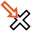

PatMax
======

Overview
--------

The purpose of PatMax is to locate and measure the conformity of a previously trained set of object's contours, called object's features. The search operation measures how much the features extracted on the current image match with the previously trained model.

PatMax locates the object position in the current image by finding the contours in the image to which the model is most similar.

PatMax offers three key distinctive features:

- High-speed location of objects whose appearance is rotated, scaled, and/or stretched
- Location technology that is based on object shape, not on grey-scale values
- Very high accuracy

PatMax differs from other pattern-location technologies in that it is not based on pixel grid representations that cannot be efficiently and accurately rotated or scaled. Instead, PatMax uses a geometrical feature-based representation that can be transformed quickly and accurately for pattern matching.

Settings
--------

| Options | |
| --- | --- |
| Enable | Enable or disable the tool. (default = Yes) |
| Search area | Select the area where search for a model.<ud> <li>All Image (default) Search area agrees with overall image area.</li>  <li>Centered Search area is the model area enlarged by a symmetrical frame.</li>  <li>Free Search area is defined by the user.</li> </ud><blockquote> **Frame X** Frame width. (default = 20)   **Frame Y** Frame height. (default = 20)  </blockquote> |
| Model | Defines tool's model shape.<ud> <li>Circle Circular shape.</li>  <li>General rectangle (default) Rectangular shape.</li>  <li>Annulus Annulus shape.</li>  <li>General polygon General polygon shape.</li>  <li>CAD (Closed ROI) Closed shape imported from a CAD file.</li> </ud> |
| User origin | Allows to set the model origin in an arbitrary position, instead of the center of the model area |
| CAD file | CAD file name. |
| Layer name | Lists the layer names defined in the selected CAD file.<blockquote> **Connection tolerance** Distance between close segment points to be considered as connected.. (default = 0)   **Normalize XY weight** If checked weight is distributed for 50% to X features and for 50% to Y features. If unchecked all features have the same weight. (default = No)  </blockquote> |
| User calibration | If checked user defines parameters for CAD shapes calibration. Otherwise tool calibration is used.<blockquote> **Axes X rotation** Rotation in the X axes to be applied to the CAD shape. (default = 0; min = -360; max = 360)   **Axes Y rotation** Rotation in the Y axes to be applied to the CAD shape. (default = 0; min = -360; max = 360)   **Scale X** Scale variation in the X axes to be applied to the CAD shape. You express scale value as a multiplier value. (default = 1)   **Scale Y** Scale variation in the Y axes to be applied to the CAD shape. You express scale value as a multiplier value. (default = 1)  </blockquote> |
| Synthetic model | Model is created using a synthetic image shapes instead of using the reference image.<blockquote> **Model polarity** Polarity of the shapes represented in the synthetic model  </blockquote><ud> <li>White on black background (default) White foreground (pixels within the shape) on black background.</li>  <li>Black on white background Black foreground (pixels within the shape) on white background.</li> </ud>  <blockquote> **Model frame X (pixel)** symmetrical X frame to add to the width of the model shape.   **Model frame Y (pixel)** symmetrical Y frame to add to the height of the model shape.  </blockquote> |

| Tolerances and limits | |
| --- | --- |
| Check results count | The expected number of results<ud> <li>None No check.</li>  <li>Expected number Number of results must be equal to Num. of results to find.</li>  <li>Less than Number of results must be less then Num. of results to find.</li>  <li>Greater than Number of results must be greater then Num. of results to find.</li> </ud>    | Num. of results to find | Number of results to be found. | | --- | --- | |
| Shape index | Conformity limit for acceptable result.<blockquote> **Shape index limit** Minimum acceptable shape index. (default = 1.0)  </blockquote> |
| Position offset | Enables or disables position tolerance.<blockquote> **Elliptical Region** Use an elliptical region area instead of a rectangular one. Position XY tolerances are the semi-axes the ellipse or the semi-size of rectangle.   **Position X tolerance** Position tolerance in the X axes. (default = 10)   **Position Y tolerance** Position tolerance in the Y axes. (default = 10)  </blockquote> |
| Angle offset | Enables or disables orientation tolerance.<blockquote> **Angle+** Tolerance for positive angles. (default = 360; min = 0; max = 360)   **Angle-** Tolerance for negative angles. (default = 360; min = 0; max = 360)  </blockquote> |
| Coverage | Enables or disables the coverage tolerance limit. The coverage score is a measure of the extent to which all parts of the trained pattern are also present in the run-time image. The coverage score is computed by determining the proportion of the trained pattern that is found in the run-time image. If all of the trained pattern is also present in the run-time image, the coverage score is 1.0. Lower coverage scores indicate that less of the pattern is present.<blockquote> **Coverage limit** Minimum acceptable value. (default = 1.0)  </blockquote> |
| Clutter | Enables or disables the clutter tolerance limit. The clutter score is a measure of the extent to which the found object contains features that are not present in the trained pattern. The clutter score is the proportion of extraneous features present in the found object relative to the number of features in the trained pattern. A clutter score of 0.0 indicates that the found instance contains no extraneous features. A clutter score of 1.0 indicates that for every feature in the trained pattern there is an additional extraneous feature in the found pattern instance. The clutter score can exceed 1.0.<blockquote> **Clutter limit** Minimum acceptable value. (default = 0.0)  </blockquote> |
| Fit error | Enables or disables the fit error tolerance limit. The fit error is a measure of the variance between the shape of the trained pattern and the shape of the pattern instance found in the run-time image. The fit error is computed by taking the square root of the sum of the weighted average distances between each boundary point in the pattern and the corresponding boundary point in the pattern instance in the run-time image. If the pattern instance in the run-time image is a perfect fit for the trained pattern, the fit error is 0.0. You can use the fit error to assess the degree to which the shape of a pattern instance matches the shape of the trained pattern<blockquote> **Fit error limit** Maximum acceptable fit error. (default = 0.0)  </blockquote> |

| Analysis | |
| --- | --- |
| Max. number of results | Number of model instances to find. (default = 1) |
| Multimodel | This button shows [Multimodel](../Pattern_Match/Multimodel.md) parameters settings. |
| Acceptance threshold | The acceptance level for the global matching score. Results with scores below this limit are not accepted. (default = 0.50) |
| Contrast threshold | Minimum contrast of boundaries used to locate the pattern. (default = 10) |
| Elasticity | It specifies the degree to which you will allow PatMax to tolerate deformations of the object boundaries. You specify the elasticity value in pixels. You should keep the following points in mind when specifying a nonzero elasticity value: • Specifying a nonzero elasticity value does not affect PatMax’s execution speed. • Increasing the elasticity value does not decrease PatMax’s accuracy. However, location information returned about additional object instances that are found as a result of increasing the elasticity value can be less accurate. • If the elasticity value is too low, you will see low scores and your application may fail to find patterns in the run-time image and/or the positions will be incorrect or unstable. • If the elasticity value is too high, PatMax may match false instances and may return inaccurate or unstable results. (default = 0.00) |
| Score using clutter | When this option is enabled, the system takes into account the clutter (presence of extra contours in the image that were not present in the model) in computing the global score. (default = No) |
| Angle | Enables or disables angle search range. (default = No)<blockquote> **Angle min** Lower limit. (default = -180)   **Angle max** Upper limit. (default = 180)  </blockquote> |
| Scale | Enables or disables scale range. (default = No)<blockquote> **Min** Lower limit in %. (default = 50)   **Max** Upper limit in %. (default = 200)  </blockquote> |
| Ignore polarity | You can specify whether to ignore the polarity of contours. Each of the boundary points that describes a pattern feature has a polarity. The polarity of a boundary point indicates whether the boundary can be characterized as light-to-dark or dark-to-light. You can configure PatMax to find only objects in which every boundary point has the same polarity as the trained pattern, or you can configure PatMax to find objects with mismatched polarity. |
| Pattern granularity | PatMax uses large features first to do a pre-localization of the object and then refines the search using fine features. Granularity is expressed as the radius of interest, in pixels, within which features are detected.<ud> <li>Automatic (default) The system perform, at train time, an estimate of the optimal settings for Fine and Coarse granularity.</li>  <li>Manual You define fine and coarse granularity to use to train the pattern and to run.</li> </ud>  <blockquote> **Fine** The smallest granularity used to detect features in the training image or shape description. (default = 1)   **Coarse** The largest granularity used to detect features. (default = 4)  </blockquote> |
| Accepted overlap (%) | Percentage overlapping area needed to PatMax before it considers multiple overlapping instances as a single instance. (default = 0.00) |
| Angle overlap | Angle within which PatMax treats multiple overlapping instances as a single instance. (default = 360) |
| Timeout (s) | Maximum amount of time allowed to the PatMax algorithm to process the image. A fail result will be set if this time expires. (default = 8) |
| Algorithm | Used algorithm.<ud> <li>PatMax (default) Full PatMax.</li>  <li>PatQuick A quicker version of the PatMax algorithm. PatQuick provides the basic PatMax results but lacks separate measurements of clutter, coverage and fit error. PatQuick may yield a lower localization accuracy.</li>  <li>PatFlex An algorithm that can tolerate and report information about a high degree of nonlinear deformation like spherical or cylindrical distortion, surface flex distortion.</li>  <li>PatPers An algorithm that can tolerate and report information about a high degree of nonlinear deformation like planar perspective.</li> </ud> |
| High sensitivity | High sensitivity is designed to improve PatMax performance for noisy images and/or patterns with extremely low contrast. PatMax will run slower in high sensitivity mode than in standard sensitivity mode. (default = No)<blockquote> **Sensitivity parameter** When set to 1.0 PatMax uses minimum noise rejection. when set to 10.0 PatMax uses maximum noise rejection. Usually the default value 2.0 produces optimal results. This is an advanced parameter and should usually be left set to its default value. (default = 2; min = 0; max = 10)  </blockquote> |
| Manual edge threshold | Enables or disables manual edge threshold. If set to true, tells PatMax to ignore the   automatic edge detection threshold computed at train time and  to use the user supplied edge threshold. <blockquote> **edge threshold** threshold to use instead of automatically computed at train time. (default = 5)  </blockquote> |
| Deformation rate | expected deformation rate in PatFlex. Higher values increase the time of the alignment, and  may result in spurious matches due to the large amount  of freedom that the tool has to deform parts of the training image to fit the run-time image. |
| Flex elasticity | PatFlex flex pattern elasticity in pixels. (default = -1) |
| Limited deformation | whether or not deformation is known to be minor, in  PatFlex. If the runtime image is sufficiently undeformed  (e.g. undeformed enough that the PatMax algorithm can still  find it, even though PatMax's answer might not be completely  accurate), then setting this flag to true may result in  accurately modeled deformation at much higher speeds |

### More

Click [here](../../../Windows/dialog_settings.md) to access the More section description.

Results
-------

| Results | |
| --- | --- |
| Decision | Pass/Fail decision of a tool, including multiple results if any. |
| Processing time | Tool processing time in msec. |
| Position X | X position coordinates. The position is referred to the origin point of the tool.<blockquote> **Offset X** Offset between the tool's specification X position and tool's result X position (specification reference system).  </blockquote> |
| Position Y | Y position coordinates. The position is referred to the origin point of the tool.<blockquote> **Offset Y** Offset between the tool's specification Y position and tool's result Y position (specification reference system).  </blockquote> |
| Offset length | Distance between specification and result points. |
| Angle | Angle of the tool.<blockquote> **Angle offset** Offset between the tool's specification orientation angle and tool's result orientation angle.  </blockquote> |
| Scale X | Scale value in the X axes. |
| Scale Y | Scale value in the Y axes. |
| Score | Match quality index. A value from 0 to 1 indicating the global level of conformity between the model and the pattern found. |
| Clutter | The clutter score: it is a measure of the extent to which the found object contains features that are not present in the trained pattern. |
| Coverage | The coverage score: it is a measure of the extent to which all parts of the trained pattern are also present in the run-time image. |
| Fit error | Measure of the variance between the shape of the trained pattern and the shape of the pattern instance found in the run-time image. |

Images
------

| Images | |
| --- | --- |
| Model | Image of the trained model . |
| Mask | Mask image to apply. White pixels are care pixels. Black pixels are don't care. |
| Model featrures | Image of the trained model with the coarse features (cyan color) and fine features (blue color) |

Configuration
-------------

This tool is included into the library UvfCvl.

