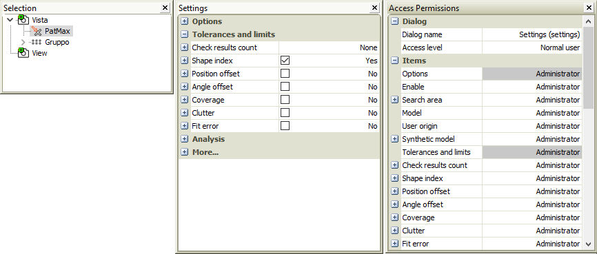
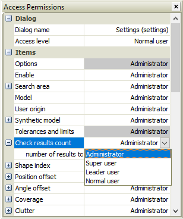

Permission
==========

Overview
--------

It is possible to set the visibility of windows or tool settings parameters according to the current user level.

Per-user permission settings are stored in a database.

Dialogs permission
------------------

Each dialog is assigned a minimum user level. The access level that can only be changed by a higher level user. Editing is done through the Access Permissions window.

	Tools > Users >Access Permissions

The Access Permissions dialog has a section named Dialog where the user can change the access level of each window.

| Dialog | |
| --- | --- |
| Dialog name | Select dialog by name |
| Access level | Select access level |

To change the access level of one dialog, select the dialog name in the Dialog name list. Then select the desired access level in the Access level list.

If a dialog is not enabled for viewing, in addition to not being visible, it will also be removed from the menu.

To apply the changes, you must log in with the changed authorization level.

Settings permission
-------------------

The tool settings parameters are subject to visibility conditioned by the user's access level.

Each parameter is assigned a level that can only be changed by a higher level user. Editing is done through the Access Permissions window.

The Access Permissions dialog has a section named Items where the user can change the access level of each parameter of each tool. The content of this section changes according to the selected tool.

With the permissions window open, select a tool in the selector. Then click inside the settings window.

Setting parameters permissions

For each parameter in the settings window there is a parameter in the permissions window with the same name. In correspondence to each parameter it is possible to select the user level.

Changing parameter permission

Upon user change, if a settings parameter is not enabled to be visible, it will be removed from the settings dialog.

